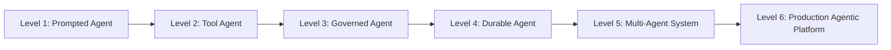

# Agentic Levels

Structured maturity levels for building AFK agents from simple chat flows to production-grade multi-agent systems.

Source: `docs/library/agentic-levels.mdx`

This page defines a clear build path for AFK systems. Pick a target level first, then implement only the required features for that level.

## TL;DR

- Start at Level 1 and move one level at a time.
- Each level adds specific runtime features and operational requirements.
- Do not jump to multi-agent orchestration before policy, safety, and durability are in place.

## When to Use

- You need to plan implementation scope by capability maturity.
- You are deciding which runtime features to add next.
- You want a phased path from prototype to production platform.

## Maturity Ladder

## Levels and Required Features

| Level | Goal | Required AFK Features | Core Docs |
| --- | --- | --- | --- |
| 1. Prompted Agent | Single-agent responses with clear instruction behavior | `Agent`, `instructions` or `instruction_file`, model config | [Developer Guide](/library/developer-guide), [System Prompts](/library/system-prompts) |
| 2. Tool Agent | Deterministic tool usage with typed input | `@tool`, Pydantic args schemas, `ToolRegistry` flow | [Examples](/library/examples/index), [Tools Walkthrough](/library/tools-system-walkthrough) |
| 3. Governed Agent | Safe execution for side effects | `policy_roles`/`PolicyEngine`, HITL interaction, sandbox/output controls | [Tool Call Lifecycle](/library/tool-call-lifecycle), [Security Model](/library/security-model) |
| 4. Durable Agent | Resume-safe long-running workflows | checkpoints, `Runner.resume`, compaction strategy | [Checkpoint Schema](/library/checkpoint-schema), [Failure Policy Matrix](/library/failure-policy-matrix) |
| 5. Multi-Agent System | Delegation and specialization | subagents, router, context inheritance boundaries, fanout/depth guards | [Agentic Behavior](/library/agentic-behavior), [Architecture](/library/architecture) |
| 6. Production Agentic Platform | Reliability, observability, and regression protection | fail-safe limits, fallback models, telemetry, tested behavior contracts, evals | [Run Event Contract](/library/run-event-contract), [Tested Behaviors](/library/tested-behaviors), [API Reference](/library/api-reference) |

## Feature Checklist by Level

### Level 1: Prompted Agent

- Choose one model and one agent prompt strategy
- Use either inline instructions or file-backed prompt loading
- Keep output scope narrow and deterministic

### Level 2: Tool Agent

- Add typed tools with strict validation
- Ensure every tool has strong description and bounded args
- Confirm tool results are model-safe and predictable

### Level 3: Governed Agent

- Add policy gates for risky tools
- Require approval for write/delete/command operations
- Enforce sandbox restrictions and output caps

### Level 4: Durable Agent

- Persist run state and replay-safe effects
- Verify resume path under interruption/failure
- Define memory retention/compaction behavior

### Level 5: Multi-Agent System

- Split work into specialist agents with explicit responsibilities
- Configure router with deterministic target selection
- Keep context inheritance minimal and explicit

### Level 6: Production Agentic Platform

- Enforce budgets (`max_steps`, wall time, cost, tool count)
- Configure fallback model chain and failure policies
- Track telemetry and run contract events
- Protect quality with eval scenarios and behavior tests

## Example Mapping

- Level 1: [01 Minimal Chat Agent](/library/examples/index#01-minimal-chat-agent)
- Level 2: [08 Prebuilt Runtime Tools](/library/examples/index#08-prebuilt-runtime-tools)
- Level 3: [02 Policy with HITL](/library/examples/index#02-policy-with-hitl), [06 Tool Registry Security](/library/examples/index#06-tool-registry-security)
- Level 4: [04 Resume and Compact](/library/examples/index#04-resume-and-compact)
- Level 5: [03 Subagents with Router](/library/examples/index#03-subagents-with-router)
- Level 6: Combine Level 3-5 patterns with [Tested Behaviors](/library/tested-behaviors) and [API Reference](/library/api-reference)

## Recommended Build Order

1. Reach Level 2 in development quickly.
2. Add Level 3 before any high-impact production tool.
3. Add Level 4 before long-running or resumable workflows.
4. Add Level 5 only when specialization materially improves results.
5. Add Level 6 before scaling traffic or integrating critical systems.
