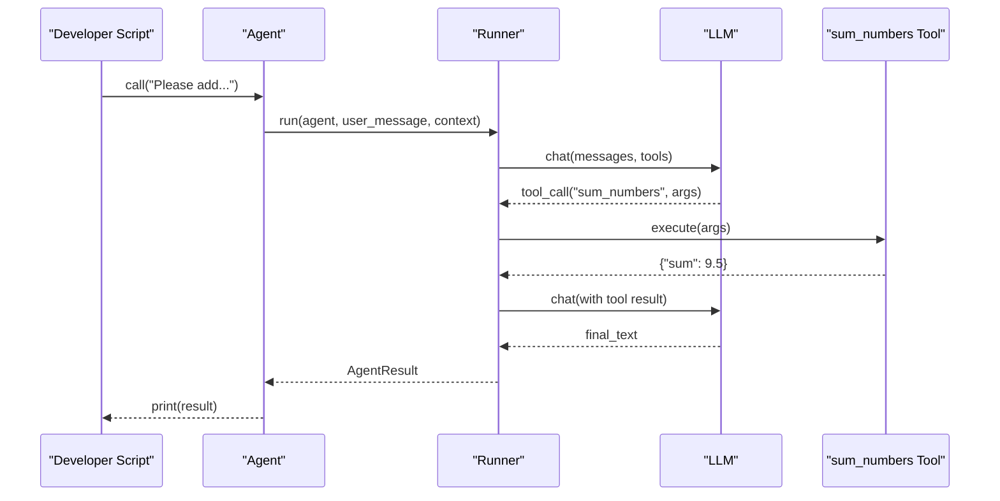
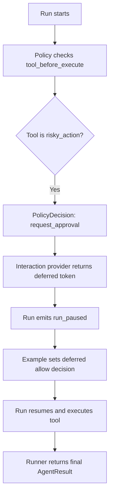
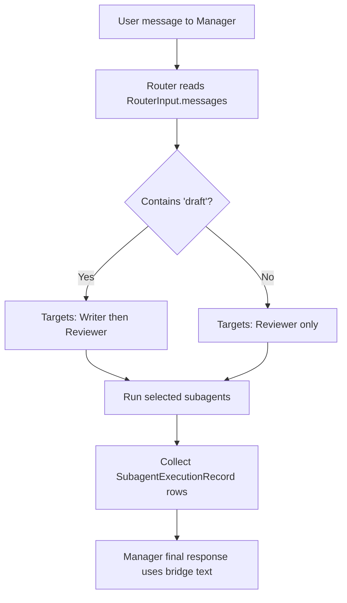
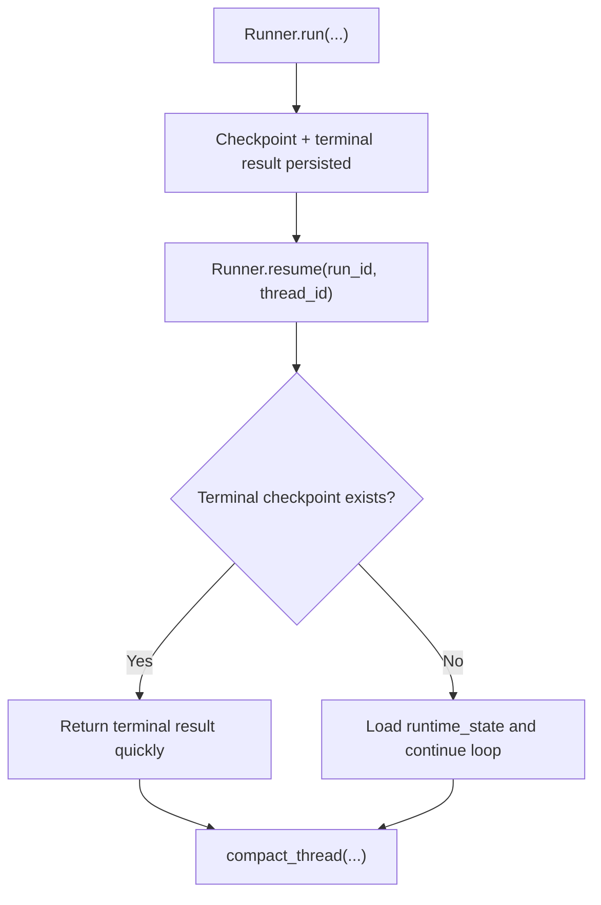
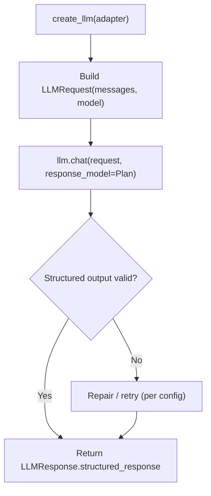
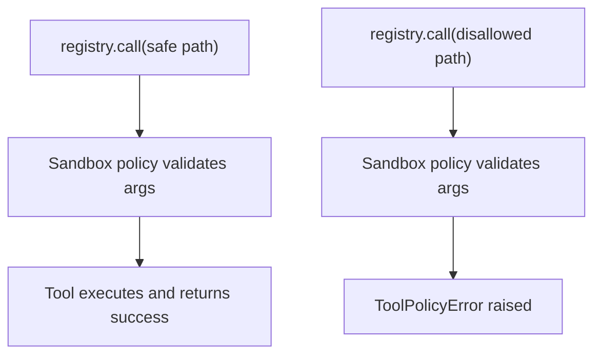
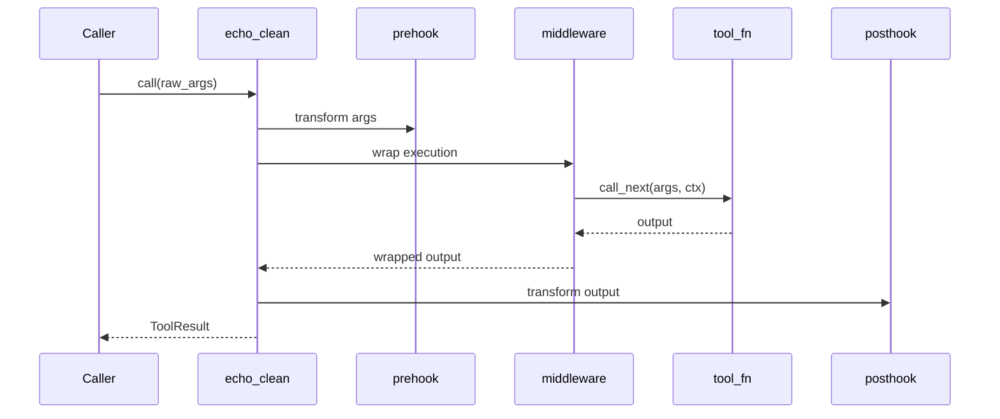
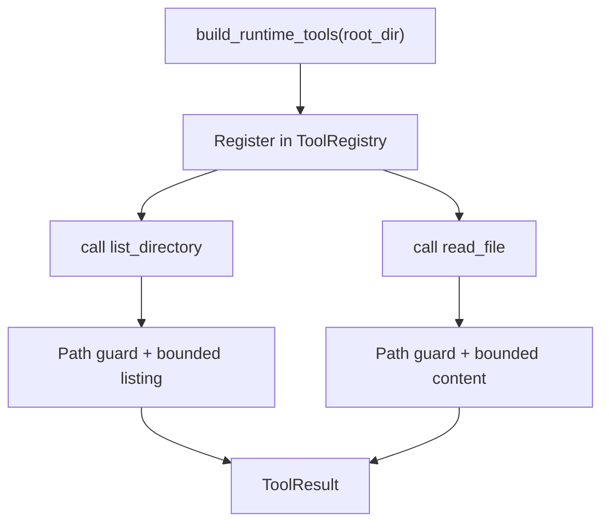
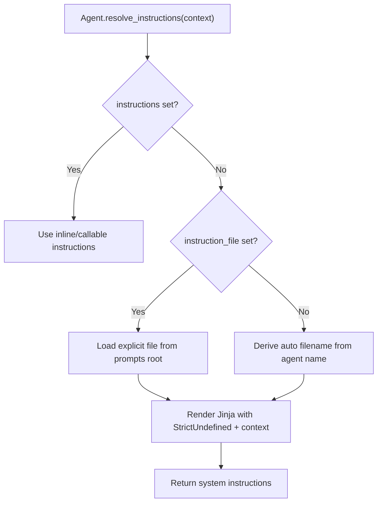

# Examples

Runnable AFK examples in build order with architecture diagrams and customization guidance.

Source: `docs/library/examples/index.mdx`

Every example is embedded below as a copy-ready script using the published `afk` SDK (`from afk...` imports).

Run examples in order. Each one introduces one new concept while preserving the previous mental model.

## TL;DR

- This page provides runnable, progressively harder AFK examples.
- Each example maps to a capability level in the agent maturity model.
- Code is embedded and copy-ready using public `afk.*` imports.

## When to Use

- You want working templates before writing custom runtime code.
- You need reference implementations for policy, subagents, checkpoints, and prompts.
- You are onboarding new engineers to AFK development patterns.

## Recommended Run Order

  Run `01_minimal_chat_agent.py` for baseline prompted behavior.
  Run `08_prebuilt_runtime_tools.py` for bounded tool operations.
  Run `02_policy_with_hitl.py` and `06_tool_registry_security.py` for governance/safety.
  Run `04_resume_and_compact.py` for durability and restart behavior.
  Run `03_subagents_with_router.py` for multi-agent orchestration.
  Combine 02 + 04 + 06 + tested behavior contracts for production hardening.

## Prerequisites

```bash uv
uv pip install afk pydantic

```

```bash pip
pip install afk pydantic

```

## Example Catalog

    Agent + typed tool + one-shot run.

    Deferred approvals and pause/resume flow.

    Manager routes requests to worker subagents.

    Checkpoint persistence, resume, and retention.

    Use `afk.llms` with typed structured response.

    Sandbox policy and output limits.

    Tool interception and output shaping.

    Safe filesystem tools for agent runtime.

    Auto prompt loading, templating, and prompt cache reuse.

## Level Mapping

| Level | Purpose | Recommended Examples |
| --- | --- | --- |
| 1. Prompted Agent | base single-agent behavior | `01_minimal_chat_agent.py`, `09_system_prompt_loader.py` |
| 2. Tool Agent | typed, bounded tool operations | `08_prebuilt_runtime_tools.py`, `07_tool_hooks_and_middleware.py` |
| 3. Governed Agent | policy + HITL + tool safety | `02_policy_with_hitl.py`, `06_tool_registry_security.py` |
| 4. Durable Agent | resume-safe workflows | `04_resume_and_compact.py` |
| 5. Multi-Agent System | delegation and orchestration | `03_subagents_with_router.py` |
| 6. Production Agentic Platform | reliability + observability + controls | combine Levels 3-5 patterns + [Tested Behaviors](/library/tested-behaviors) |

## Run Commands

Use the same filenames shown in each accordion code block.

```bash
python 01_minimal_chat_agent.py
python 02_policy_with_hitl.py
python 03_subagents_with_router.py
python 04_resume_and_compact.py
python 05_direct_llm_structured_output.py
python 06_tool_registry_security.py
python 07_tool_hooks_and_middleware.py
python 08_prebuilt_runtime_tools.py
python 09_system_prompt_loader.py
```

```bash
for f in 0*.py; do python "$f"; done
```

## 01. Minimal Chat Agent

- Defines a typed tool (`sum_numbers`) with Pydantic validation.
- Creates one `Agent` with model, instructions, and tool list.
- Calls `agent.call(...)` and returns `AgentResult`.



## 02. Policy With HITL

- Adds policy rule that gates `risky_action` with `request_approval`.
- Uses `InMemoryInteractiveProvider` for deferred decisions.
- Resolves deferred approval after `run_paused` event.



## 03. Subagents With Router

- Defines `Writer` and `Reviewer` subagents.
- Router inspects transcript text and returns subagent names.
- Manager runs selected subagents and merges outputs.



## 04. Resume And Compact

- Runs once with `Runner.run(...)`.
- Resumes with same `run_id` and `thread_id`.
- Compacts thread records with retention policies.



## 05. Direct LLM Structured Output

- Uses `afk.llms.create_llm(...)` directly.
- Builds `LLMRequest` manually.
- Validates typed response with `response_model=Plan`.



## 06. Tool Registry Security

- Builds a sandbox profile with allowlists and execution restrictions.
- Registers tools in `ToolRegistry` with output-limiting middleware.
- Demonstrates one allowed path and one blocked path call.



## 07. Tool Hooks And Middleware

- Uses prehook to normalize arguments.
- Uses middleware to wrap tool behavior.
- Uses posthook to shape final output.



## 08. Prebuilt Runtime Tools

- Builds prebuilt filesystem tools with `build_runtime_tools(root_dir)`.
- Registers them in a `ToolRegistry`.
- Calls both tools using bounded/safe arguments.



## 09. System Prompt Loader

- Demonstrates auto prompt loading (`ChatAgent` -> `CHAT_AGENT.md`).
- Shows explicit prompt file selection with `instruction_file`.
- Uses `AFK_AGENT_PROMPTS_DIR` as directory fallback.
- Passes context keys for Jinja templates and shows prompt reuse across agents.



## Continue Reading

- [Tool Call Lifecycle](/library/tool-call-lifecycle)
- [Security Model](/library/security-model)
- [Checkpoint & Resume](/library/checkpoint-schema)
- [System Prompts](/library/system-prompts)
