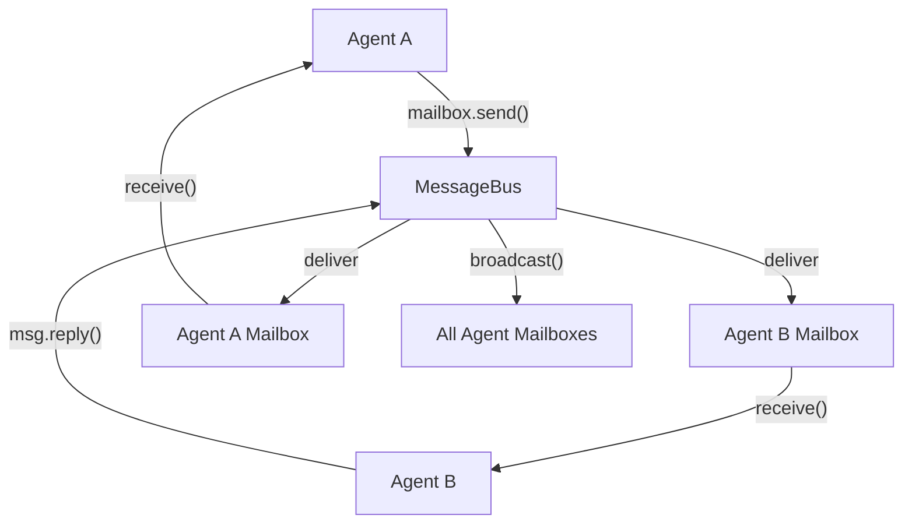

# Agent-to-Agent Messaging

Peer-to-peer async messaging between agents via a shared message bus.

Source: `docs/library/messaging.mdx`

Send messages between agents using a shared `MessageBus`. Each agent gets an `AgentMailbox` for send, receive, broadcast, and peek operations.

## TL;DR

- `MessageBus` is the transport layer — register agents, deliver messages.
- `AgentMailbox` provides per-agent `send()`, `receive()`, `broadcast()`, and `peek()`.
- `AgentMessage` carries sender, recipient, content, correlation ID, priority, and metadata.
- Two backends: `InMemoryMessageBus` (single-process) and `RedisMessageBus` (distributed).
- Messages support request-reply via `message.reply(content)`.

## When to Use

- Agents need to coordinate without parent-child delegation.
- You are building a multi-agent system where peers exchange data.
- You need distributed inter-agent communication across processes.

## Architecture



## Quick Start

```python
from afk.messaging import InMemoryMessageBus

bus = InMemoryMessageBus()

# Register agents
mailbox_a = await bus.register("researcher")
mailbox_b = await bus.register("writer")

# Send a message
await mailbox_a.send("writer", "Please draft a summary of quantum computing")

# Receive the message
msg = await mailbox_b.receive()
print(msg.sender)    # "researcher"
print(msg.content)   # "Please draft a summary of quantum computing"

# Reply
reply = msg.reply("Here's the draft: ...")
await bus.deliver(reply)
```

## Message Fields

| Field            | Type                              | Description                                |
| ---------------- | --------------------------------- | ------------------------------------------ |
| `id`             | `str`                             | Unique message ID (auto-generated)         |
| `sender`         | `str`                             | Sending agent name                         |
| `recipient`      | `str`                             | Target agent name (or `"*"` for broadcast) |
| `content`        | `str \| JSONValue`                | Message payload                            |
| `correlation_id` | `str \| None`                     | Links request and reply messages           |
| `priority`       | `low \| normal \| high \| urgent` | Message priority level                     |
| `timestamp`      | `float`                           | Unix creation timestamp                    |
| `metadata`       | `dict`                            | Arbitrary JSON-safe metadata               |

## Broadcasting

Send a message to all registered agents except the sender:

```python
await mailbox_a.broadcast("System maintenance in 5 minutes")
```

## Backends

### InMemoryMessageBus

- Uses `asyncio.Queue` per agent
- Suitable for single-process systems and testing
- Messages are lost on process exit

### RedisMessageBus

- Uses Redis lists per agent with `BLPOP` for efficient blocking
- Tracks registered agents in a Redis set
- Messages persist across process restarts
- Requires `pip install redis`

```python

from afk.messaging import RedisMessageBus

r = redis.Redis(host="localhost", port=6379)
bus = RedisMessageBus(r)

mailbox = await bus.register("agent_1")
await mailbox.send("agent_2", {"task": "analyze", "data": [1, 2, 3]})
```

## Continue Reading

1. [Architecture](/library/architecture)
2. [Task Queues](/library/task-queues)
3. [Observability](/library/observability)
