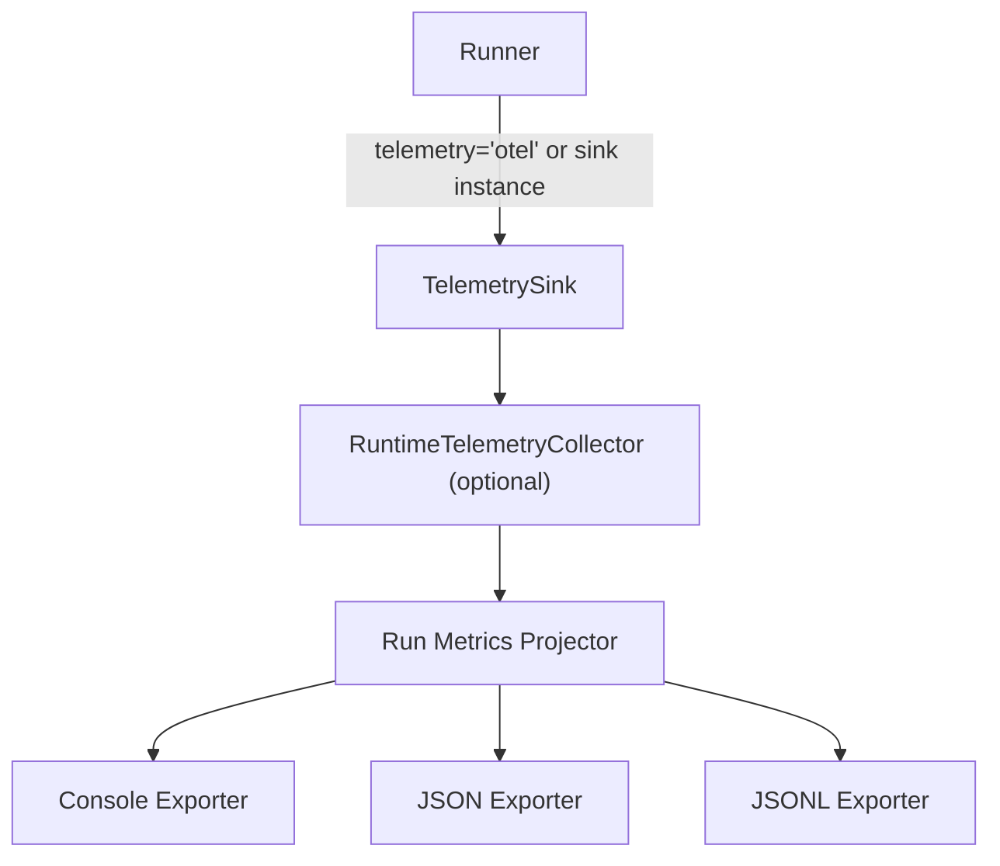

# Observability

Provider-driven telemetry backends, runtime collectors, metrics projectors, and exporters.

Source: `docs/library/observability.mdx`

The observability package is now contract-first and backend-driven. You can pass a sink instance or backend id to `Runner(telemetry=...)`, then project run metrics with dedicated projectors.

## TL;DR

- Telemetry contracts live in `afk.observability.contracts`.
- Register or resolve backends via `afk.observability.backends`.
- Built-in backends: `null`, `inmemory`, `otel`.
- Use `RuntimeTelemetryCollector` to capture telemetry in-process.
- Project metrics with:
  - `project_run_metrics_from_collector(...)`
  - `project_run_metrics_from_result(...)`
- Export metrics with console/JSON/JSONL exporters.

## Backend Model



## Configure Runner Telemetry

```python
from afk.core import Runner

# Built-in backend by id
runner = Runner(telemetry="otel", telemetry_config={
    "service_name": "my-agent-service",
    "tracer_name": "my.service.runner",
    "meter_name": "my.service.runner",
})
```

```python
from afk.core import Runner
from afk.observability.collectors import RuntimeTelemetryCollector

collector = RuntimeTelemetryCollector()
runner = Runner(telemetry=collector)
```

## Project and Export Metrics

```python
from afk.observability.projectors import project_run_metrics_from_collector
from afk.observability.exporters import JSONRunMetricsExporter

metrics = project_run_metrics_from_collector(collector)
JSONRunMetricsExporter(path="run-metrics.json").export(metrics)
```

## Custom Backend Registration

```python
from afk.observability.backends import register_telemetry_backend

class MyBackend:
    backend_id = "mybackend"

    def create_sink(self, *, config=None):
        ...

register_telemetry_backend(MyBackend())
```

## Continue Reading

1. [Architecture](/library/architecture)
2. [Evals](/library/evals)
3. [API Reference](/library/api-reference)
