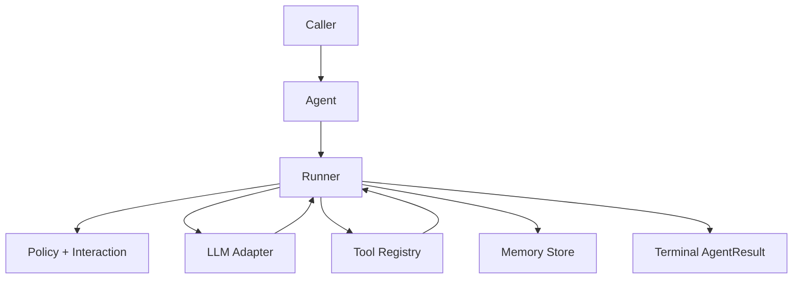

# Library Overview

Learn AFK quickly, then go deep into architecture, behavior, and full API contracts.

Source: `docs/library/overview.mdx`

All examples are embedded as copy-ready scripts and use public SDK imports (`afk.*`) only.

## TL;DR

- Start with the Developer Guide for first implementation.
- Use Agentic Levels to scope capabilities before coding.
- Use Concepts for behavior guarantees and Reference for exact API contracts.

## When to Use

- You are evaluating AFK for a new agentic project.
- You need a single navigation point for docs and examples.
- You want a fast path from onboarding to internals.

## Start Here

    Fast onboarding path for first production-ready agent behavior.

    Structured path from prompted agent to production agentic platform.

    Install AFK skills with `npx skills` and apply them in coding workflows.

    Nine runnable examples with diagrams and extension tips.

    Execution flow, state model, persistence, and safety boundaries.

    Public APIs, contracts, edge cases, and import patterns.

## Prerequisites

- Install SDK: `pip install afk pydantic` (or `uv pip install afk pydantic`)
- Configure provider env vars (`AFK_LLM_ADAPTER`, `AFK_LLM_MODEL`, `AFK_LLM_API_KEY`)
- Optional prompt root: `AFK_AGENT_PROMPTS_DIR=.agents/prompt`
- For a full bootstrap script, use [Developer Guide](/library/developer-guide)

## Concept Progression

1. Runtime model: [Architecture](/library/architecture)
2. Prompt/instruction model: [System Prompts](/library/system-prompts)
3. Tool model: [Tools Walkthrough](/library/tools-system-walkthrough)
4. Governance model: [Tool Call Lifecycle](/library/tool-call-lifecycle)
5. Orchestration model: [Agentic Behavior](/library/agentic-behavior)
6. Durability model: [Checkpoint Schema](/library/checkpoint-schema)
7. Reliability model: [Failure Policy Matrix](/library/failure-policy-matrix)
8. Contract model: [Run Event Contract](/library/run-event-contract)

## Public Imports

```python
from afk.agents import Agent
from afk.core import Runner, RunnerConfig
from afk.llms import create_llm
from afk.tools import tool
from afk import agents, core, llms, tools, memory, evals
```

Avoid importing from `src/...` in application code. Stay on public imports (`afk.*`) for stability across releases.

## Runtime Mental Model



## Read by Goal

    Tool policy gates, deferred approvals, and fallback behavior.

    Router semantics, orchestration flow, and subagent execution records.

    Checkpoint shape, replay behavior, and resume guarantees.

    Request/response lifecycle, structured output, and retries.

    Auto prompt loading, strict templates, and cache-aware reuse.

    Constructor fields, contracts, defaults, and edge-case behavior.

## Choose by Use Case

      Approvals/HITL: Tool Call Lifecycle
      Agent skills: Agent Skills
      AI-assisted coding setup: Building with AI
      System prompts: System Prompts
      Subagent orchestration: Agentic Behavior
      Resume/checkpoints: Checkpoint Schema
      Tool hardening: Security Model

      LLM runtime internals: LLM Interaction
      Full public contract: API Reference
      Full source symbol map: Full Module Reference

## Production Readiness Checklist

  Use the `01_minimal_chat_agent.py` snippet from `/library/examples/index` and keep the first run deterministic.
  Add typed args, policy rules, sandbox restrictions, and output limits.
  Persist checkpoints in non-ephemeral storage and validate resume behavior.
  Add eval scenarios for business-critical tool and policy paths.
