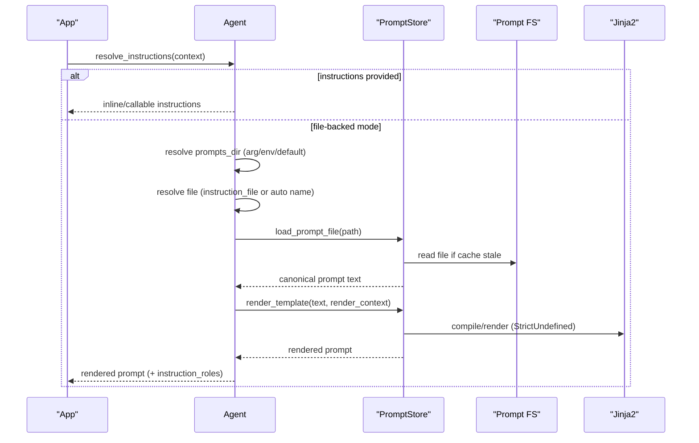
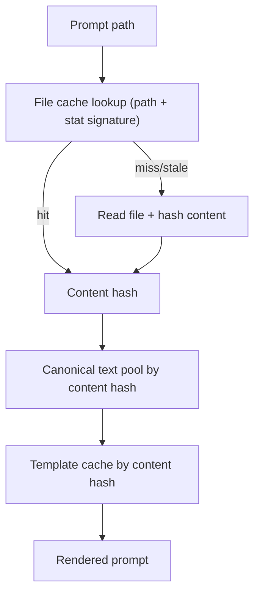

# System Prompts

Auto-load, template, secure, and reuse AFK system prompts with a process-wide prompt store.

Source: `docs/library/system-prompts.mdx`

AFK can load system prompts from files automatically for every `BaseAgent`-based type (`Agent`, `ChatAgent`, and custom subclasses).

Primary code paths:

- [afk/agents/core/base.py](https://github.com/socioy/afk/blob/main/src/afk/agents/core/base.py)
- [afk/agents/prompts/store.py](https://github.com/socioy/afk/blob/main/src/afk/agents/prompts/store.py)
- [afk/agents/errors.py](https://github.com/socioy/afk/blob/main/src/afk/agents/errors.py)

## TL;DR

- `instructions` stays the highest-precedence source.
- `instruction_file` enables explicit file selection under a guarded prompt root.
- If both are missing, AFK auto-loads from agent name (`ChatAgent` -> `CHAT_AGENT.md`).
- Prompt templates are rendered with full Jinja2 + `StrictUndefined`.
- Prompt files and compiled templates are cached process-wide to avoid duplicate memory.

## When to Use

- You want reusable system prompts outside source code
- You need strict context-aware prompt templating
- You need deterministic prompt lookup and failure behavior

## Required Capabilities

- prompt source strategy (`instructions`, `instruction_file`, or auto-name)
- prompt root strategy (`prompts_dir` / `AFK_AGENT_PROMPTS_DIR` / default)
- strict template validation (`StrictUndefined`)
- guarded file access under configured prompt root

## Prompt Source Precedence

| Order | Condition                                        | Behavior                                             |
| ----- | ------------------------------------------------ | ---------------------------------------------------- |
| 1     | `instructions` is set                            | Uses inline string/callable and ignores file loading |
| 2     | `instructions` is `None`, `instruction_file` set | Loads and renders that file                          |
| 3     | both are `None`                                  | Auto-resolves filename from agent name and loads it  |

## Prompt Root Resolution

AFK resolves prompt directory in this order:

1. `agent.prompts_dir`
2. `AFK_AGENT_PROMPTS_DIR`
3. `.agents/prompt`

## Auto Filename Rules

Auto mode maps agent name to `UPPER_SNAKE.md`.

- `ChatAgent` -> `CHAT_AGENT.md`
- `chatagent` -> `CHAT_AGENT.md`
- `BillingReviewerAgent` -> `BILLING_REVIEWER_AGENT.md`

## Runtime Sequence



## Template Context Contract

When AFK renders prompt templates, context includes:

- `context`: full runtime context object
- `ctx`: alias of full runtime context object
- all top-level context keys flattened for direct access
- `agent_name`
- `agent_class`

Reserved keys always win over same-named user context keys:
`context`, `ctx`, `agent_name`, `agent_class`.

Example:

```jinja
You are {{ agent_name }} ({{ agent_class }}).
User={{ user_id }} Locale={{ ctx.locale }} Account={{ context.account_id }}.
```

## Security Model

Prompt file resolution is root-constrained:

- Prompt files must stay under resolved prompt root.
- Path traversal/escape attempts raise `PromptAccessError`.
- Missing prompt files raise `PromptResolutionError`.
- Missing template variables or invalid Jinja raise `PromptTemplateError`.

## Cache Model



Cache guarantees:

- identical prompt text is interned once per process
- compiled Jinja templates are reused by content hash
- file changes are detected via stat signature and reloaded

## Failure Modes

| Scenario                                       | Result                              |
| ---------------------------------------------- | ----------------------------------- |
| `instructions` and `instruction_file` both set | inline/callable `instructions` wins |
| auto prompt file missing                       | `PromptResolutionError`             |
| explicit `instruction_file` missing            | `PromptResolutionError`             |
| `instruction_file` escapes prompt root         | `PromptAccessError`                 |
| template references unknown variable           | `PromptTemplateError`               |
| prompt root env var set but empty              | `PromptResolutionError`             |

## Examples

```python
from afk.agents import Agent

agent = Agent(
    name="ChatAgent",
    model="gpt-4.1-mini",
    prompts_dir=".agents/prompt",
)

result = await agent.call(
    "Summarize today's incidents.",
    context={"user_id": "u-42", "locale": "en-US", "account_id": "acme"},
)
```

Expected auto prompt file:
`.agents/prompt/CHAT_AGENT.md`

## Continue Reading

1. [Agentic System Levels](/library/agentic-levels)
2. [Agent Skills](/library/agent-skills)
3. [Examples: System Prompt Loader](/library/examples/index#09-system-prompt-loader)
