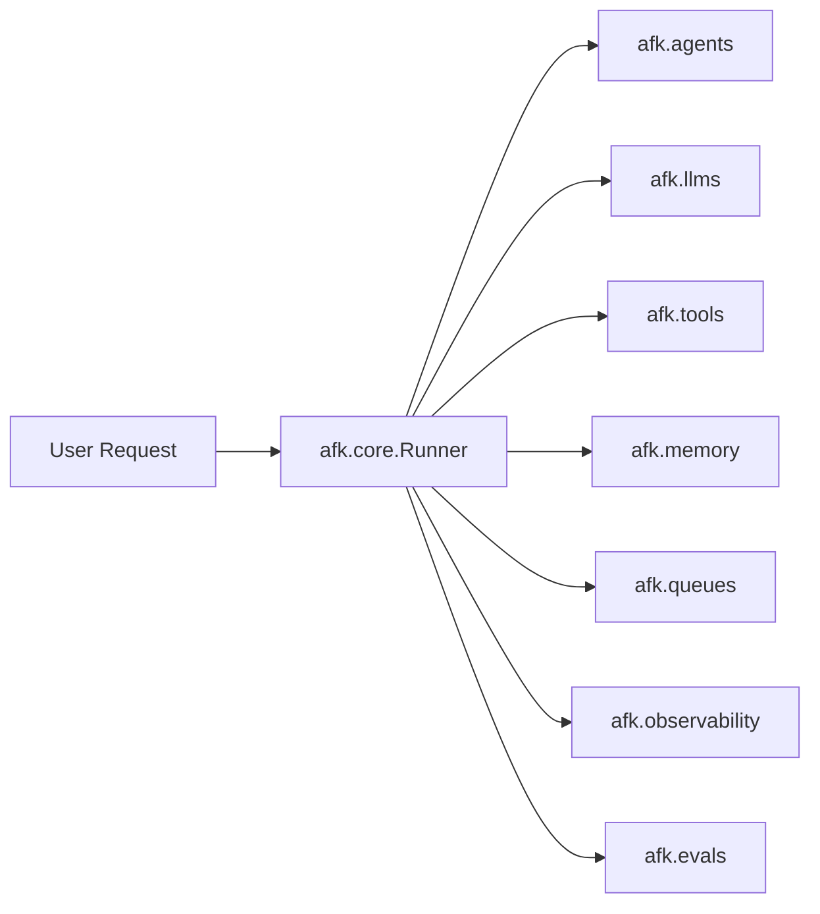

# AFK Python SDK

AFK is a Python SDK for building deterministic, extensible, and observable agent systems. It gives you
a contract-first framework where every boundary between orchestration, LLM providers, tools, and
memory is defined by typed interfaces. Instead of gluing together prompt chains with ad-hoc wrappers,
you declare agents, register tools, and let the runner handle the execution lifecycle -- including
retries, checkpoints, subagent delegation, and telemetry -- so you can focus on what your agent
actually does rather than how it stays alive in production.

<CardGroup cols={2}>
  <Card title="Start Building" icon="rocket" href="/library/quickstart">
    Create your first agent and run it in under five minutes. The quickstart walks you through
    agent definition, tool registration, and a synchronous run.
  </Card>
  <Card title="Understand Internals" icon="cpu" href="/library/architecture">
    Learn how the runner orchestrates LLM calls, tool execution, memory checkpoints, and subagent
    delegation through clearly separated modules.
  </Card>
  <Card title="Ship Safely" icon="shield" href="/library/security-model">
    Apply policy gates, sandbox profiles, secret-scope controls, and secure defaults so your agents
    operate within well-defined safety boundaries.
  </Card>
  <Card title="Operate at Scale" icon="activity" href="/library/observability">
    Instrument agents with structured telemetry, run evals against golden datasets, and offload
    work to queue-backed workers for horizontal scaling.
  </Card>
</CardGroup>

## Install

```bash
pip install the-afk==1.0.0
```

AFK requires Python 3.11 or later. The package installs with minimal dependencies; provider-specific
extras (such as `litellm` or `redis`) can be added as needed.

## Your First Agent

The two primary imports you need are `Agent` (the declarative configuration object) and `Runner`
(the execution engine). An agent describes *what* to do -- which model, which tools, what
instructions. The runner handles *how* -- managing the LLM loop, tool dispatch, memory, and
lifecycle events.

```python
from afk.agents import Agent
from afk.core import Runner

agent = Agent(
    model="openai/gpt-4o",
    name="greeter",
    instructions="You are a helpful assistant. Greet the user by name.",
)

runner = Runner()
result = runner.run_sync(agent, user_message="Hi, my name is Ada.")

print(result.output)
```

`run_sync()` is a convenience wrapper that blocks until the agent produces a terminal result. For
async applications, use `await runner.run(...)` instead. When you need real-time streaming of text
deltas and tool events, use `runner.run_stream(...)`, which returns an async iterator.

## Module Map

AFK is organized into focused packages. Each package owns a single responsibility and communicates
with other packages through typed contracts. This table shows what each package does and when you
will interact with it.

| Package | Responsibility | You use it when... |
|---|---|---|
| `afk.agents` | Agent configuration, policy engine, delegation plans, A2A protocols | Defining agent behavior, subagent graphs, or inter-agent communication |
| `afk.core` | Runner lifecycle, execution loop, streaming, interaction providers | Starting runs, resuming checkpoints, or consuming event streams |
| `afk.llms` | Provider adapters, routing, caching, rate limiting, circuit breakers | Configuring model access, adding middleware, or switching providers |
| `afk.tools` | Tool base classes, registry, hooks, middleware, security profiles | Building tools the agent can call, adding pre/post hooks |
| `afk.memory` | State persistence, retention policies, thread compaction | Persisting conversation state across runs or resuming from checkpoints |
| `afk.queues` | Task queue abstraction, worker lifecycle, backpressure metrics | Offloading agent runs to background workers for scaling |
| `afk.observability` | Telemetry sinks, span models, exporters | Emitting structured traces for debugging or production monitoring |
| `afk.evals` | Evaluation suites, budgets, golden-dataset assertions, reporting | Validating agent quality before deployment |
| `afk.mcp` | MCP server protocol, tool store, discovery | Exposing agent tools over the Model Context Protocol |
| `afk.messaging` | Event bus abstraction for pub/sub messaging | Broadcasting events between decoupled system components |

## System Interaction

The following diagram shows how a user request flows through the AFK module graph. The runner
sits at the center of the architecture: it receives user requests and coordinates every other
module to produce a result.



Each arrow represents a typed contract boundary. The runner never calls provider-specific APIs
directly; it talks to `afk.llms` through the `LLMClient` protocol, to `afk.tools` through the
`ToolRegistry` and `Tool` base class, and to `afk.memory` through the `MemoryStore` interface. This
means you can swap any adapter -- switch from OpenAI to Anthropic, from in-memory state to Redis --
without changing your agent definitions or runner configuration.

The runner also drives the observability and eval modules. Telemetry spans are emitted at each
step of the execution loop, and eval assertions can be run against recorded outputs to validate
agent quality.

<AccordionGroup>
  <Accordion title="Why AFK is structured this way">
    AFK keeps orchestration (`afk.core`) separate from providers (`afk.llms`), execution surfaces
    (`afk.tools`), and persistence (`afk.memory`). This separation exists for a practical reason:
    failure semantics differ across these layers. An LLM timeout should not corrupt memory state.
    A tool validation error should not crash the runner loop. By isolating each concern behind a
    typed contract, AFK lets each module define its own retry, fallback, and error-handling
    behavior while the runner maintains a stable, predictable lifecycle. This also means each
    module can evolve independently -- you can upgrade your LLM provider adapter without touching
    any orchestration or tool code.
  </Accordion>
  <Accordion title="Who this docs set is for">
    Platform engineers, AI product teams, and SDK integrators who need robust control over
    multi-agent behavior, runtime safety, and production diagnostics. Whether you are building a
    single chat assistant or orchestrating a fleet of specialist subagents, these docs cover the
    contracts you need to implement, the configuration knobs available to you, and the operational
    patterns that keep your system reliable. The documentation is also written to be useful for
    coding agents (such as Claude Code or Cursor) that are implementing features within the AFK
    codebase itself.
  </Accordion>
</AccordionGroup>

## Where to Go Next

<Steps>
  <Step title="Walk through the mental model">
    Read the [Mental Model](/library/mental-model) page to understand the core abstractions --
    agents, runner, tools, and memory -- and how they relate to each other before diving into code.
  </Step>
  <Step title="Build your first real agent">
    Follow the [Quickstart](/library/quickstart) to create an agent with tools, run it, and see
    results. This is the fastest path from zero to a working system.
  </Step>
  <Step title="Understand the architecture">
    Read [Architecture](/library/architecture) to learn how modules are separated, where to put
    new code, and how the runtime sequence flows from request to result.
  </Step>
  <Step title="Add tools and subagents">
    Explore the [Tools](/library/tools) and [Agents](/library/agents) pages to register custom
    tools with Pydantic argument models and delegate work to specialist subagents.
  </Step>
  <Step title="Ship to production">
    Review the [Security Model](/library/security-model), [Observability](/library/observability),
    and [Evals](/library/evals) pages to add policy gates, telemetry, and quality validation
    before deploying.
  </Step>
</Steps>
