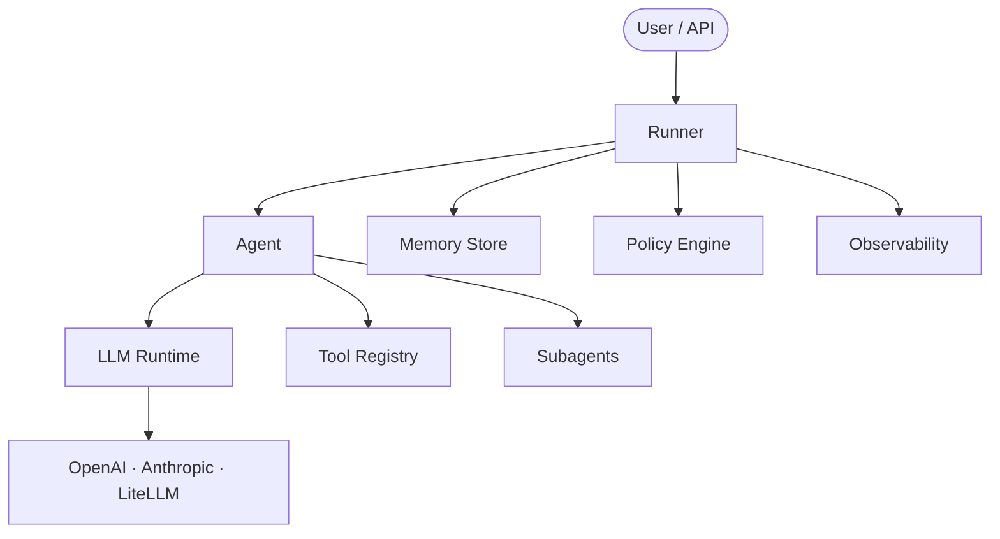

<div className="not-prose mb-8">
  <p className="text-lg text-muted-foreground">
    AFK is the Python SDK for building AI agents that are{" "}
    <strong>reliable by default</strong>. Define agents with typed contracts,
    wire in tools and policies, and ship to production with observability,
    evals, and safety limits built in.
  </p>
</div>

## Install

<Tabs>
  <Tab title="pip">```bash pip install afk ```</Tab>
  <Tab title="poetry">```bash poetry add afk ```</Tab>
  <Tab title="uv">```bash uv add afk ```</Tab>
</Tabs>

> [!NOTE]
> You need an LLM provider API key. Set `OPENAI_API_KEY`, or configure any provider supported by [LiteLLM](https://docs.litellm.ai/docs/providers).

## Your first agent

```python
from afk.agents import Agent
from afk.core import Runner

agent = Agent(
    name="my-agent",
    model="gpt-4.1-mini",
    instructions="You are a helpful assistant. Be concise and accurate.",
)

runner = Runner()
result = runner.run_sync(agent, user_message="What is an error budget in SRE?")
print(result.final_text)   # ← The agent's response
print(result.state)        # ← "completed"
```

<Accordion title="What just happened?">
  1. `Agent(...)` defines the agent — its name, model, and system prompt
  instructions. 2. `Runner()` creates the execution engine with safe defaults
  (headless mode, in-memory state). 3. `run_sync()` sends the user message to
  the LLM, waits for the response, and returns an `AgentResult`. 4. `final_text`
  holds the model's response. `state` tells you how the run ended (`completed`,
  `failed`, `degraded`, or `cancelled`).
</Accordion>

## Add a tool in 30 seconds

```python
from pydantic import BaseModel
from afk.tools import tool

class WeatherArgs(BaseModel):
    city: str

@tool(name="get_weather", description="Get current weather for a city.")
def get_weather(args: WeatherArgs) -> dict:
    return {"city": args.city, "temp_f": 72, "condition": "sunny"}

agent = Agent(
    name="weather-bot",
    model="gpt-4.1-mini",
    instructions="Answer weather questions using your tools.",
    tools=[get_weather],           # ← Attach tools here
)

result = runner.run_sync(agent, user_message="What's the weather in Austin?")
print(result.final_text)           # ← "It's 72°F and sunny in Austin."
```

## What AFK gives you

<CardGroup cols={3}>
  <Card title="Agents" icon="robot" href="/library/agents">
    Define agents with typed inputs, instructions, tools, and subagents.
    Single-agent or multi-agent — you choose.
  </Card>
  <Card title="Runner" icon="play" href="/library/core-runner">
    Execute agents synchronously, asynchronously, or with real-time streaming.
    Pause, resume, cancel at any point.
  </Card>
  <Card title="Tools" icon="wrench" href="/library/tools">
    Give agents capabilities through typed Python functions. Schema validation,
    policy gates, and output sanitization built in.
  </Card>
  <Card title="Memory" icon="database" href="/library/memory">
    Persist conversation state across runs. Resume interrupted runs from
    checkpoints. Compact long threads automatically.
  </Card>
  <Card title="Multi-Agent" icon="sitemap" href="/library/agentic-behavior">
    Orchestrate subagent DAGs with fan-out/fan-in, join policies, and
    backpressure controls.
  </Card>
  <Card title="LLM Layer" icon="sparkles" href="/llms/index">
    Provider-portable LLM runtime with retry, circuit breaking, caching, rate
    limiting, and fallback chains.
  </Card>
  <Card title="Observability" icon="chart-bar" href="/library/observability">
    Built-in telemetry pipeline with spans, metrics, and exporters for console,
    JSON, and OpenTelemetry.
  </Card>
  <Card title="Evals" icon="check-circle" href="/library/evals">
    Behavioral testing framework with assertions, budgets, golden traces, and
    CI-ready reporting.
  </Card>
  <Card title="Security" icon="shield" href="/library/security-model">
    Policy engine, sandbox profiles, tool allowlists, A2A auth, and secret scope
    isolation out of the box.
  </Card>
</CardGroup>

## How it all fits together



## Where to go next

<CardGroup cols={2}>
  <Card title="Quickstart" icon="rocket" href="/library/quickstart">
    Build your first agent with tools and streaming in 5 minutes.
  </Card>
  <Card
    title="Learn in 15 Minutes"
    icon="graduation-cap"
    href="/library/learn-in-15-minutes"
  >
    Hands-on tutorial covering agents, tools, streaming, multi-agent, and
    memory.
  </Card>
  <Card title="Examples" icon="code" href="/library/examples/index">
    Runnable code examples for every major AFK feature.
  </Card>
  <Card title="API Reference" icon="book" href="/library/api-reference">
    Complete import reference organized by task.
  </Card>
</CardGroup>
