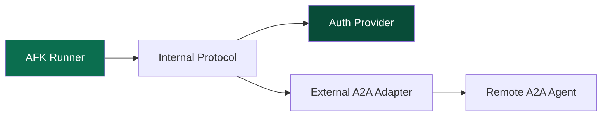
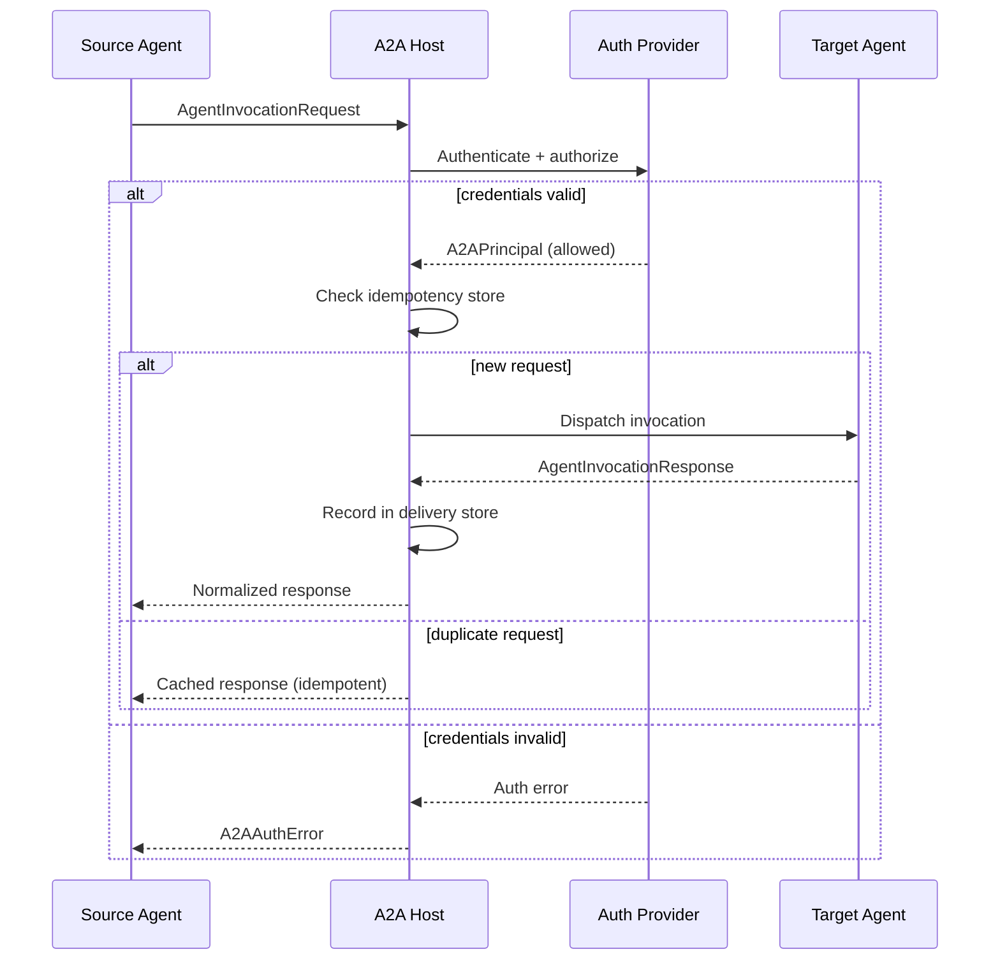

Agent-to-Agent (A2A) communication lets agents invoke other agents — whether they are in the same process, on a different service, or running on a completely separate platform. This is the communication backbone for multi-agent systems that span service boundaries.

AFK's A2A system is built in layers: an internal protocol for in-process communication, an external adapter for cross-service communication, and an authentication layer that sits in front of both.

## A2A Integration Layers

The A2A system is organized into three layers, each with a clear responsibility:



- **AFK Runner** — The runner initiates agent-to-agent communication when it executes a delegation plan. It does not communicate directly with remote agents — it goes through the protocol layer.

- **Internal Protocol** — Handles in-process agent communication. When the target agent is in the same process (the most common case), the protocol dispatches the invocation directly to the runner without any network overhead. Every invocation is wrapped in an `InternalA2AEnvelope` that carries correlation IDs, idempotency keys, and causation chains for tracing.

- **Auth Provider** — Authenticates and authorizes every A2A request, regardless of whether it is internal or external. Even internal calls go through auth to maintain a consistent security model. AFK provides three built-in providers:
  - `AllowAllA2AAuthProvider` — Allows everything. Use only during development.
  - `APIKeyA2AAuthProvider` — Validates API keys from request headers.
  - `JWTA2AAuthProvider` — Validates JWT tokens with configurable claims.

- **External A2A Adapter** — Handles cross-service agent communication. When the target agent is on a different service or platform, the adapter translates AFK's internal protocol into the external A2A wire format, handles network transport, and manages delivery guarantees.

## Request Flow

When an agent invokes another agent through A2A, here is the full lifecycle of the request:



There are several important details in this flow:

**Authentication happens first.** Every request is authenticated before the host even looks at the payload. This prevents unauthorized agents from wasting compute resources.

**Idempotency is built in.** Every `AgentInvocationRequest` carries an `idempotency_key`. If the same request is sent twice (e.g., due to a network retry), the host returns the cached response from the delivery store instead of re-executing the agent. This makes retries safe by default.

**Responses are normalized.** Regardless of whether the target agent is internal or external, the response comes back as an `AgentInvocationResponse` with a consistent structure: `success`, `output`, `error`, and correlation metadata.

**Dead letters are captured.** If a request fails permanently (e.g., target agent does not exist, serialization error), it is recorded as an `AgentDeadLetter` in the delivery store. You can list and inspect dead letters for debugging.

## Invocation Contracts

The A2A protocol is built on two core data structures:

```python
from afk.agents.a2a import AgentInvocationRequest, AgentInvocationResponse

# Sending a request
request = AgentInvocationRequest(
    run_id="run-123",
    thread_id="thread-456",
    conversation_id="conv-789",
    correlation_id="corr-abc",
    idempotency_key="idem-unique-key",
    source_agent="coordinator",
    target_agent="research",
    payload={"topic": "circuit breaker patterns"},
    timeout_s=60.0,
)

# Receiving a response
response = AgentInvocationResponse(
    run_id="run-123",
    thread_id="thread-456",
    conversation_id="conv-789",
    correlation_id="corr-abc",
    idempotency_key="idem-unique-key",
    source_agent="coordinator",
    target_agent="research",
    success=True,
    output={"findings": "Circuit breakers prevent cascading failures..."},
)
```

Every field in these structures serves a tracing or reliability purpose:

| Field | Purpose |
|---|---|
| `run_id` | Ties the invocation to a specific agent run for telemetry |
| `correlation_id` | Connects request and response across async boundaries |
| `idempotency_key` | Ensures duplicate requests return cached results |
| `causation_id` | Links this invocation to the event that caused it (for causal tracing) |
| `timeout_s` | Prevents the calling agent from waiting indefinitely |

## Hosting an A2A Service

To expose your agents to external callers, set up an `A2AServiceHost`:

```python
from afk.agents.a2a import A2AServiceHost, APIKeyA2AAuthProvider

auth = APIKeyA2AAuthProvider(
    valid_keys={"service-key-1", "service-key-2"},
    key_header="X-API-Key",
)

host = A2AServiceHost(
    auth_provider=auth,
    production_mode=True,
)
host.start()
```

The host handles request routing, authentication, idempotency, and dead-letter recording. You register agents with the host, and it dispatches incoming requests to the correct agent based on the `target_agent` field.

In `production_mode=True`, the host enforces strict authentication and rejects requests with missing or invalid credentials. In development mode, you can use `AllowAllA2AAuthProvider` to skip authentication.

## Delivery Guarantees

AFK provides delivery stores that track request outcomes for idempotency and dead-letter handling:

- **`InMemoryA2ADeliveryStore`** — For development and testing. State is lost on restart.
- **`RedisA2ADeliveryStore`** — For production. State is durable across restarts.

The delivery store records:
- Successful responses (keyed by idempotency key) for deduplication
- Dead letters for permanently failed requests

```python
# List dead letters for debugging
dead_letters = await delivery_store.list_dead_letters()
for dl in dead_letters:
    print(f"Failed: {dl.target_agent} - {dl.error}")
```

## Design Guidance

When building A2A-enabled systems:

- **Use internal protocol for in-process agents.** There is no need to use external adapters when all agents are in the same process. The internal protocol is faster and simpler.
- **Always set timeouts.** A2A calls without timeouts can hang indefinitely if the target agent is slow or unresponsive. Set `timeout_s` on every `DelegationNode`.
- **Generate unique idempotency keys.** Use UUIDs or deterministic keys derived from the request content. Reusing idempotency keys across different logical requests will cause incorrect cached responses.
- **Monitor dead letters.** Dead letters indicate systemic problems — misconfigured routing, schema mismatches, or persistent auth failures. Set up alerts on dead-letter counts.
- **Start with `AllowAllA2AAuthProvider` in development**, but switch to `APIKeyA2AAuthProvider` or `JWTA2AAuthProvider` before deploying. Never use `AllowAll` in production.
