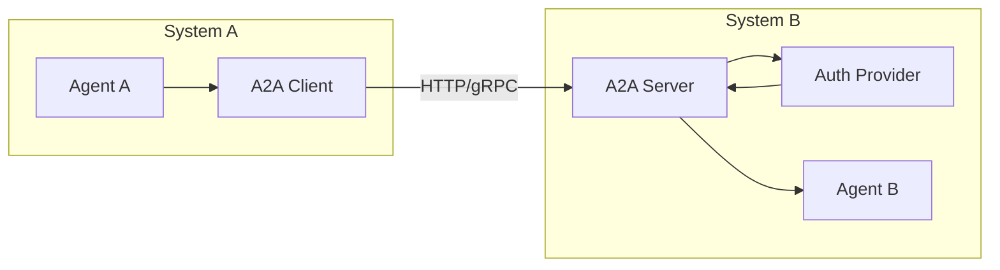

The A2A protocol enables agent communication **across system boundaries** — between services, organizations, or deployment environments. It builds on [internal messaging](/library/messaging) by adding authentication, authorization, and external transport.

## Architecture



## Three integration layers

| Layer                 | What it does                      | When you need it                      |
| --------------------- | --------------------------------- | ------------------------------------- |
| **Internal Protocol** | Typed envelopes with idempotency  | Always (agents in the same system)    |
| **Auth Provider**     | Token validation, caller identity | When agents are in different services |
| **External Adapter**  | HTTP/gRPC transport, discovery    | When agents are in different systems  |

## Request flow

<Steps>
  <Step title="Client builds invocation request">
    ```python
    from afk.a2a import A2AClient, AgentInvocationRequest

    client = A2AClient(base_url="https://agent-b.example.com", auth_token="...")

    request = AgentInvocationRequest(
        target_agent="analyzer",
        user_message="Analyze this dataset",
        context={"source": "system-a"},
        idempotency_key="analysis-42",
    )
    ```

  </Step>
  <Step title="Auth provider validates">
    The server validates the auth token, extracts the caller identity, and checks authorization rules.
  </Step>
  <Step title="Server runs the agent">
    The target agent executes locally with a Runner, using the invocation request as input.
  </Step>
  <Step title="Response returned">
    ```python
    response = await client.invoke(request)
    print(response.final_text)   # Agent's response
    print(response.state)        # "completed"
    print(response.run_id)       # For tracing
    ```
  </Step>
</Steps>

## Invocation contracts

<Tabs>
  <Tab title="Request">
    ```python
    class AgentInvocationRequest(BaseModel):
        target_agent: str  # Which agent to invoke
        user_message: str  # The input message
        context: dict = {}  # Additional context
        idempotency_key: str  # Deduplication key
        timeout_s: float = 60.0  # Max wait time
        thread_id: str | None = None  # For multi-turn
    ```
  </Tab>
  <Tab title="Response">
    ```python
    class AgentInvocationResponse(BaseModel):
        final_text: str  # Agent's response
        state: str  # completed, failed, degraded
        run_id: str  # Unique run identifier
        error: str | None = None  # Error details (if failed)
        usage: UsageAggregate | None  # Token usage
    ```
  </Tab>
</Tabs>

## Hosting an A2A service

Expose your agents as an A2A-accessible service:

```python
from afk.a2a import A2AServer, TokenAuthProvider
from afk.agents import Agent
from afk.core import Runner

# Define the agent
analyzer = Agent(name="analyzer", model="gpt-4.1-mini", instructions="Analyze data.")

# Create auth provider
auth = TokenAuthProvider(
    valid_tokens={"system-a": "token-abc", "system-c": "token-xyz"},
    allowed_agents={"system-a": ["analyzer"], "system-c": ["analyzer"]},
)

# Start the server
server = A2AServer(
    agents={"analyzer": analyzer},
    runner_factory=lambda: Runner(),
    auth_provider=auth,
    host="0.0.0.0",
    port=8080,
)
await server.start()
```

## Security considerations

| Concern              | Mechanism                                                        |
| -------------------- | ---------------------------------------------------------------- |
| **Authentication**   | Token-based (API keys, JWT, OAuth)                               |
| **Authorization**    | Per-agent access control (which callers can invoke which agents) |
| **Idempotency**      | `idempotency_key` prevents duplicate processing on retries       |
| **Rate limiting**    | Configure per-caller request limits                              |
| **Input validation** | All requests validated against `AgentInvocationRequest` schema   |
| **Cost isolation**   | Each invocation has its own `FailSafeConfig` budget              |

<Warning>
  **Always authenticate A2A endpoints.** An unauthenticated A2A server allows
  anyone to invoke your agents, consuming your LLM API credits.
</Warning>

## Next steps

<CardGroup cols={2}>
  <Card title="Task Queues" icon="list-check" href="/library/task-queues">
    Async job processing for long-running work.
  </Card>
  <Card title="MCP Server" icon="plug" href="/library/mcp-server">
    Expose tools via the Model Context Protocol.
  </Card>
</CardGroup>
