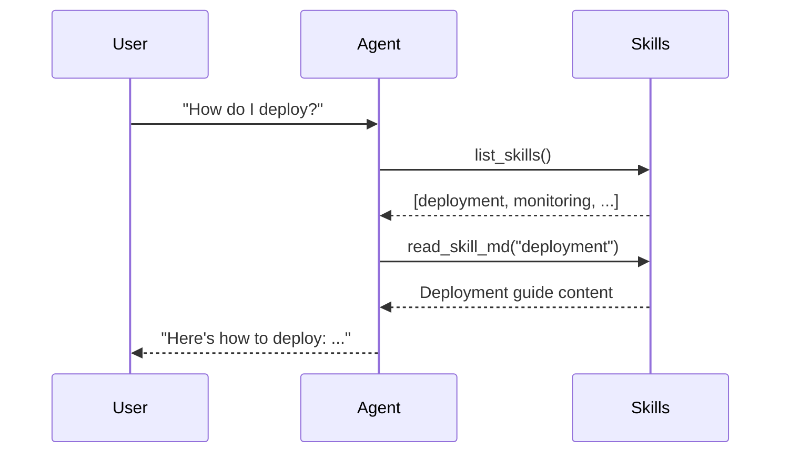

**Skills** are reusable knowledge bundles — directories of instructions, scripts, and resources that extend an agent's capabilities without being hard-coded into the system prompt. Agents discover and read skills at runtime using built-in skill tools.

## When to use skills vs tools

| Feature          | Tools                                               | Skills                                   |
| ---------------- | --------------------------------------------------- | ---------------------------------------- |
| **What it is**   | A Python function the agent calls                   | A directory of knowledge the agent reads |
| **When it runs** | During the agent loop (function execution)          | During the agent loop (file reads)       |
| **Best for**     | Taking actions (API calls, calculations, mutations) | How-to guides, playbooks, reference docs |
| **Schema**       | Typed Pydantic model                                | Unstructured markdown + files            |
| **Side effects** | Yes (executes code)                                 | Read-only (by default)                   |

<Tip>
  **Rule of thumb:** If the agent needs to *do something*, use a tool. If it
  needs to *know something*, use a skill.
</Tip>

## Creating a skill

A skill is a directory with a `SKILL.md` file:

```
skills/
  deployment/
    SKILL.md           # ← Required: main instructions
    scripts/
      deploy.sh        # ← Optional: helper scripts
      rollback.sh
    resources/
      config.yaml      # ← Optional: reference files
```

### SKILL.md format

```markdown SKILL.md
---
name: deployment
description: How to deploy and rollback the application
---

# Deployment Guide

## Prerequisites

- Docker installed
- AWS CLI configured
- Access to the production cluster

## Deploy Steps

1. Build the image: `./scripts/deploy.sh build`
2. Push to registry: `./scripts/deploy.sh push`
3. Rolling update: `./scripts/deploy.sh apply`

## Rollback

Run `./scripts/rollback.sh <version>` to revert to a previous version.

## Monitoring

Check the dashboard at https://monitoring.internal/deployments
```

The YAML frontmatter (`name`, `description`) helps the agent decide which skill is relevant. The markdown body is the knowledge content.

## Registering skills on an agent

```python
from afk.agents import Agent

agent = Agent(
    name="devops-agent",
    model="gpt-4.1-mini",
    instructions="""
    You are a DevOps assistant. Use your skills to help with
    deployment, monitoring, and infrastructure tasks.
    """,
    skills_dir="skills/",   # ← Directory containing skill subdirectories
)
```

AFK scans the `skills_dir` and registers each subdirectory as an available skill. The agent can discover and read skills using built-in tools.

## Built-in skill tools

When an agent has skills, AFK automatically provides these tools:

| Tool                | Purpose                                  | Returns                                   |
| ------------------- | ---------------------------------------- | ----------------------------------------- |
| `list_skills`       | List all available skills                | `[{"name": "...", "description": "..."}]` |
| `read_skill_md`     | Read a skill's SKILL.md                  | Markdown content                          |
| `read_skill_file`   | Read any file in a skill directory       | File content                              |
| `run_skill_command` | Execute a command from a skill's scripts | Command output                            |

### How the agent uses skills



The agent autonomously decides which skills to read based on the user's question. You don't need to explicitly tell it which skill to use.

## Security controls

<AccordionGroup>
  <Accordion title="File access restrictions">
    By default, `read_skill_file` only allows reading files within the skill directory. Path traversal (`../`) is blocked.

    ```python
    # ✅ Allowed: read within skill directory
    read_skill_file("deployment", "scripts/deploy.sh")

    # ❌ Blocked: path traversal
    read_skill_file("deployment", "../../../etc/passwd")
    ```

  </Accordion>
  <Accordion title="Command execution policies">
    `run_skill_command` is gated by policy. You can allowlist specific commands:

    ```python
    from afk.agents import PolicyEngine, PolicyRule

    policy = PolicyEngine(rules=[
        PolicyRule(
            rule_id="skill-commands",
            condition=lambda e: e.tool_name == "run_skill_command",
            action="request_approval",
            reason="Skill commands need approval before execution",
        ),
    ])
    ```

  </Accordion>
  <Accordion title="Read-only mode">
    To disable command execution entirely, only register the read-only skill tools:

    ```python
    agent = Agent(
        name="reader",
        model="gpt-4.1-mini",
        skills_dir="skills/",
        skill_tools=["list_skills", "read_skill_md", "read_skill_file"],
        # ← No run_skill_command
    )
    ```

  </Accordion>
</AccordionGroup>

## Design guidelines

- **One skill per topic.** Keep skills focused (e.g., `deployment`, `monitoring`, `database`) rather than creating one giant knowledge base.
- **Write SKILL.md for the agent, not a human.** The agent reads this file, so be explicit about what to do in each scenario.
- **Include examples.** Show the agent what good output looks like.
- **Version your skills.** Store skills in git alongside your agent code.
- **Gate commands.** Always use policy rules for `run_skill_command`.

## Next steps

<CardGroup cols={2}>
  <Card title="Tools" icon="wrench" href="/library/tools">
    Define typed functions for taking actions.
  </Card>
  <Card title="Security Model" icon="shield" href="/library/security-model">
    Policy gates for tools and skill commands.
  </Card>
</CardGroup>
