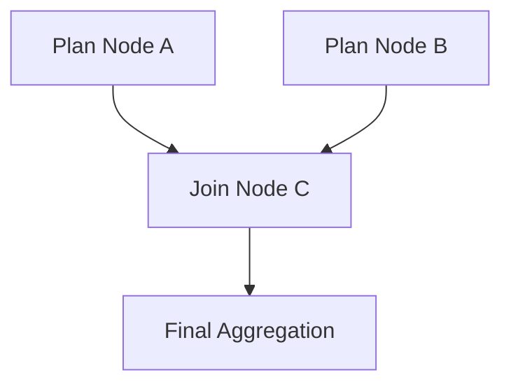

Agentic behavior in AFK refers to the framework's ability to orchestrate multiple agents as a directed acyclic graph (DAG). Instead of running agents one at a time in a linear chain, AFK lets you fan out work to independent specialist agents in parallel, define dependency edges between them, and then fan in their results through a configurable join policy. This model is designed for workloads where different parts of a task can be handled by different agents -- some independently, some depending on earlier results -- and the final answer requires aggregating their outputs in a deterministic way.

The core data structures live in `afk.agents.delegation`: `DelegationPlan`, `DelegationNode`, `DelegationEdge`, and `JoinPolicy`. The runner's `DelegationEngine` takes a plan and executes it, respecting parallelism limits, retry policies, timeouts, and the chosen join strategy.

## Delegation DAG Model



A delegation DAG consists of three kinds of nodes:

- **Independent nodes** have no incoming edges. They are ready to execute immediately when the plan starts. In the diagram above, nodes A and B are independent -- they can run in parallel without waiting for anything.
- **Dependent nodes** have one or more incoming edges. They become ready only after all their upstream nodes have finished successfully. Node C depends on both A and B completing before it can start.
- **Aggregation nodes** serve as fan-in points where multiple upstream results are merged. Node D receives the merged output from C.

Edges carry an optional `output_key_map` that controls how the output of one node is bound into the input of the next. For example, an edge from A to C with `output_key_map={"summary": "a_summary"}` would take the `summary` field from A's output and inject it as `a_summary` in C's input binding.

## Orchestration Pipeline

<Steps>
  <Step title="Plan">
    The delegation plan is constructed either explicitly by your code or by a subagent router that inspects the current conversation state and decides which subagents to dispatch. The plan is a `DelegationPlan` containing a list of `DelegationNode` objects (each targeting a specific agent), a list of `DelegationEdge` objects defining dependencies, a `join_policy`, and a `max_parallelism` limit.

    During this phase, each node is configured with its `target_agent`, `input_binding` (initial data passed to that agent), `timeout_s` (per-node timeout), `retry_policy` (retry attempts and backoff), and whether the node is `required` or optional.
  </Step>
  <Step title="Validate">
    Before execution begins, the engine validates the DAG structure. It rejects plans that contain cycles (which would cause infinite loops), edges referencing nodes that do not exist in the plan, and duplicate node IDs. This validation runs in O(V+E) time using topological sorting and guarantees that the execution phase will not encounter structural errors.
  </Step>
  <Step title="Schedule">
    The engine performs a topological traversal of the DAG and schedules nodes for execution as their dependencies are satisfied. Nodes without incoming edges are scheduled immediately. The engine enforces three parallelism limits simultaneously:

    - `max_parallelism` on the plan itself (how many nodes run concurrently within this delegation)
    - `max_parallel_subagents_per_parent` on the runner (how many subagent tasks a single parent run can have in flight)
    - `max_parallel_subagents_per_target_agent` on the runner (how many concurrent tasks target the same agent)

    Each node execution is dispatched through an `AgentCommunicationProtocol` (typically `InternalA2AProtocol` for in-process agents). If a node fails and has remaining retry attempts, the engine re-enqueues it with exponential backoff governed by `RetryPolicy.backoff_base_s`, `max_backoff_s`, and optional `jitter_s`.
  </Step>
  <Step title="Aggregate">
    Once all nodes have reached a terminal state (completed, failed, cancelled, skipped, or timed out), the engine applies the join policy to determine the overall result. The `DelegationResult` contains a `node_results` dictionary keyed by node ID, an `ordered_outputs` list sorted deterministically by topological order (not completion time), and summary counts (`success_count`, `failure_count`). The `final_status` is one of `completed`, `degraded`, `failed`, or `cancelled`.
  </Step>
</Steps>

## Join Policy Behavior

The join policy controls how the engine determines success or failure of an overall delegation, and when execution can terminate early.

| Join policy | Outcome logic | Early termination |
| --- | --- | --- |
| `all_required` | Fail if any required node fails | No -- waits for all nodes |
| `allow_optional_failures` | Succeed if all required nodes succeed; degrade when optional nodes fail | No -- waits for all nodes |
| `first_success` | Complete as soon as any one node succeeds | Yes -- cancels remaining nodes |
| `quorum` | Complete when `quorum` successful nodes are reached | Yes -- cancels remaining nodes after quorum met |

### `all_required`

The strictest policy. Every node marked `required=True` (the default) must complete successfully. If any required node fails, times out, or is cancelled, the entire delegation fails. Use this when all specialist agents must contribute to a valid result.

```python
plan = DelegationPlan(
    nodes=[
        DelegationNode(node_id="research", target_agent="ResearchAgent"),
        DelegationNode(node_id="analysis", target_agent="AnalysisAgent"),
    ],
    join_policy="all_required",
    max_parallelism=2,
)
# Both agents MUST succeed. If either fails, the delegation fails.
```

### `allow_optional_failures`

A relaxed variant of `all_required`. Required nodes must still succeed, but nodes marked `required=False` are allowed to fail without failing the delegation. When optional nodes fail, the final status is `degraded` rather than `completed`, signaling that the result is partial.

```python
plan = DelegationPlan(
    nodes=[
        DelegationNode(node_id="primary", target_agent="CoreAgent", required=True),
        DelegationNode(node_id="enrichment", target_agent="EnrichmentAgent", required=False),
    ],
    join_policy="allow_optional_failures",
    max_parallelism=2,
)
# If EnrichmentAgent fails, the delegation is "degraded" but not "failed".
```

### `first_success`

An optimistic policy useful for redundancy or racing strategies. The delegation completes as soon as any single node succeeds. Remaining in-flight nodes are cancelled. Use this when you have multiple agents that can answer the same question and you want the fastest response.

```python
plan = DelegationPlan(
    nodes=[
        DelegationNode(node_id="fast_model", target_agent="FastAgent"),
        DelegationNode(node_id="smart_model", target_agent="SmartAgent"),
    ],
    join_policy="first_success",
    max_parallelism=2,
)
# Whichever agent answers first wins. The other is cancelled.
```

### `quorum`

A consensus policy that completes when a specified number of successful results have been collected. Set the `quorum` field on the plan to the required count. This is useful when you need 2-of-3 specialist agents to agree, or when you want majority-rules behavior for validation tasks.

```python
plan = DelegationPlan(
    nodes=[
        DelegationNode(node_id="reviewer_1", target_agent="ReviewAgent"),
        DelegationNode(node_id="reviewer_2", target_agent="ReviewAgent"),
        DelegationNode(node_id="reviewer_3", target_agent="ReviewAgent"),
    ],
    join_policy="quorum",
    quorum=2,
    max_parallelism=3,
)
# Delegation succeeds as soon as 2 of 3 reviewers succeed.
```

## Failure Semantics

Understanding what happens when things go wrong is critical for building reliable multi-agent systems.

### When a required node fails

If a node with `required=True` (the default) exhausts all retry attempts and still fails, the behavior depends on the join policy:

- **`all_required`**: The entire delegation immediately fails. Remaining in-flight nodes may be cancelled.
- **`allow_optional_failures`**: The entire delegation fails (the node is required).
- **`first_success`**: The failure is noted, but the delegation continues as long as other nodes are still running. It only fails if all nodes fail.
- **`quorum`**: The failure is noted. The delegation fails only if it becomes mathematically impossible to reach quorum.

### When an optional node fails

A node with `required=False` that fails does not cause the delegation to fail under any join policy. The node's result is recorded with status `failed`, and the overall `DelegationResult` reflects it in the `failure_count`. Under `allow_optional_failures`, the `final_status` changes from `completed` to `degraded`.

### When a timeout fires

Each `DelegationNode` has a `timeout_s` (default 60 seconds). When a node exceeds its timeout, the node is marked with status `timeout`, which is treated as a failure. Retry attempts, if configured, are tried before the node is considered fully failed. The node-level timeout is independent of any overall wall-clock limits on the parent run.

### When retries are exhausted

The `RetryPolicy` on each node controls retry behavior. `max_attempts=1` (the default) means no retries. When `max_attempts > 1`, the engine retries failed nodes with exponential backoff: wait time = `min(backoff_base_s * 2^attempt + jitter_s, max_backoff_s)`. After all attempts are exhausted, the `DelegationNodeResult` records `attempts` reflecting the total number of tries, along with the final `error` message.

## Backpressure

The runner enforces multiple layers of parallelism control to prevent resource exhaustion when running large delegation plans or nested agent hierarchies.

### Parallelism limits

Three limits are enforced simultaneously by the `DelegationEngine`:

| Limit | Config field | Default | Scope |
| --- | --- | --- | --- |
| Global concurrent subagents | `max_parallel_subagents_global` | 64 | All runs across the entire runner |
| Per-parent concurrent subagents | `max_parallel_subagents_per_parent` | 8 | One parent run's delegation |
| Per-target-agent concurrent tasks | `max_parallel_subagents_per_target_agent` | 4 | Tasks targeting the same agent name |

When a node is ready to execute but all slots are occupied, it waits in the engine's internal queue until a slot opens. The effective parallelism for any single plan execution is `min(plan.max_parallelism, per_parent, global_remaining)`.

### Queue backpressure

The runner has a `subagent_queue_backpressure_limit` (default 512) that caps the number of pending (queued but not yet executing) nodes per parent run. If a delegation plan has more pending nodes than this limit, the engine raises a `DelegationBackpressureError` instead of silently queuing unbounded work. This protects against plans that accidentally create thousands of nodes.

### What happens when limits are hit

When parallelism limits are saturated:

1. Ready nodes that cannot start immediately are queued internally by the engine.
2. As running nodes complete (or fail), queued nodes are dequeued in topological order and started.
3. If the backpressure limit is exceeded, the delegation is rejected with an error before any node executes.
4. Timeouts still apply to queued-but-waiting nodes -- a node's `timeout_s` counts from when it starts executing, not from when it was enqueued.

## Complete Code Example

```python
from afk.agents import (
    Agent,
    DelegationPlan,
    DelegationNode,
    DelegationEdge,
    RetryPolicy,
)
from afk.core.runner import Runner

# Define specialist agents
researcher = Agent(name="Researcher", model="claude-sonnet-4")
analyst = Agent(name="Analyst", model="claude-sonnet-4")
writer = Agent(name="Writer", model="claude-sonnet-4")

# Build a delegation plan: research and analysis run in parallel,
# then the writer synthesizes both results.
plan = DelegationPlan(
    nodes=[
        DelegationNode(
            node_id="research",
            target_agent="Researcher",
            input_binding={"topic": "renewable energy trends"},
            timeout_s=120.0,
            retry_policy=RetryPolicy(max_attempts=2, backoff_base_s=1.0),
        ),
        DelegationNode(
            node_id="analysis",
            target_agent="Analyst",
            input_binding={"topic": "renewable energy market data"},
            timeout_s=120.0,
        ),
        DelegationNode(
            node_id="synthesis",
            target_agent="Writer",
            timeout_s=180.0,
        ),
    ],
    edges=[
        DelegationEdge(
            from_node="research",
            to_node="synthesis",
            output_key_map={"summary": "research_findings"},
        ),
        DelegationEdge(
            from_node="analysis",
            to_node="synthesis",
            output_key_map={"summary": "market_analysis"},
        ),
    ],
    join_policy="all_required",
    max_parallelism=2,
)
```

This plan creates a diamond-shaped DAG: `research` and `analysis` run concurrently (up to `max_parallelism=2`), and `synthesis` waits for both to finish before starting. The `output_key_map` on each edge controls how upstream outputs are threaded into the downstream node's input.
