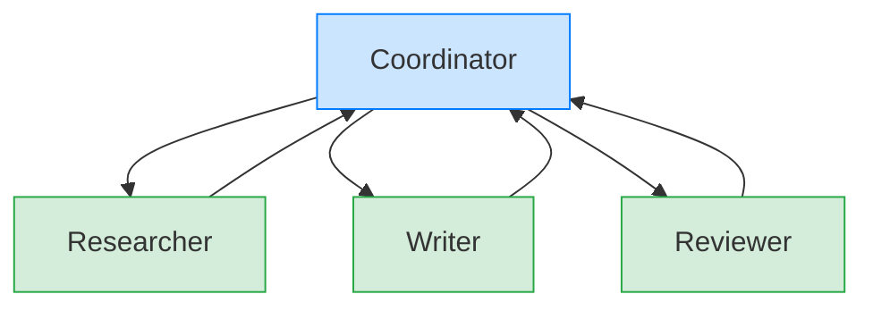

When a single agent isn't enough, AFK lets you orchestrate teams of specialist agents using **delegation DAGs** — directed acyclic graphs where a coordinator fans out work, collects results, and combines them.

## Quick example

```python
import asyncio
from afk.agents import Agent
from afk.core import Runner

# Specialist agents
researcher = Agent(name="researcher", model="gpt-4.1-mini", instructions="Find facts.")
writer = Agent(name="writer", model="gpt-4.1-mini", instructions="Write summaries.")
reviewer = Agent(name="reviewer", model="gpt-4.1-mini", instructions="Review for accuracy.")

# Coordinator
coordinator = Agent(
    name="coordinator",
    model="gpt-4.1-mini",
    instructions="""
    1. Ask 'researcher' for facts
    2. Ask 'writer' to summarize
    3. Ask 'reviewer' to verify
    Combine everything into a final response.
    """,
    subagents=[researcher, writer, reviewer],
)

async def main():
    runner = Runner()
    result = await runner.run(coordinator, user_message="Write a brief on quantum computing")
    print(result.final_text)

asyncio.run(main())
```

## Delegation DAG model



The coordinator makes all delegation decisions. Subagents don't talk to each other directly — they report back to the coordinator, which decides what to do next.

## Orchestration pipeline

<Steps>
  <Step title="Plan">
    The coordinator decides which subagents to call and in what order, based on
    the user's request and its instructions.
  </Step>
  <Step title="Validate">
    AFK validates the delegation request: does the subagent exist? Are the
    arguments valid? Does the policy allow it?
  </Step>
  <Step title="Schedule">
    The subagent is enqueued for execution. With fan-out, multiple subagents can
    run in parallel.
  </Step>
  <Step title="Execute">
    Each subagent runs a full agent loop (LLM calls, tool execution, etc.) and
    returns an `AgentResult`.
  </Step>
  <Step title="Aggregate">
    Results are collected according to the join policy. The coordinator receives
    them and decides whether to delegate more or produce a final response.
  </Step>
</Steps>

## Join policies

When multiple subagents run in parallel (fan-out), the **join policy** controls how the coordinator handles results:

<Tabs>
  <Tab title="all_required (default)">
    All subagents must succeed. Any failure fails the entire delegation batch.

    ```python
    coordinator = Agent(
        name="coordinator",
        subagents=[researcher, writer],
        join_policy="all_required",   # ← Default
    )
    ```

    **Use when:** Every subagent's output is essential for the final result.

  </Tab>
  <Tab title="allow_optional_failures">
    Failures are tolerated. The coordinator proceeds with whatever results are available.

    ```python
    coordinator = Agent(
        name="coordinator",
        subagents=[researcher, writer, fact_checker],
        join_policy="allow_optional_failures",
    )
    ```

    **Use when:** Some subagents provide nice-to-have additions (e.g., fact-checking, sentiment analysis).

  </Tab>
  <Tab title="first_success">
    Return as soon as one subagent succeeds. Cancel the rest.

    ```python
    coordinator = Agent(
        name="coordinator",
        subagents=[fast_model_agent, accurate_model_agent],
        join_policy="first_success",
    )
    ```

    **Use when:** Multiple agents attempt the same task with different strategies. First correct answer wins.

  </Tab>
  <Tab title="quorum">
    Succeed when N out of M subagents complete successfully.

    ```python
    coordinator = Agent(
        name="coordinator",
        subagents=[validator_1, validator_2, validator_3],
        join_policy={"type": "quorum", "min_success": 2},
    )
    ```

    **Use when:** You need consensus from a majority of agents.

  </Tab>
</Tabs>

## Failure handling

| Failure            | `all_required` | `allow_optional_failures` | `first_success`  | `quorum`                      |
| ------------------ | -------------- | ------------------------- | ---------------- | ----------------------------- |
| One subagent fails | ❌ Batch fails | ⚠️ Continue with others   | Continue waiting | Continue if quorum not needed |
| All subagents fail | ❌ Batch fails | ❌ Batch fails            | ❌ Batch fails   | ❌ Batch fails                |
| Timeout            | ❌ Batch fails | ⚠️ Use available results  | ❌ Batch fails   | Depends on completed count    |

## Backpressure

AFK limits concurrent subagent executions to prevent resource exhaustion:

```python
coordinator = Agent(
    name="coordinator",
    subagents=[agent_1, agent_2, agent_3, agent_4, agent_5],
    max_concurrent_subagents=3,   # ← At most 3 run in parallel
)
```

When the concurrency limit is reached, additional subagent calls are queued and execute as slots become available.

## When to use multi-agent delegation

| Scenario                          | Single agent         | Multi-agent         |
| --------------------------------- | -------------------- | ------------------- |
| Simple Q&A or classification      | ✅                   | Overkill            |
| Task needs different expertise    | Consider             | ✅                  |
| Need to parallelize work          | N/A                  | ✅                  |
| Task needs consensus/verification | N/A                  | ✅                  |
| Tight latency budget              | ✅ (fewer LLM calls) | ⚠️ (more LLM calls) |

## Next steps

<CardGroup cols={2}>
  <Card title="Agentic Levels" icon="stairs" href="/library/agentic-levels">
    Capability maturity model — when to add agents.
  </Card>
  <Card title="Architecture" icon="layer-group" href="/library/architecture">
    How orchestration and execution are separated.
  </Card>
</CardGroup>
