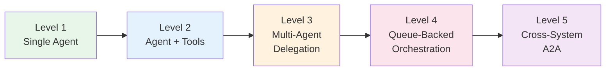

AFK applications span a spectrum of complexity, from a single agent answering questions to multi-system orchestrations that cross process and network boundaries. The agentic levels model provides a structured way to think about where your application sits on this spectrum, what AFK features you need at each stage, and when it makes sense to move to the next level.

This is not a prescriptive framework -- most applications do not need to reach level 5. The goal is to help you choose the right level of complexity for your problem and avoid over-engineering.

## Level Progression



---

## Level 1: Single Agent

**What it means.** A single agent with no tools, no subagents, and no external integrations. The agent receives a user message, generates a response from the LLM, and returns it. This is the simplest possible AFK application.

**When to use it.** Chatbots, Q&A systems, text transformation (summarization, rewriting, translation), or any task where the LLM's parametric knowledge is sufficient.

**AFK features involved.** `Agent`, `Runner.run()` or `Runner.run_sync()`, `AgentResult.final_text`, inline `instructions` or prompt files for system prompts.

```python
from afk.agents import Agent
from afk.core.runner import Runner

agent = Agent(
    name="Greeter",
    model="claude-sonnet-4",
    instructions="You are a friendly assistant. Be concise.",
)
runner = Runner()
result = runner.run_sync(agent, user_message="What is the capital of France?")
print(result.final_text)
# "The capital of France is Paris."
```

**Signals you need the next level.** The agent needs to look up real-time data, call APIs, read files, execute code, or perform any action beyond generating text. When users start asking questions the model cannot answer from its training data alone, it is time to add tools.

---

## Level 2: Agent + Tools

**What it means.** A single agent augmented with tools that let it take actions: calling APIs, querying databases, reading files, running computations. The agent decides which tools to call, the runner executes them, and the results are fed back into the conversation for the LLM to incorporate into its response.

**When to use it.** Any application where the agent needs to interact with external systems or perform actions that require real-time data. Customer support bots that look up order status, coding assistants that run tests, research assistants that search the web.

**AFK features involved.** `Agent(tools=[...])`, `Tool` decorator (`@tool`), `ToolRegistry`, `FailSafeConfig` for tool call limits, `SkillToolPolicy` for command execution constraints.

```python
from afk.agents import Agent
from afk.core.runner import Runner
from afk.tools import tool
from pydantic import BaseModel, Field

class WeatherArgs(BaseModel):
    city: str = Field(description="City name to look up weather for")

@tool(args_model=WeatherArgs)
async def get_weather(args: WeatherArgs) -> dict:
    """Get current weather for a city."""
    # In production, call a real weather API
    return {"city": args.city, "temp_f": 72, "condition": "sunny"}

agent = Agent(
    name="WeatherBot",
    model="claude-sonnet-4",
    instructions="You help users check the weather. Use the get_weather tool.",
    tools=[get_weather],
)
runner = Runner()
result = runner.run_sync(agent, user_message="What's the weather in Seattle?")
print(result.final_text)
print(f"Tools used: {[t.tool_name for t in result.tool_executions]}")
```

**Signals you need the next level.** A single agent is struggling to handle diverse tasks well. Different parts of a request would benefit from agents with different instructions, different models, or different tool sets. You find yourself writing one massive system prompt that tries to cover too many responsibilities, or tool counts are growing past what works well in a single agent context.

---

## Level 3: Multi-Agent Delegation

**What it means.** A parent agent delegates parts of a task to specialized subagents. AFK models this as a DAG (directed acyclic graph) where subagents can run in parallel, have dependencies between them, and their results are aggregated through a join policy. Each subagent has its own instructions, model, and tools.

**When to use it.** Complex workflows where different expertise is needed for different subtasks. A research pipeline where one agent searches, another analyzes, and a third writes. A code review system where one agent checks style, another checks correctness, and a third checks security.

**AFK features involved.** `Agent(subagents=[...])`, `DelegationPlan`, `DelegationNode`, `DelegationEdge`, `JoinPolicy` (`all_required`, `allow_optional_failures`, `first_success`, `quorum`), `SubagentRouter`, `AgentResult.subagent_executions`.

```python
from afk.agents import Agent
from afk.core.runner import Runner

style_checker = Agent(
    name="StyleChecker",
    model="claude-haiku-4",
    instructions="Review code for style issues. Be specific about line numbers.",
)

security_reviewer = Agent(
    name="SecurityReviewer",
    model="claude-sonnet-4",
    instructions="Review code for security vulnerabilities. Focus on injection and auth.",
)

lead_reviewer = Agent(
    name="LeadReviewer",
    model="claude-sonnet-4",
    instructions="You coordinate code reviews. Delegate to your subagents and synthesize.",
    subagents=[style_checker, security_reviewer],
)

runner = Runner()
result = runner.run_sync(lead_reviewer, user_message="Review this PR: ...")
print(result.final_text)
for sub in result.subagent_executions:
    print(f"  {sub.subagent_name}: {'passed' if sub.success else 'failed'}")
```

**Signals you need the next level.** Your agent workloads are long-running (minutes to hours), need to survive process restarts, or need to be distributed across multiple workers. You need durable task queues rather than in-process async execution.

---

## Level 4: Queue-Backed Async Orchestration

**What it means.** Agent runs are submitted to durable task queues and executed by background workers. This decouples the request submission from execution, enables horizontal scaling, provides retry semantics at the infrastructure level, and lets long-running agent tasks survive process restarts through checkpointing and `Runner.resume()`.

**When to use it.** Production systems with high throughput requirements, long-running agent tasks (data processing pipelines, multi-step research), or when you need to scale agent execution across multiple machines. Also useful when agent tasks need to be triggered by external events (webhooks, cron jobs, message buses).

**AFK features involved.** `afk.queues` (task queue abstraction), `Runner.resume()`, `Runner.compact_thread()`, `AgentResult.run_id` and `AgentResult.thread_id` for resumption, checkpoint persistence in `MemoryStore`, `FailSafeConfig` for wall-time limits.

```python
from afk.agents import Agent
from afk.core.runner import Runner
from afk.queues import create_queue, QueueWorker

agent = Agent(
    name="DataProcessor",
    model="claude-sonnet-4",
    instructions="Process and analyze the provided dataset.",
)

# Submit work to a queue
queue = create_queue("redis://localhost:6379/0")
await queue.enqueue({"agent": "DataProcessor", "message": "Analyze Q4 sales data"})

# Worker picks up and executes
runner = Runner()
worker = QueueWorker(queue=queue, runner=runner, agents={"DataProcessor": agent})
await worker.start()

# Resume a previously interrupted run
result = await runner.resume(
    agent,
    run_id="run_abc123",
    thread_id="thread_xyz789",
)
print(result.final_text)
```

**Signals you need the next level.** Your agents need to communicate with agents running in other processes, other services, or other organizations. You need a standardized protocol for cross-boundary agent communication rather than in-process function calls.

---

## Level 5: Cross-System A2A Interoperability

**What it means.** Agents communicate across process and network boundaries using the Agent-to-Agent (A2A) protocol. AFK provides both an internal protocol for in-process communication and adapters for external protocols (such as the Google A2A protocol). Agents can discover, authenticate with, and invoke agents hosted by other services.

**When to use it.** Microservice architectures where different teams own different agents, multi-organization workflows where agents from different companies need to collaborate, or when you need to expose your agents as services that external systems can invoke.

**AFK features involved.** `AgentCommunicationProtocol`, `InternalA2AProtocol`, `GoogleA2AProtocolAdapter`, `A2AServiceHost`, `A2AAuthProvider` (with `AllowAllA2AAuthProvider`, `APIKeyA2AAuthProvider`, `JWTA2AAuthProvider`), `AgentInvocationRequest`, `AgentInvocationResponse`, `AgentProtocolEvent`.

```python
from afk.agents import Agent
from afk.agents.a2a import (
    A2AServiceHost,
    APIKeyA2AAuthProvider,
    GoogleA2AProtocolAdapter,
)
from afk.core.runner import Runner

# Host an agent as an A2A service
agent = Agent(name="TranslationAgent", model="claude-sonnet-4")
runner = Runner()
host = A2AServiceHost(
    agent=agent,
    runner=runner,
    auth_provider=APIKeyA2AAuthProvider(valid_keys=["sk-prod-key-123"]),
)
await host.start(port=8080)

# Invoke a remote agent using the Google A2A adapter
adapter = GoogleA2AProtocolAdapter(
    endpoint="https://partner-service.example.com/a2a",
    api_key="sk-partner-key-456",
)
response = await adapter.invoke(
    AgentInvocationRequest(
        run_id="run_1",
        thread_id="thread_1",
        conversation_id="conv_1",
        correlation_id="corr_1",
        idempotency_key="idem_1",
        source_agent="MyAgent",
        target_agent="PartnerAgent",
        payload={"text": "Translate this to French"},
    )
)
print(response.output)
```

---

## Choosing Your Level

Start at the lowest level that solves your problem. Here is a decision guide:

1. **Can the LLM answer from its own knowledge?** Start at Level 1.
2. **Does the agent need to call APIs, read files, or take actions?** Move to Level 2.
3. **Is a single agent struggling with a task that has clearly separable subtasks?** Move to Level 3.
4. **Do tasks need to survive restarts, scale horizontally, or run for more than a few minutes?** Move to Level 4.
5. **Do agents need to talk to agents in other services or organizations?** Move to Level 5.

Each level builds on the previous one. A Level 3 application still uses tools (Level 2) and single agents (Level 1). The levels are additive, not replacements. You can also mix levels within a single application -- a parent agent at Level 3 might delegate to a subagent that itself is a simple Level 1 agent with no tools.
