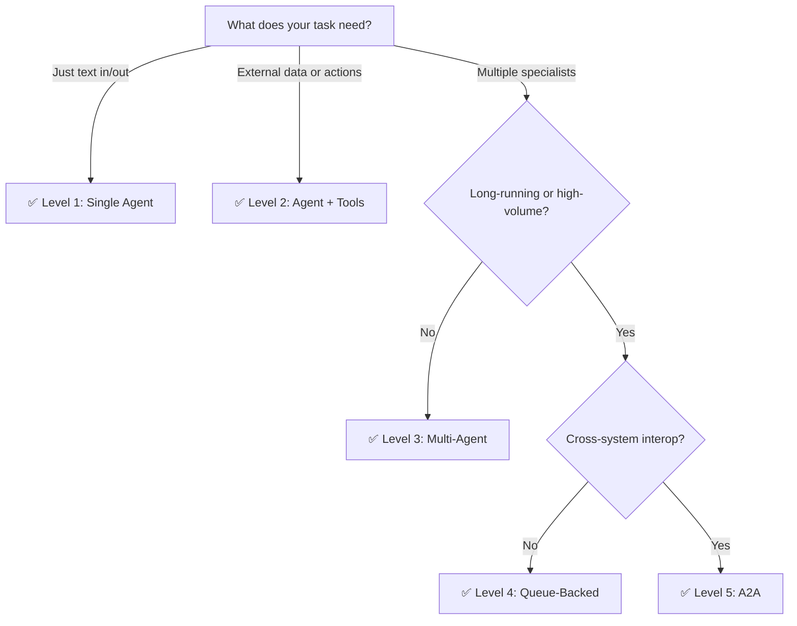

AFK applications progress through five levels of capability. Each level adds features and complexity. Start at Level 1 and move up only when you have clear signals that the current level isn't enough.

## The five levels

<Steps>
  <Step title="Level 1: Single Agent" icon="circle">
    One agent, one model, no tools. The simplest possible setup.

    ```python
    agent = Agent(name="classifier", model="gpt-4.1-mini", instructions="Classify as positive/negative/neutral.")
    result = runner.run_sync(agent, user_message="Great product!")
    ```

    **AFK features used:** `Agent`, `Runner`, `run_sync`

    **Good for:** Text classification, summarization, translation, simple Q&A

    **Move up when:** The agent needs to take actions or access external data

  </Step>

  <Step title="Level 2: Agent + Tools" icon="circle">
    Add typed tool functions for the agent to call.

    ```python
    @tool(name="search", description="Search knowledge base.")
    def search(args: SearchArgs) -> dict: ...

    agent = Agent(name="helper", model="gpt-4.1-mini", tools=[search])
    ```

    **AFK features added:** `@tool`, Pydantic models, `FailSafeConfig`

    **Good for:** RAG, data lookup, calculations, API integrations

    **Move up when:** Different parts of the task need different expertise or models

  </Step>

  <Step title="Level 3: Multi-Agent Delegation" icon="circle">
    Coordinator delegates to specialist subagents.

    ```python
    coordinator = Agent(
        name="coordinator",
        subagents=[researcher, writer, reviewer],
        join_policy="all_required",
    )
    ```

    **AFK features added:** `subagents`, join policies, backpressure

    **Good for:** Complex tasks, parallel work, specialist expertise, consensus

    **Move up when:** Tasks take minutes, need async processing, or need queue-based reliability

  </Step>

  <Step title="Level 4: Queue-Backed Async" icon="circle">
    Decouple producers and consumers with task queues. Long-running jobs execute asynchronously.

    ```python
    queue = TaskQueue(backend="redis")
    await queue.push(TaskItem(contract="runner.chat.v1", agent=agent, user_message="..."))
    ```

    **AFK features added:** `TaskQueue`, `TaskItem`, workers, dead-letter handling

    **Good for:** Batch processing, background jobs, retryable pipelines, high-throughput

    **Move up when:** You need cross-system communication or external agent interop

  </Step>

  <Step title="Level 5: Cross-System A2A" icon="circle">
    Agents communicate across systems using the A2A protocol with authenticated endpoints.

    ```python
    from afk.a2a import A2AClient
    response = await a2a_client.invoke("external-agent", request=invocation_request)
    ```

    **AFK features added:** `A2AClient`, `A2AServer`, auth providers, external adapters

    **Good for:** Microservice agent meshes, third-party integrations, federated AI systems

    **This is the ceiling** — most applications don't need Level 5.

  </Step>
</Steps>

## Capability comparison

| Capability                 | L1  | L2  | L3  | L4  | L5  |
| -------------------------- | --- | --- | --- | --- | --- |
| Text generation            | ✅  | ✅  | ✅  | ✅  | ✅  |
| Tool calling               | —   | ✅  | ✅  | ✅  | ✅  |
| Multi-agent delegation     | —   | —   | ✅  | ✅  | ✅  |
| Async processing           | —   | —   | —   | ✅  | ✅  |
| Cross-system communication | —   | —   | —   | —   | ✅  |
| Policy engine              | ○   | ✅  | ✅  | ✅  | ✅  |
| Observability              | ○   | ○   | ✅  | ✅  | ✅  |
| Evals                      | ○   | ○   | ✅  | ✅  | ✅  |

✅ = essential at this level &nbsp;&nbsp; ○ = recommended &nbsp;&nbsp; — = not applicable

## Decision guide



> [!TIP]
> **Start at Level 1.** The simplest system that works is the best system. Premature complexity is the most common mistake in agent design.

## Signals to level up

| Signal                                          | Current Level | Move to                    |
| ----------------------------------------------- | ------------- | -------------------------- |
| Agent needs external data                       | 1             | 2 — Add tools              |
| One prompt can't cover all expertise            | 2             | 3 — Split into specialists |
| Users waiting too long for results              | 3             | 4 — Queue for async        |
| Tasks fail and need to be retried automatically | 3             | 4 — Queue with DLQ         |
| Other systems need to invoke your agents        | 4             | 5 — Expose A2A             |
| Third-party agents need to use your tools       | 4             | 5 — Use MCP server         |

## Next steps

<CardGroup cols={2}>
  <Card
    title="Agentic Behavior"
    icon="sitemap"
    href="/library/agentic-behavior"
  >
    DAG orchestration, join policies, and fan-out.
  </Card>
  <Card title="Architecture" icon="layer-group" href="/library/architecture">
    How AFK separates orchestration from execution.
  </Card>
</CardGroup>
