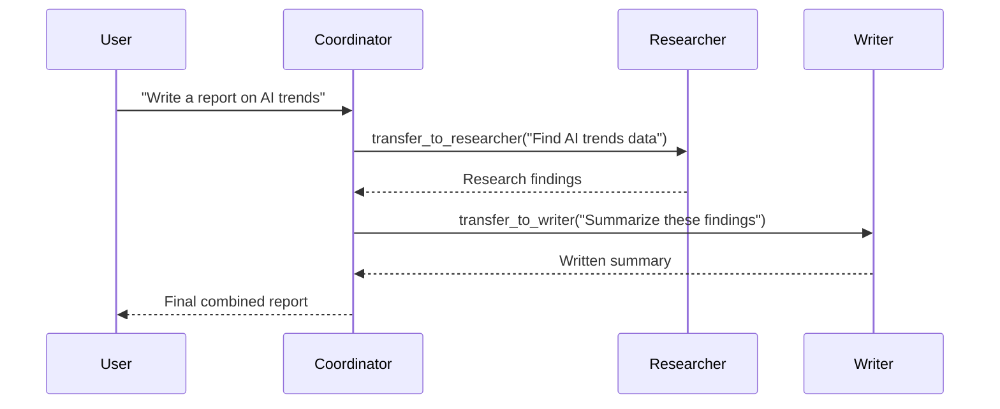

An **Agent** is a configuration object that describes _what_ your AI agent is — its identity, capabilities, and boundaries. Agents don't execute themselves; they're run by a [Runner](/library/core-runner).

## Your first agent

```python
from afk.agents import Agent

agent = Agent(
    name="assistant",                          # ← Identity (used in logs, telemetry)
    model="gpt-4.1-mini",                      # ← Which LLM to use
    instructions="Be helpful and concise.",     # ← System prompt
)
```

That's it. Three fields define a working agent. Everything else is optional.

## Agent fields reference

| Field              | Type                 | Default  | Purpose                                                           |
| ------------------ | -------------------- | -------- | ----------------------------------------------------------------- |
| `name`             | `str`                | required | Agent identity for logs, telemetry, and subagent routing          |
| `model`            | `str` or `LLMClient` | required | LLM model name or pre-built client instance                       |
| `instructions`     | `str`                | `""`     | System prompt — what the agent knows and how it behaves           |
| `instruction_file` | `str`                | `None`   | Path to a `.txt` or `.md` file containing the system prompt       |
| `tools`            | `list[tool]`         | `[]`     | Typed functions the agent can call                                |
| `subagents`        | `list[Agent]`        | `[]`     | Specialist agents this agent can delegate to                      |
| `fail_safe`        | `FailSafeConfig`     | defaults | Step limits, cost budgets, timeout, and failure policies          |
| `context`          | `dict`               | `{}`     | Key-value context available in prompt templates and tool handlers |
| `model_resolver`   | `callable`           | `None`   | Custom function to resolve model names to LLM clients             |

## Single agent vs multi-agent

<Tabs>
  <Tab title="Single agent">
    A single agent handles everything. Best for focused tasks.

    ```python
    agent = Agent(
        name="classifier",
        model="gpt-4.1-mini",
        instructions="""
        Classify the input into one of: positive, negative, neutral.
        Output only the label.
        """,
    )

    result = runner.run_sync(agent, user_message="I love this product!")
    print(result.final_text)  # "positive"
    ```

    **Use when:** The task is well-defined and doesn't need specialized sub-expertise.

  </Tab>
  <Tab title="Multi-agent">
    A coordinator delegates to specialist subagents.

    ```python
    researcher = Agent(
        name="researcher",
        model="gpt-4.1-mini",
        instructions="Find relevant facts. Be thorough.",
    )

    writer = Agent(
        name="writer",
        model="gpt-4.1-mini",
        instructions="Write clear, concise summaries.",
    )

    coordinator = Agent(
        name="coordinator",
        model="gpt-4.1-mini",
        instructions="""
        You manage a team:
        - Delegate research to 'researcher'
        - Delegate writing to 'writer'
        Combine outputs into a final response.
        """,
        subagents=[researcher, writer],
    )
    ```

    **Use when:** Different parts of the task need different expertise, models, or tools.

  </Tab>
</Tabs>

## How subagent delegation works

When an agent has subagents, AFK automatically generates transfer tools (`transfer_to_researcher`, `transfer_to_writer`). The coordinator calls these like any other tool.



Each subagent runs a **full agent loop** with its own model, instructions, and tools. The coordinator sees only the subagent's `final_text`.

## Adding safety limits

Every agent should have a `FailSafeConfig` in production:

```python
from afk.agents import Agent, FailSafeConfig

agent = Agent(
    name="safe-agent",
    model="gpt-4.1-mini",
    instructions="...",
    tools=[...],
    fail_safe=FailSafeConfig(
        max_steps=15,              # Max agent loop iterations
        max_llm_calls=10,          # Max LLM API calls
        max_tool_calls=20,         # Max tool executions
        max_wall_time_s=60.0,      # Max run duration in seconds
        max_total_cost_usd=0.50,   # Max estimated cost

        # What to do when things fail
        llm_failure_policy="degrade",        # "fail" | "degrade"
        tool_failure_policy="continue",      # "fail" | "degrade" | "continue"
        subagent_failure_policy="degrade",   # "fail" | "degrade" | "continue"

        # Fallback model chain for LLM resilience
        fallback_model_chain=["gpt-4.1-mini", "gpt-4.1-nano"],
    ),
)
```

<Warning>
  **Always set `max_total_cost_usd`** in production. A runaway agent loop can
  spend significant API credits in minutes.
</Warning>

## Policy-aware agents

Attach a [PolicyEngine](/library/security-model) to control what the agent can do:

```python
from afk.agents import Agent, PolicyEngine, PolicyRule

policy = PolicyEngine(rules=[
    PolicyRule(
        rule_id="require-approval-for-writes",
        condition=lambda event: event.tool_name and "write" in event.tool_name,
        action="request_approval",
        reason="Write operations need human approval",
    ),
    PolicyRule(
        rule_id="deny-admin-tools",
        condition=lambda event: event.tool_name and "admin" in event.tool_name,
        action="deny",
        reason="Admin tools are disabled in this environment",
    ),
])

runner = Runner(policy_engine=policy)
```

Policy decisions: `allow` (default), `deny`, `request_approval` (human-in-the-loop), or `request_user_input`.

## Design guidelines

- **Start with one agent.** Only add subagents when you have clear evidence that the task needs specialized expertise.
- **Keep instructions focused.** Vague instructions produce vague results. Tell the agent exactly what to do and what not to do.
- **Use typed tools.** Every tool argument should be a Pydantic model. Untyped arguments bypass validation.
- **Set cost limits early.** Add `FailSafeConfig` before your first deployment, not after your first runaway bill.

## Next steps

<CardGroup cols={2}>
  <Card title="Core Runner" icon="play" href="/library/core-runner">
    How agents are executed — lifecycle, API modes, and state management.
  </Card>
  <Card title="Tools" icon="wrench" href="/library/tools">
    Define typed tool functions with validation and policy gates.
  </Card>
</CardGroup>
