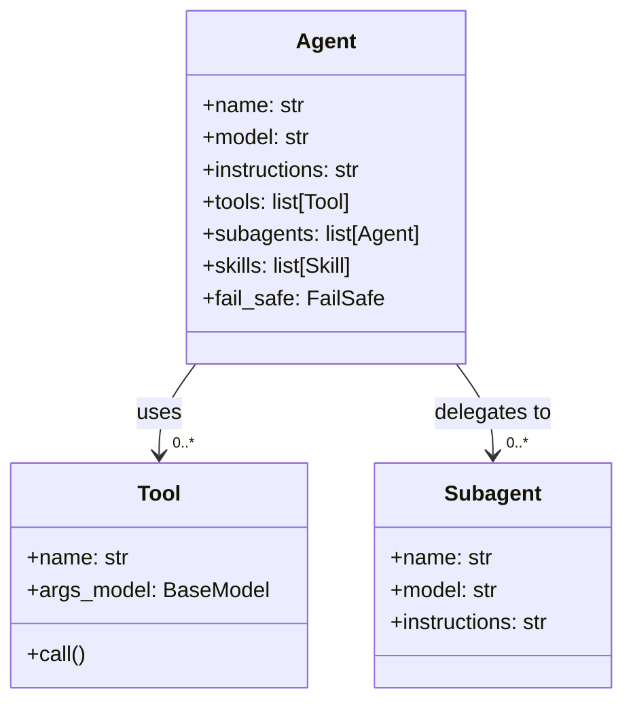
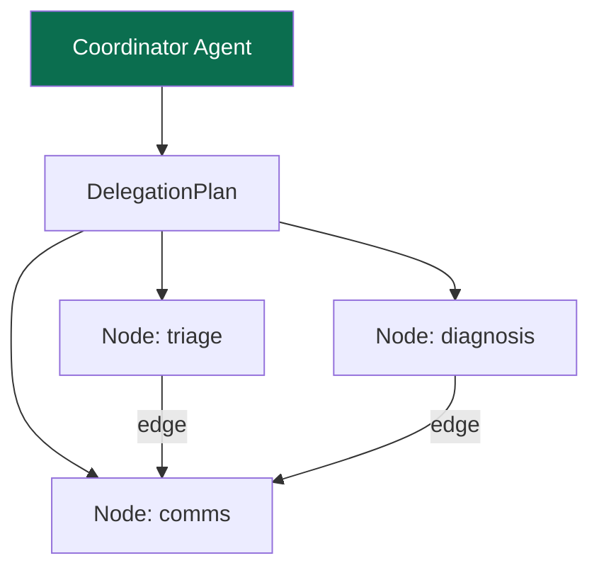

Agents are the central abstraction in AFK. An agent defines *what* the system should do — its instructions, the tools it can use, the subagents it can delegate to, and the model that powers its reasoning. The runner then takes this definition and executes it.

This page explains how agents are composed, when to use single vs. multi-agent architectures, and how to design agents that are safe, debuggable, and maintainable.

## Agent Composition

Every agent in AFK is built from the same set of building blocks:



Here is what each field does:

| Field | Purpose |
|---|---|
| `name` | A unique identifier for this agent. Used in logs, telemetry, and delegation routing. |
| `model` | The LLM model to use (e.g., `"gpt-4.1-mini"`, `"claude-3-5-sonnet"`). |
| `instructions` | A natural language string that tells the agent what it is and how to behave. This is sent as the system prompt. |
| `tools` | A list of typed tools the agent can call. Each tool has a Pydantic args model for schema validation. |
| `subagents` | A list of other agents this agent can delegate to. The agent decides when and what to delegate. |
| `skills` | Reusable capability bundles that can be loaded dynamically. |
| `fail_safe` | Defines what happens when the agent encounters irrecoverable failure. |

The key design principle is that an agent's **capabilities are fully declared in its definition**. You can inspect what an agent can do — which tools it has, which subagents it can call — without running it. This makes agents introspectable, testable, and auditable.

## Single Agent vs. Multi-Agent

Choosing between a single agent and a multi-agent architecture is one of the first decisions you will make. Here is how to decide.

<Tabs>
  <Tab title="Single Agent">

**Use a single agent when:**
- The task is focused and well-defined (e.g., "classify this ticket", "summarize this document")
- You have a limited tool surface (fewer than 5-7 tools)
- The reasoning does not naturally decompose into independent sub-tasks
- You want to minimize latency and complexity

```python
from afk.agents import Agent

support_agent = Agent(
    name="support",
    model="gpt-4.1-mini",
    instructions="You are a support agent. Classify tickets by severity and suggest resolution steps.",
    tools=[lookup_ticket, search_knowledge_base],
)
```

A single agent is the right default. Start here and only add subagents when you have a concrete reason.

  </Tab>
  <Tab title="Multi-Agent">

**Use multiple agents when:**
- The task naturally breaks into sub-tasks with different expertise needs
- Different sub-tasks benefit from different model choices or instruction sets
- You want to parallelize independent work for faster execution
- You need failure isolation — if one sub-task fails, the others should still succeed

```python
triage = Agent(name="triage", model="gpt-4.1-mini", instructions="Classify incident severity.")
diagnosis = Agent(name="diagnosis", model="gpt-4.1-mini", instructions="Identify root cause from logs.")
comms = Agent(name="comms", model="gpt-4.1-mini", instructions="Draft stakeholder updates.")

coordinator = Agent(
    name="coordinator",
    model="gpt-4.1-mini",
    instructions="Delegate to specialists, then synthesize a final incident report.",
    subagents=[triage, diagnosis, comms],
)
```

Each subagent runs in its own context with its own instructions. The coordinator receives their outputs and combines them into a final response.

  </Tab>
</Tabs>

## Policy-Aware Agents

In production systems, agents need guardrails. AFK supports this through policy engines that evaluate whether an action should be allowed, denied, or escalated for human approval.

A policy-aware agent looks the same as any other agent — the policy logic is configured at the runner level, not embedded in the agent definition. This keeps agents focused on their task, while policies are applied consistently across all agents.

```python
from afk.agents import Agent

secure_agent = Agent(
    name="secure-assistant",
    model="gpt-4.1-mini",
    instructions="Answer questions and perform lookups. Never execute destructive actions without explicit approval.",
    tools=[read_database, write_database],
)
```

When this agent tries to call `write_database`, the runner's policy engine evaluates the call. Depending on the policy configuration, it might:

- **Allow** the call if it matches safe patterns
- **Deny** the call if it matches restricted patterns
- **Request approval** from a human operator before proceeding

This separation of concerns — agent defines behavior, policy engine defines boundaries — means you can change security rules without modifying agent code.

## Delegation Patterns

When using multi-agent architectures, AFK supports structured delegation through `DelegationPlan`. This gives you fine-grained control over how subagent tasks are orchestrated.



In this diagram, the coordinator creates a delegation plan with three nodes. `triage` and `diagnosis` can run in parallel (they have no dependency between them), but `comms` depends on both (it needs the severity from triage and the root cause from diagnosis before it can write the stakeholder update).

A delegation plan is composed of:

- **Nodes** — Individual subagent tasks, each with a target agent, input bindings, timeout, and retry policy
- **Edges** — Dependencies between nodes that control execution order
- **Join policy** — How to handle partial failures (`all_required`, `allow_optional_failures`, `first_success`, `quorum`)
- **Parallelism** — How many nodes can run concurrently

```python
from afk.agents.delegation import DelegationPlan, DelegationNode, DelegationEdge

plan = DelegationPlan(
    nodes=[
        DelegationNode(node_id="triage", target_agent="triage", timeout_s=30.0),
        DelegationNode(node_id="diagnosis", target_agent="diagnosis", timeout_s=60.0),
        DelegationNode(node_id="comms", target_agent="comms", timeout_s=30.0, required=True),
    ],
    edges=[
        DelegationEdge(from_node="triage", to_node="comms"),
        DelegationEdge(from_node="diagnosis", to_node="comms"),
    ],
    join_policy="all_required",
    max_parallelism=2,
)
```

The `DelegationResult` tells you exactly what happened: which nodes completed, which failed, how many attempts each took, and the overall status (`completed`, `degraded`, or `failed`).

## Design Guidelines

When designing agents for AFK systems:

- **Keep instructions focused.** An agent should do one thing well. If your instructions are longer than a paragraph, consider splitting into multiple agents.
- **Declare all capabilities explicitly.** Every tool and subagent should be listed in the agent definition. Avoid dynamic tool registration at runtime unless you have a strong reason.
- **Use descriptive names.** Agent names appear in logs, telemetry, and delegation routing. Names like `"triage"` and `"diagnosis"` are more useful than `"agent1"` and `"agent2"`.
- **Test agents in isolation.** Each agent should be testable independently — give it a message, check the output. Multi-agent tests should come after single-agent tests pass.
- **Prefer typed contracts over prompt tricks.** If you need to constrain an agent's behavior, use tools with typed schemas and policy engines — not long instruction strings that hope the LLM complies.
