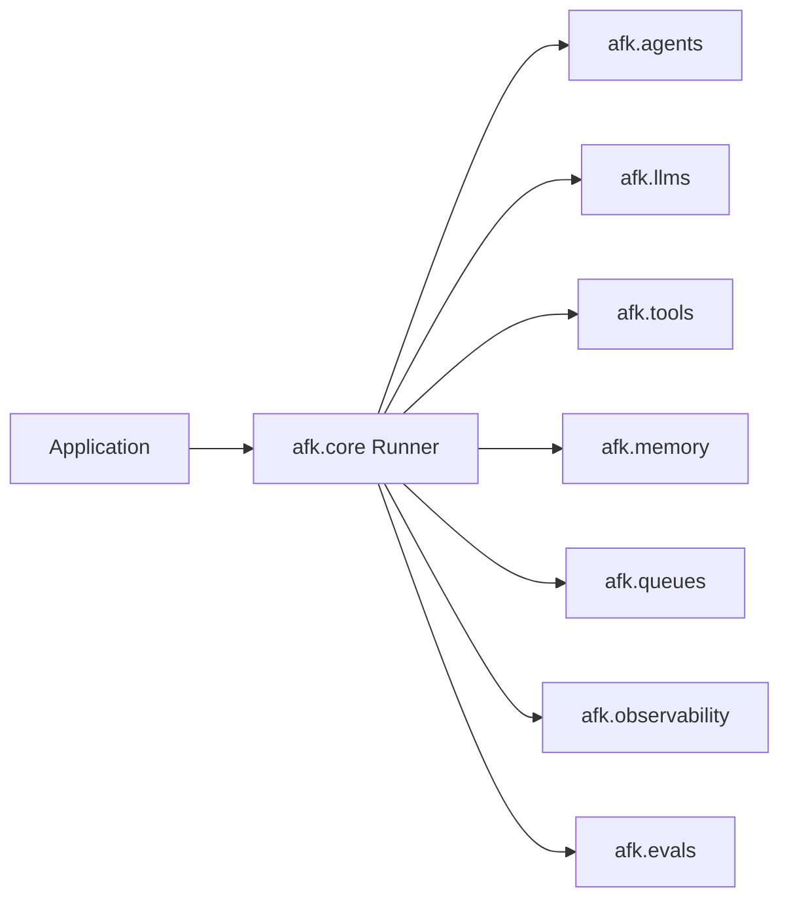
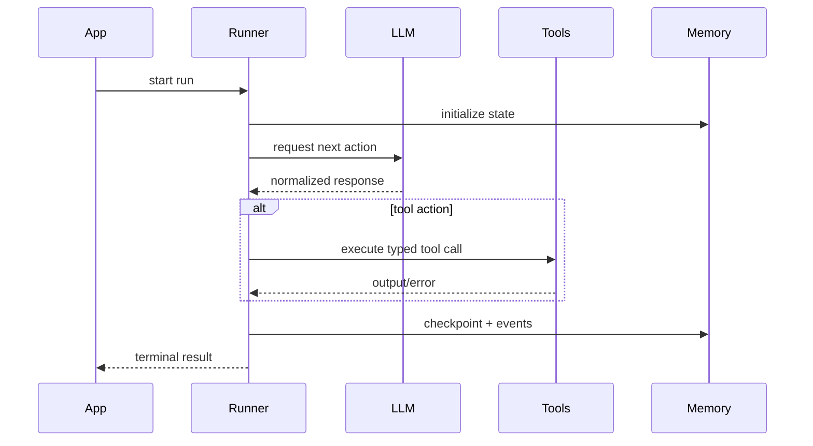

## System Contract

AFK architecture separates **orchestration ownership** from **execution adapters**.

- orchestration owner: `afk.core`
- adapters/providers: `afk.llms`, `afk.tools`, `afk.memory`, `afk.queues`
- assurance: `afk.observability`, `afk.evals`

## Interaction Map

## Runtime sequence

## Builder Checklist

- Keep orchestration decisions in runner/core only.
- Keep provider/tool/backend specifics inside adapter modules.
- Treat unknown/invalid contracts as terminal failures.
- Make telemetry failures non-fatal.

## For Coding Agents

When generating architecture-level changes:

1. never mix orchestration and provider logic in one module
2. add explicit type contracts before behavior
3. include failure path tests for timeout/cancel/invalid payload
