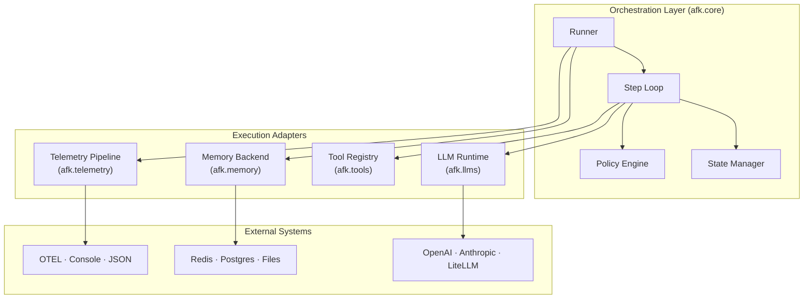
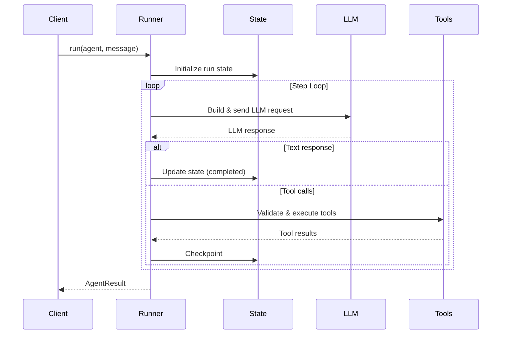
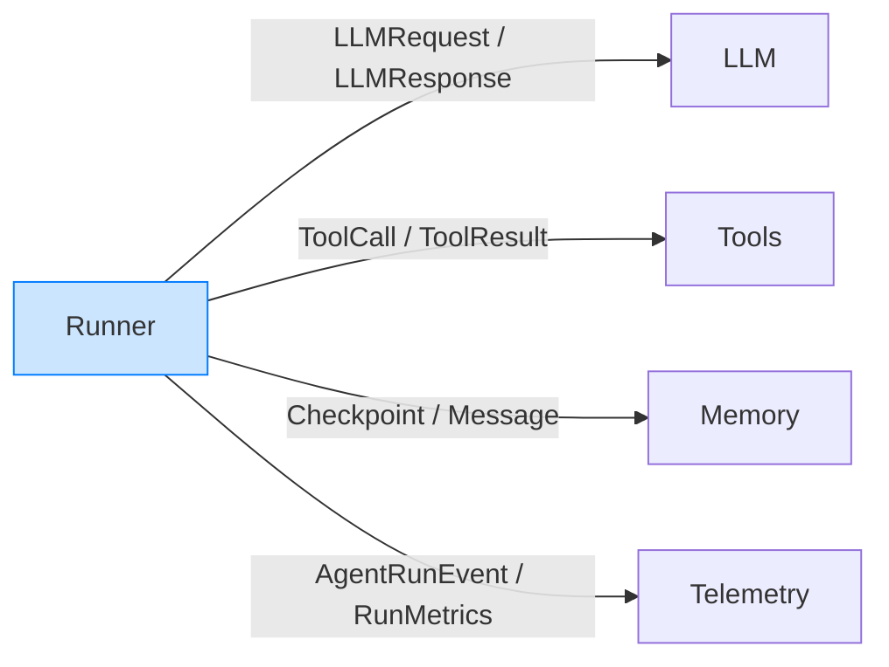

AFK's architecture is built on one principle: **orchestration and execution are separate concerns**. The runner (orchestration) manages the step loop, state, and policies. Adapters (execution) handle LLM calls, tool execution, and external communication. You can swap any adapter without touching your agent code.

## Layered architecture

## Module boundaries

| Module          | Responsibility                                         | Dependencies                                        |
| --------------- | ------------------------------------------------------ | --------------------------------------------------- |
| `afk.agents`    | Agent definition, configuration, fail-safe             | `pydantic`                                          |
| `afk.core`      | Runner, step loop, state management, policies          | `afk.agents`, `afk.llms`, `afk.tools`, `afk.memory` |
| `afk.llms`      | LLM runtime, provider adapters, retry/circuit breaking | Provider SDKs                                       |
| `afk.tools`     | Tool registry, execution, validation, hooks            | `pydantic`                                          |
| `afk.memory`    | State persistence, checkpoints, compaction             | Backend drivers                                     |
| `afk.telemetry` | Event pipeline, metrics, exporters                     | OTEL SDK (optional)                                 |
| `afk.a2a`       | Agent-to-agent protocol, auth, external adapters       | `afk.core`                                          |
| `afk.evals`     | Eval runner, assertions, reporting                     | `afk.core`                                          |

<Note>
  **Key rule:** Modules in the Adapters layer never import from each other.
  `afk.llms` doesn't know about `afk.tools`. Only `afk.core` wires them
  together.
</Note>

## Runtime sequence

What happens when you call `runner.run(agent, user_message="...")`:

## Contract boundaries

Every boundary between modules uses a typed contract:

All contracts are Pydantic models. This means:

- **Validation at boundaries** — malformed data causes clear errors
- **Serializable** — every contract can be logged, stored, or sent over the wire
- **Versionable** — contracts have stable shapes for backward compatibility

## Error isolation

Failures in one adapter don't crash the others:

| Failure              | Impact                         | Runner behavior                         |
| -------------------- | ------------------------------ | --------------------------------------- |
| LLM call fails       | No response for this step      | Retry (if retryable) or fail the run    |
| Tool execution fails | Tool result is an error object | Return error to LLM for self-correction |
| Memory backend fails | State not persisted            | Run continues (degraded mode)           |
| Telemetry fails      | Events not exported            | Run continues (events dropped silently) |

<Tip>
  **Telemetry failures are always silent.** A broken exporter should never block
  an agent run. If telemetry is critical to your use case, add a separate
  monitoring check.
</Tip>

## Design principles

1. **Contracts first.** Define the interface (Pydantic model), then implement the behavior. Never skip the contract.
2. **No cross-adapter imports.** `afk.llms` doesn't import `afk.tools`. Only `afk.core` wires modules together.
3. **Classify failures.** Every error is retryable, terminal, or non-fatal. The runner uses this classification to decide what to do.
4. **Least privilege.** Adapters get only the data they need. LLM adapters don't see tool results until the runner decides to include them.

## Next steps

<CardGroup cols={2}>
  <Card title="LLM Layer" icon="sparkles" href="/llms/index">
    Provider-portable LLM runtime in detail.
  </Card>
  <Card title="Developer Guide" icon="code" href="/library/developer-guide">
    Contribute to AFK — patterns and conventions.
  </Card>
</CardGroup>
