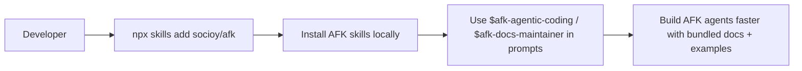

This page is for developers using the AFK SDK with coding agents.

## TL;DR

- Install AFK skills from GitHub using `npx skills`.
- Use the installed skills directly in your coding-agent prompts.
- Docs/context assets are prebuilt and bundled by maintainers.

## When to Use

- You are using AFK with coding agents and want fast onboarding.
- You want prepackaged prompts, references, and examples in one install.
- You do not want to manage docs indexing as an SDK consumer.

## Install Skills

```bash
npx skills add socioy/afk
```

If prompted, select the AFK skills you need:

- `afk-agentic-coding`
- `afk-docs-maintainer`

## Use the Skills

Example prompts:

- `Use $afk-agentic-coding to implement a Level 3 governed AFK agent with typed tools and approvals.`
- `Use $afk-docs-maintainer to refactor docs order and remove duplicated sections.`

## What You Get in the Skill Package

Each AFK skill folder includes:

- `SKILL.md`
- bundled docs references for agent retrieval
- merged `examples.md` generated from AFK snippets
- optional custom scripts/tools when needed by that skill

So SDK users do not need to build assets locally.

## Developer Flow



## Skill Source

- [GitHub: `agent-skill/`](https://github.com/socioy/afk/tree/main/agent-skill)

## Maintainer Note

Maintainers prebuild/bundle docs assets before publishing skills:

```bash
./scripts/build_agentic_ai_assets.sh
```

SDK users should not need this step.

## Continue Reading

1. [Developer Guide](/library/developer-guide)
2. [Agentic System Levels](/library/agentic-levels)
3. [Examples](/library/examples/index)
