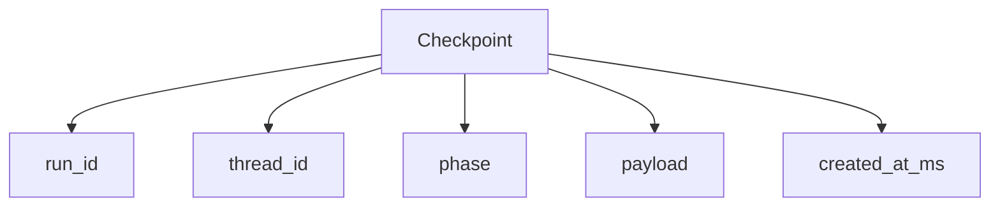

Checkpoints are the persistence mechanism that allows AFK agent runs to survive process
restarts, crashes, and intentional pauses. At key boundaries during execution (step
start, pre-LLM call, post-tool batch, run terminal), the runner writes a checkpoint
record to the memory store. Each checkpoint captures enough state to reconstruct the
execution context and resume from where the run left off.

Checkpoints matter for three reasons:

1. **Fault tolerance** -- If the process crashes mid-run, the latest checkpoint lets you
   resume without re-executing already-completed work.
2. **Human-in-the-loop** -- When a run pauses for approval, the checkpoint preserves
   the full conversation and pending state so the run can resume hours or days later.
3. **Auditability** -- The checkpoint chain provides a step-by-step record of every
   phase the run passed through, useful for debugging and compliance.

## Checkpoint model



### Field reference

| Field | Type | Description |
| --- | --- | --- |
| `run_id` | `str` | Unique identifier for the agent run. Generated at run start or provided when resuming. Used as the primary key for checkpoint lookup. |
| `thread_id` | `str` | Identifier for the conversation thread. Multiple runs can share a thread (for multi-turn conversations). Checkpoints are scoped to `(thread_id, run_id)`. |
| `phase` | `str` | The execution phase when the checkpoint was written. Values include: `run_started`, `step_started`, `pre_llm`, `post_llm`, `pre_tool_batch`, `post_tool_batch`, `pre_subagent_batch`, `post_subagent_batch`, `run_terminal`. |
| `payload` | `dict` | Phase-specific data. The contents vary by phase -- see the payload section below. |
| `created_at_ms` | `int` | Unix timestamp in milliseconds when the checkpoint was written. Used for ordering when multiple checkpoints exist for the same run. |

## Resume behavior

<Steps>
  <Step title="Load latest checkpoint">
    The runner calls `memory.get_state(thread_id, checkpoint_latest_key(run_id))` to
    fetch the most recent checkpoint for the given run. If no checkpoint exists, a
    `AgentCheckpointCorruptionError` is raised.
  </Step>
  <Step title="Validate shape">
    The checkpoint record must be a dict with the required fields (`run_id`,
    `thread_id`, `phase`, `payload`). Missing or malformed fields cause an
    `AgentCheckpointCorruptionError`. The runner also normalizes legacy checkpoint
    formats through `_normalize_checkpoint_record()`.
  </Step>
  <Step title="Check for terminal state">
    If the checkpoint's `phase` is `run_terminal` and the payload contains a
    `terminal_result`, the run is already complete. The runner returns a pre-resolved
    handle with the deserialized `AgentResult` -- no re-execution occurs.
  </Step>
  <Step title="Load runtime snapshot">
    For non-terminal checkpoints, the runner loads the full runtime snapshot which
    contains the conversation messages, counters, usage aggregates, and any pending
    LLM response. This snapshot is used to reconstruct the execution context.
  </Step>
  <Step title="Resume execution">
    The runner calls `run_handle()` with the restored snapshot. Execution continues
    from the step where the run was interrupted. If a `pending_llm_response` exists
    in the snapshot, the runner skips the LLM call and proceeds directly to tool
    execution for that response.
  </Step>
</Steps>

### Resume code example

```python
from afk.agents import Agent
from afk.core import Runner

agent = Agent(name="analyst", model="gpt-4.1-mini", instructions="Analyze data.")
runner = Runner()

# Start a run that might be interrupted
result = await runner.run(agent, user_message="Analyze Q4 revenue trends")

# Later, resume from the checkpoint
resumed_result = await runner.resume(
    agent,
    run_id=result.run_id,
    thread_id=result.thread_id,
)
print(resumed_result.state)  # "completed"
```

## What gets stored in the payload

The `payload` field carries different data depending on the checkpoint `phase`. The
most important payload is the **runtime snapshot** persisted at `step_started` and
`post_llm` phases, which contains everything needed for full resume:

| Payload key | Type | Description |
| --- | --- | --- |
| `messages` | `list[dict]` | Serialized conversation history (system, user, assistant, tool messages). |
| `step` | `int` | Current step counter in the execution loop. |
| `state` | `str` | Current run state (`running`, `degraded`, etc.). |
| `context` | `dict` | Run context dict merged from agent defaults and caller-provided context. |
| `llm_calls` | `int` | Number of LLM calls made so far. |
| `tool_calls` | `int` | Number of tool calls made so far. |
| `started_at_s` | `float` | Unix timestamp when the run originally started. |
| `usage` | `dict` | Token usage aggregate (`input_tokens`, `output_tokens`, `total_tokens`). |
| `total_cost_usd` | `float` | Accumulated estimated cost in USD. |
| `session_token` | `str \| None` | Provider session token for session-aware providers. |
| `checkpoint_token` | `str \| None` | Provider checkpoint token for checkpoint-aware providers. |
| `pending_llm_response` | `dict \| None` | Serialized LLM response that was received but whose tool calls have not yet been executed. On resume, the runner skips the LLM call and processes these tool calls directly. |
| `tool_executions` | `list[dict]` | Serialized `ToolExecutionRecord` entries for all tools executed so far. |
| `subagent_executions` | `list[dict]` | Serialized `SubagentExecutionRecord` entries. |
| `requested_model` | `str` | The model string originally requested by the agent. |
| `normalized_model` | `str` | The model string after resolution and normalization. |
| `provider_adapter` | `str` | The provider adapter type used (e.g., `openai`, `litellm`). |
| `final_text` | `str` | The final text output accumulated so far. |
| `final_structured` | `dict \| None` | Structured output if the LLM returned schema-validated JSON. |

## Phase-specific payloads

Beyond the runtime snapshot, individual phase checkpoints carry lighter payloads:

| Phase | Key payload fields |
| --- | --- |
| `run_started` | `agent_name`, `resumed` |
| `step_started` | `state`, `message_count` |
| `pre_llm` | `model`, `provider`, `message_count` |
| `post_llm` | `model`, `provider`, `finish_reason`, `tool_call_count`, `session_token`, `checkpoint_token`, `total_cost_usd` |
| `pre_tool_batch` | `tool_call_count` |
| `post_tool_batch` | `tool_calls_total`, `tool_failures` |
| `run_terminal` | `state`, `final_text`, `requested_model`, `normalized_model`, `provider_adapter`, `terminal_result` |

## Effect replay and idempotency

When a run resumes and re-enters a tool batch, the runner checks for previously
persisted effect results before re-executing tools. Each tool call's result is stored
with an `input_hash` (derived from tool name and arguments) and an `output_hash`. On
resume, if a matching effect result exists for a tool call ID with a matching input hash,
the stored result is replayed instead of re-executing the tool. This guarantees
idempotent resume for tools with side effects.

The `replayed_effect_count` field in the runtime snapshot tracks how many tool calls
were satisfied from replay rather than fresh execution.

## Common failure scenarios

**Missing checkpoint** -- Calling `runner.resume()` with a `run_id` that has no
checkpoint raises `AgentCheckpointCorruptionError`. This can happen if the memory store
was cleared or the run never persisted its first checkpoint (crashed before
`run_started`).

**Corrupted payload** -- If the checkpoint record exists but is not a valid dict or
is missing required keys, `AgentCheckpointCorruptionError` is raised. The runner does
not attempt partial recovery from corrupted checkpoints.

**Pending LLM response corruption** -- If a checkpoint has `pending_llm_response` set
but the serialized response cannot be deserialized, the runner raises
`AgentCheckpointCorruptionError` rather than making a duplicate LLM call.

**Stale session tokens** -- Provider session tokens stored in checkpoints may expire
between the original run and the resume attempt. The runner passes the stored
`session_token` and `checkpoint_token` to the provider, but the provider may reject
them. In that case, the LLM call fails and follows the normal retry/fallback chain.
