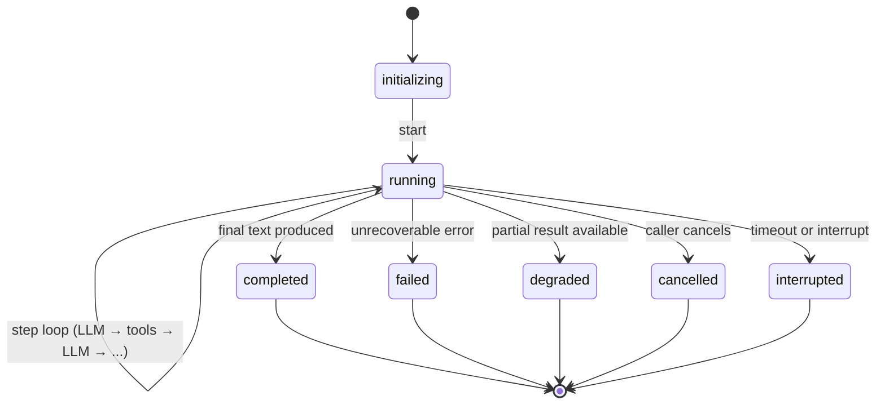

The **Runner** is the execution engine that runs agents. It manages the step loop, LLM calls, tool execution, state persistence, and telemetry. You create a Runner, hand it an Agent, and get back an `AgentResult`.

## Quick example

```python
from afk.agents import Agent
from afk.core import Runner

agent = Agent(name="demo", model="gpt-4.1-mini", instructions="Be helpful.")
runner = Runner()

# Synchronous (simplest)
result = runner.run_sync(agent, user_message="Hello!")
print(result.final_text)
```

## Three API modes

<Tabs>
  <Tab title="Sync">
    Blocks until complete. Best for scripts, tests, and simple integrations.

    ```python
    result = runner.run_sync(agent, user_message="Summarize this doc.")
    print(result.final_text)
    print(result.state)  # "completed"
    ```

  </Tab>
  <Tab title="Async">
    Awaitable. Best for async applications and API servers.

    ```python
    result = await runner.run(agent, user_message="Summarize this doc.")
    print(result.final_text)
    ```

  </Tab>
  <Tab title="Stream">
    Real-time events. Best for chat UIs and CLI tools.

    ```python
    handle = await runner.run_stream(agent, user_message="Summarize this doc.")

    async for event in handle:
        if event.type == "text_delta":
            print(event.text_delta, end="", flush=True)

    result = handle.result
    print(f"\nDone: {result.state}")
    ```

  </Tab>
</Tabs>

## Run lifecycle

Every agent run follows this state machine:



### Terminal states

| State         | Meaning                                  | `final_text`            |
| ------------- | ---------------------------------------- | ----------------------- |
| `completed`   | Run finished successfully                | ✅ Model's response     |
| `failed`      | Unrecoverable error occurred             | ❌ Error message        |
| `degraded`    | Partial result (some failures tolerated) | ⚠️ Best-effort response |
| `cancelled`   | Caller cancelled the run                 | ❌ Empty or partial     |
| `interrupted` | Timeout or external interrupt            | ❌ Empty or partial     |

## The step loop

Each "step" is one iteration of the agent's decision cycle:

<Steps>
  <Step title="Build LLM request">
    The runner constructs an `LLMRequest` with the conversation history, tool
    schemas, and model configuration.
  </Step>
  <Step title="Call the LLM">
    The request is sent through the LLM runtime (with retry, circuit breaker,
    rate limiting, and caching policies).
  </Step>
  <Step title="Process response">
    If the LLM returns **text only** → the run is complete. If it returns **tool
    calls** → proceed to tool execution.
  </Step>
  <Step title="Execute tools">
    Each tool call is validated, policy-checked, executed, and its output is
    sanitized and fed back to the LLM.
  </Step>
  <Step title="Loop or finish">
    The runner returns to Step 1 for the next LLM turn. This continues until the
    model produces a text-only response or a limit is hit.
  </Step>
</Steps>

## Runner configuration

```python
from afk.core import Runner, RunnerConfig

runner = Runner(
    config=RunnerConfig(
        # Safety defaults
        sanitize_tool_output=True,        # Prevent prompt injection from tool output
        tool_output_max_chars=8000,       # Truncate oversized tool responses
        interaction_mode="headless",      # No interactive prompts (for API servers)
    ),

    # Telemetry
    telemetry="console",                  # "console" | "otel" | "json" | None

    # Policy engine
    policy_engine=policy,                 # PolicyEngine instance (optional)
)
```

## Run handles and lifecycle control

For advanced control, use `run_handle()`:

```python
handle = await runner.run_handle(agent, user_message="Long analysis...")

# Monitor events in real time
async for event in handle.events:
    print(f"[{event.type}] {event.message}")

# Lifecycle controls
await handle.pause()      # Pause at next step boundary
await handle.resume()     # Resume execution
await handle.cancel()     # Cancel the run
await handle.interrupt()  # Interrupt mid-LLM-call (if supported)

# Wait for the final result
result = await handle.await_result()
```

## Thread-based memory

Pass a `thread_id` to maintain conversation context across runs:

```python
# Turn 1
r1 = await runner.run(agent, user_message="What is Python?", thread_id="t-123")

# Turn 2 — agent remembers Turn 1
r2 = await runner.run(agent, user_message="How does it compare to Go?", thread_id="t-123")
```

### Resume from checkpoint

```python
# Resume an interrupted run
resumed = await runner.resume(
    agent,
    run_id=result.run_id,
    thread_id=result.thread_id,
)
```

### Compact long threads

```python
# Summarize old messages to control storage growth
await runner.compact_thread(thread_id="t-123")
```

## AgentResult reference

| Field                 | Type                            | Description                                                                   |
| --------------------- | ------------------------------- | ----------------------------------------------------------------------------- |
| `final_text`          | `str`                           | The agent's final response                                                    |
| `state`               | `str`                           | Terminal state: `completed`, `failed`, `degraded`, `cancelled`, `interrupted` |
| `run_id`              | `str`                           | Unique run identifier                                                         |
| `thread_id`           | `str`                           | Thread identifier for memory continuity                                       |
| `tool_executions`     | `list[ToolExecutionRecord]`     | All tool calls with name, success, output, latency                            |
| `subagent_executions` | `list[SubagentExecutionRecord]` | All subagent invocations                                                      |
| `usage`               | `UsageAggregate`                | Token counts and cost estimates                                               |
| `events`              | `list[AgentRunEvent]`           | Full event audit trail                                                        |

## Next steps

<CardGroup cols={2}>
  <Card title="Streaming" icon="signal" href="/library/streaming">
    Real-time event streaming for chat UIs.
  </Card>
  <Card title="Memory" icon="database" href="/library/memory">
    Thread-based state persistence and resume.
  </Card>
</CardGroup>
