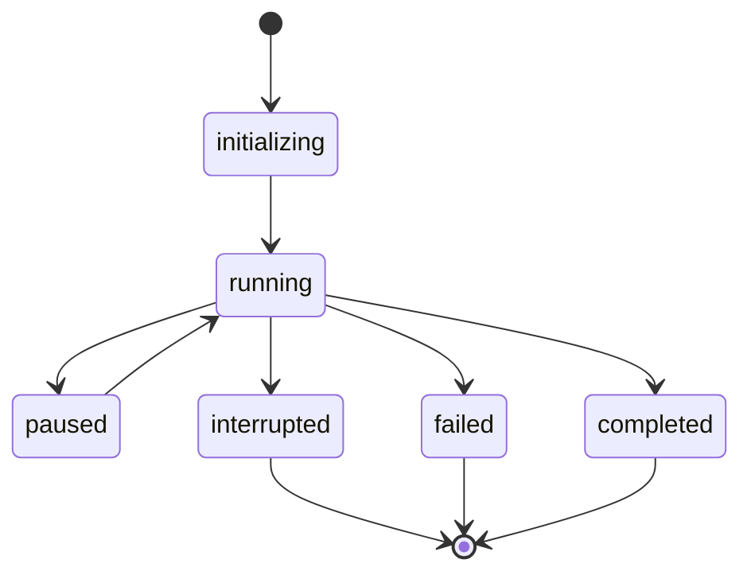
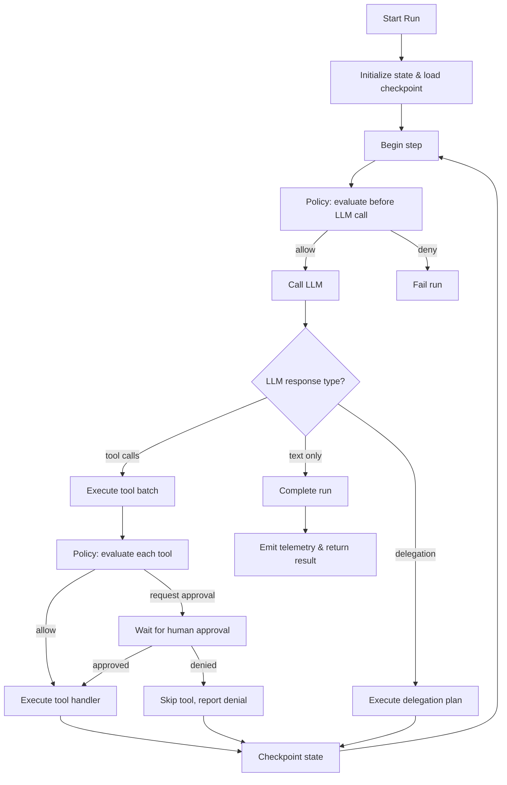

The runner is the execution engine of AFK. It takes an agent definition and a user message, then orchestrates everything needed to produce a result: calling the LLM, executing tools, delegating to subagents, managing state transitions, and emitting telemetry.

While agents define *what* the system should do, the runner defines *how* it happens — safely, auditably, and with deterministic failure semantics.

## Runner Lifecycle

Every agent run goes through a state machine with well-defined transitions. Understanding these states helps you reason about what your agent is doing and how to handle edge cases.



Here is what each state means:

| State | Description |
|---|---|
| `initializing` | The runner is setting up the run — resolving the agent's skills, loading checkpoint state (if resuming), and preparing the execution context. |
| `running` | The runner is actively executing — calling the LLM, processing tool calls, or delegating to subagents. This is where the step loop happens. |
| `paused` | The run is temporarily suspended, typically because it is waiting for human approval or user input. The run can be resumed once the interaction is resolved. |
| `completed` | The run finished successfully. The `AgentResult` contains the agent's final output, all tool executions, and telemetry data. |
| `failed` | The run encountered an irrecoverable error. The `AgentResult` contains the error details. Failures are classified as retryable or terminal. |
| `interrupted` | The run was externally interrupted (e.g., by calling `handle.interrupt()`). In-flight operations are cancelled, and the run terminates cleanly. |

**Key design principle:** The runner is the *only* component that transitions between states. Tools, agents, and LLM providers never change the run state directly. This makes state transitions deterministic and auditable.

## API Modes

AFK provides three ways to run an agent, depending on your application's needs. All three modes execute the same underlying step loop — they differ only in how they return results to you.

<Tabs>
  <Tab title="Sync">

**`run_sync`** — Blocking call that waits for the complete result. Use this for scripts, CLI tools, and any context where you do not need async.

```python
from afk.agents import Agent
from afk.core import Runner

agent = Agent(name="assistant", model="gpt-4.1-mini", instructions="Be concise.")
runner = Runner()

result = runner.run_sync(agent, user_message="Create a rollout checklist")
print(result.final_text)
print(f"State: {result.state}")        # "completed"
print(f"Run ID: {result.run_id}")      # unique run identifier
print(f"Cost: ${result.total_cost_usd}")
```

This is the simplest way to run an agent. Under the hood, it creates an event loop and runs the async version.

  </Tab>
  <Tab title="Async">

**`run`** — Async call that returns the complete result. Use this in async applications (FastAPI, async workers, etc.).

```python
result = await runner.run(agent, user_message="Create a rollout checklist")
```

Functionally identical to `run_sync`, but does not block the event loop. Use this whenever you are already in an async context.

  </Tab>
  <Tab title="Stream">

**`run_stream`** — Returns a stream handle that yields events in real time. Use this for user-facing UIs, progress indicators, or any scenario where you want to see what the agent is doing as it works.

```python
handle = await runner.run_stream(agent, user_message="Explain retry strategy")
async for event in handle:
    if event.type == "text_delta":
        print(event.text_delta, end="", flush=True)
    elif event.type == "tool_started":
        print(f"\n[Calling tool: {event.tool_name}]")
    elif event.type == "tool_completed":
        print(f"\n[Tool {event.tool_name}: {'success' if event.success else 'failed'}]")

result = handle.result
```

The stream handle also gives you control methods: `pause()`, `resume()`, `cancel()`, and `interrupt()`. These let your application react to user actions (e.g., a cancel button) while the agent is running.

  </Tab>
</Tabs>

## The Step Loop

Regardless of which API mode you use, the runner executes the same internal step loop. Understanding this loop is essential for debugging and building advanced integrations.



Each iteration of the step loop:

1. **Evaluates policies** before calling the LLM (can deny the step entirely)
2. **Calls the LLM** with the current conversation history and available tools
3. **Processes the LLM's response** — if it is text, the run is complete; if it contains tool calls, they are executed; if it triggers delegation, subagents are dispatched
4. **Evaluates per-tool policies** and optionally waits for human approval
5. **Executes tool handlers** with validated, typed arguments
6. **Checkpoints state** so the run can be resumed if interrupted
7. **Loops back** for the next step, feeding tool results back to the LLM

## Resume and Compact

For long-running or interruptible workflows, AFK supports resuming from checkpoints and compacting conversation history.

**Resume** picks up a previously interrupted run from its last checkpoint:

```python
result = await runner.resume(
    agent,
    run_id="run-456",
    thread_id="thread-123",
)
```

The runner loads the saved state, restores the conversation history, and continues from where it left off. This is essential for workflows that involve human-in-the-loop approval (where the run pauses and waits), long-running multi-step tasks, or crash recovery.

**Compact** reduces conversation history size for long-running threads:

```python
compaction_result = await runner.compact_thread(
    thread_id="thread-123",
    event_policy=retention_policy,
    state_policy=state_retention_policy,
)
```

Over time, conversation threads accumulate messages. Compaction summarizes older messages to keep the context window manageable without losing important information.

## Runner Configuration

The runner's behavior is controlled through `RunnerConfig`. This is where you set interaction modes, timeout policies, sandbox profiles, and parallelism limits.

```python
from afk.core.runner.types import RunnerConfig

config = RunnerConfig(
    interaction_mode="headless",           # "headless" or "interactive"
    approval_timeout_s=300.0,              # timeout for human approval requests
    approval_fallback="deny",              # what happens if approval times out
    sanitize_tool_output=True,             # sanitize tool output before sending to LLM
    tool_output_max_chars=12_000,          # truncate large tool outputs
    max_parallel_subagents_global=64,      # global subagent concurrency limit
    max_parallel_subagents_per_parent=8,   # per-parent concurrency limit
)

runner = Runner(config=config)
```

Key configuration decisions:

- **`interaction_mode`**: Set to `"headless"` for automated systems (approval requests use the fallback policy). Set to `"interactive"` for applications with a human operator who can approve/deny actions in real time.
- **`approval_fallback`**: Controls what happens when approval times out — `"deny"` is the safe default for production; `"allow"` is useful during development.
- **`max_parallel_subagents_*`**: These limits prevent runaway delegation from overwhelming your system. The backpressure limit (`512` by default) queues excess requests instead of rejecting them.

## How to Think About the Runner

The runner is the **source of truth for run state**. It is the only component that decides pause, resume, cancel, and interrupt semantics. This means:

- **Do not bypass the runner to call LLM providers directly** in orchestration flows. The runner needs to see every LLM call to maintain state consistency, apply policies, and emit telemetry.
- **Checkpoint after meaningful lifecycle transitions.** If the runner crashes between a tool execution and a checkpoint, the tool might run again on resume. Design your tools to be idempotent.
- **Classify failure semantics explicitly.** When a tool or subagent fails, AFK needs to know whether the failure is retryable (transient network error) or terminal (invalid credentials). This classification drives retry behavior and affects the final run state.
