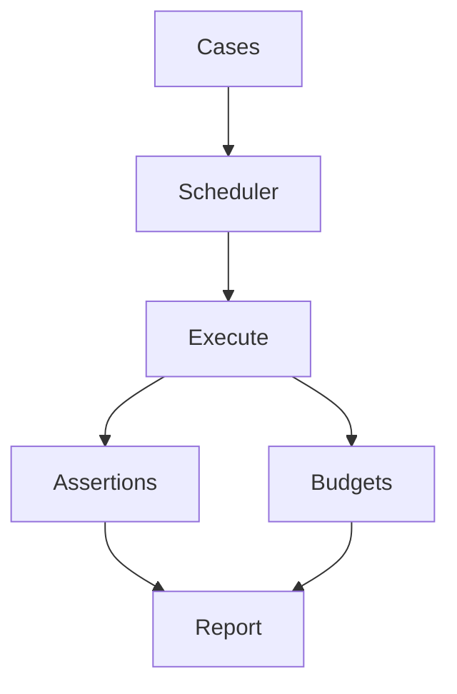

## Eval lifecycle



## Better example

```python
from afk.evals import run_suite

suite = run_suite(
    cases=[...],
    config={"execution_mode": "adaptive", "max_concurrency": 8, "fail_fast": False},
)
print(suite.summary)
```

## Release-gate usage

- block deploy when fail rate exceeds threshold
- block deploy on budget regressions
- store suite report as CI artifact

## For Coding Agents

Generate evals with:

1. happy-path case
2. failure-path case
3. timeout/interruption case
4. cost or latency budget case
