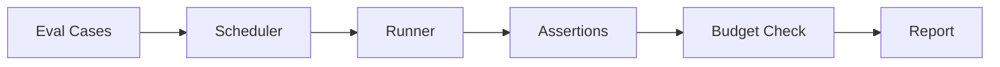

AFK's eval framework tests agent behavior with real LLM calls. Define test cases, run them against your agents, and gate releases on pass rate. Think of evals as integration tests for AI — they verify that prompts, tools, and orchestration produce correct behavior.

## Your first eval

```python
from afk.agents import Agent
from afk.core import Runner
from afk.evals import run_suite
from afk.evals.models import EvalCase, EvalBudget

agent = Agent(
    name="classifier",
    model="gpt-4.1-mini",
    instructions="Classify as: billing, technical, account, other. Output only the label.",
)

suite = run_suite(
    runner_factory=lambda: Runner(),
    cases=[
        EvalCase(
            name="billing-question",
            agent=agent,
            user_message="Why was I charged twice?",
            assertions=[lambda r: r.final_text.strip().lower() == "billing"],
        ),
        EvalCase(
            name="technical-question",
            agent=agent,
            user_message="The API returns a 500 error",
            assertions=[lambda r: r.final_text.strip().lower() == "technical"],
        ),
    ],
)

print(f"Passed: {suite.passed}/{suite.total}")
assert suite.failed == 0
```

## Eval lifecycle



<Steps>
  <Step title="Define cases">
    Each case specifies an agent, input message, and assertions to verify.
  </Step>
  <Step title="Schedule execution">
    The scheduler runs cases sequentially or in parallel, respecting concurrency
    limits.
  </Step>
  <Step title="Run agents">
    Each case runs through a full agent loop with real LLM calls.
  </Step>
  <Step title="Assert results">
    Assertions verify the result — text content, state, tool usage, cost,
    latency, etc.
  </Step>
  <Step title="Check budgets">
    Budget limits gate individual case costs and the total suite cost.
  </Step>
  <Step title="Generate report">
    Pass/fail results, assertion details, and metrics are collected into a
    report.
  </Step>
</Steps>

## Eval case types

<Tabs>
  <Tab title="Happy path">
    Verify correct behavior under normal conditions.

    ```python
    EvalCase(
        name="basic-greeting",
        agent=agent,
        user_message="Hello!",
        assertions=[
            lambda r: r.state == "completed",
            lambda r: len(r.final_text) > 0,
        ],
    )
    ```

  </Tab>
  <Tab title="Failure path">
    Verify graceful handling of errors and edge cases.

    ```python
    EvalCase(
        name="invalid-input",
        agent=agent,
        user_message="",
        assertions=[
            lambda r: r.state in ("completed", "degraded"),
        ],
    )
    ```

  </Tab>
  <Tab title="Tool usage">
    Verify that the agent uses tools correctly.

    ```python
    EvalCase(
        name="uses-search",
        agent=agent,
        user_message="Find docs about caching",
        assertions=[
            lambda r: any(t.tool_name == "search_docs" for t in r.tool_executions),
            lambda r: r.state == "completed",
        ],
    )
    ```

  </Tab>
  <Tab title="Budget-constrained">
    Verify that the agent stays within cost limits.

    ```python
    EvalCase(
        name="within-budget",
        agent=agent,
        user_message="Analyze this dataset",
        budget=EvalBudget(max_total_cost_usd=0.05, max_steps=5),
        assertions=[
            lambda r: r.usage.total_cost_usd <= 0.05,
        ],
    )
    ```

  </Tab>
</Tabs>

## Assertions

Assertions are functions that take an `AgentResult` and return `True` (pass) or `False` (fail):

```python
# Text content assertions
lambda r: "error budget" in r.final_text.lower()
lambda r: len(r.final_text) < 500

# State assertions
lambda r: r.state == "completed"
lambda r: r.state != "failed"

# Tool usage assertions
lambda r: len(r.tool_executions) > 0
lambda r: all(t.success for t in r.tool_executions)

# Cost assertions
lambda r: r.usage.total_cost_usd < 0.10
```

## Suite configuration

```python
from afk.evals.models import EvalSuiteConfig

config = EvalSuiteConfig(
    max_concurrency=3,         # Run up to 3 cases in parallel
    fail_fast=True,            # Stop on first failure
    timeout_per_case_s=60.0,   # Max time per case
    total_budget=EvalBudget(
        max_total_cost_usd=1.00,  # Total suite budget
    ),
)

suite = run_suite(
    runner_factory=lambda: Runner(),
    cases=cases,
    config=config,
)
```

## CI integration

Run evals in your CI pipeline to gate releases:

```yaml
# .github/workflows/evals.yml
name: Agent Evals
on: [pull_request]

jobs:
  eval:
    runs-on: ubuntu-latest
    steps:
      - uses: actions/checkout@v4
      - run: pip install afk
      - run: python -m pytest tests/evals/ -v
        env:
          OPENAI_API_KEY: ${{ secrets.OPENAI_API_KEY }}
```

<Tip>
  **Set a budget for CI evals.** Without a budget, a broken prompt can drain
  your API credits during a CI run. Use `EvalBudget(max_total_cost_usd=2.00)` as
  a reasonable CI limit.
</Tip>

## Release gating

Gate releases on eval pass rate:

```python
suite = run_suite(runner_factory=lambda: Runner(), cases=cases)

if suite.pass_rate < 0.95:
    print(f"Release blocked: {suite.pass_rate:.0%} pass rate (need 95%)")
    sys.exit(1)

print(f"Release approved: {suite.pass_rate:.0%} pass rate")
```

## Next steps

<CardGroup cols={2}>
  <Card title="Security Model" icon="shield" href="/library/security-model">
    Security boundaries and production hardening.
  </Card>
  <Card title="Building with AI" icon="hammer" href="/library/building-with-ai">
    Production playbook with anti-patterns.
  </Card>
</CardGroup>
