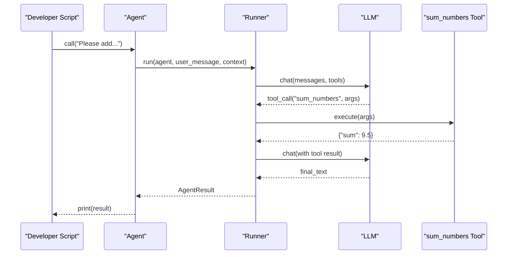
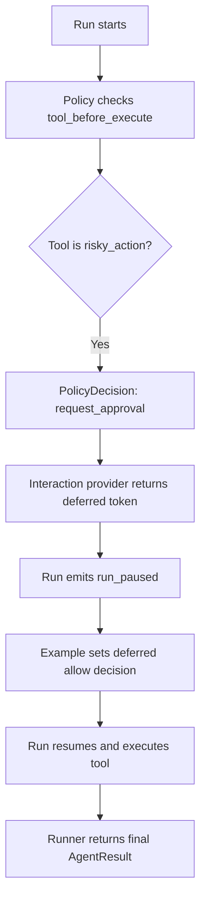
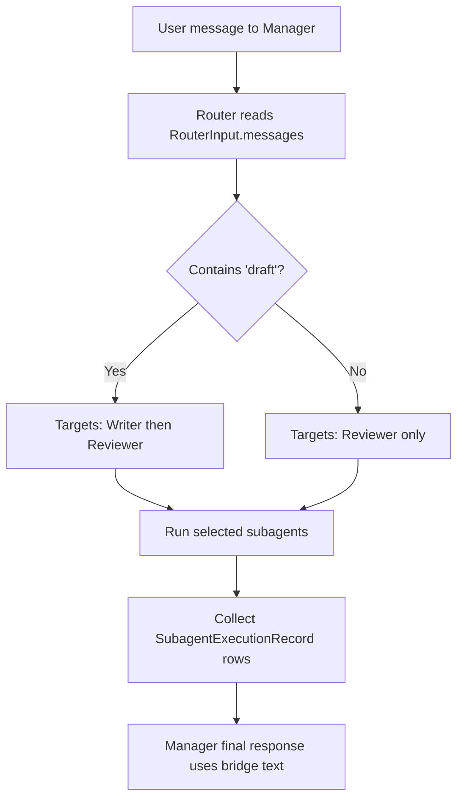
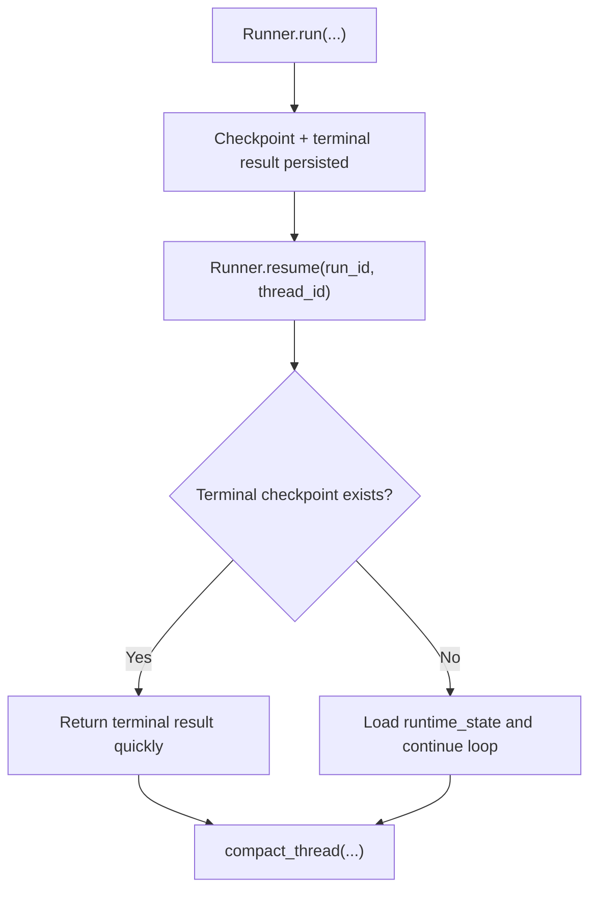
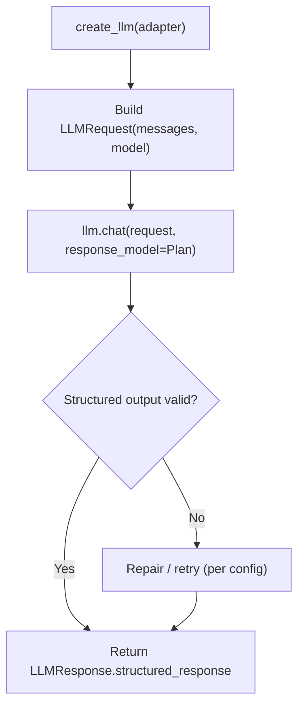
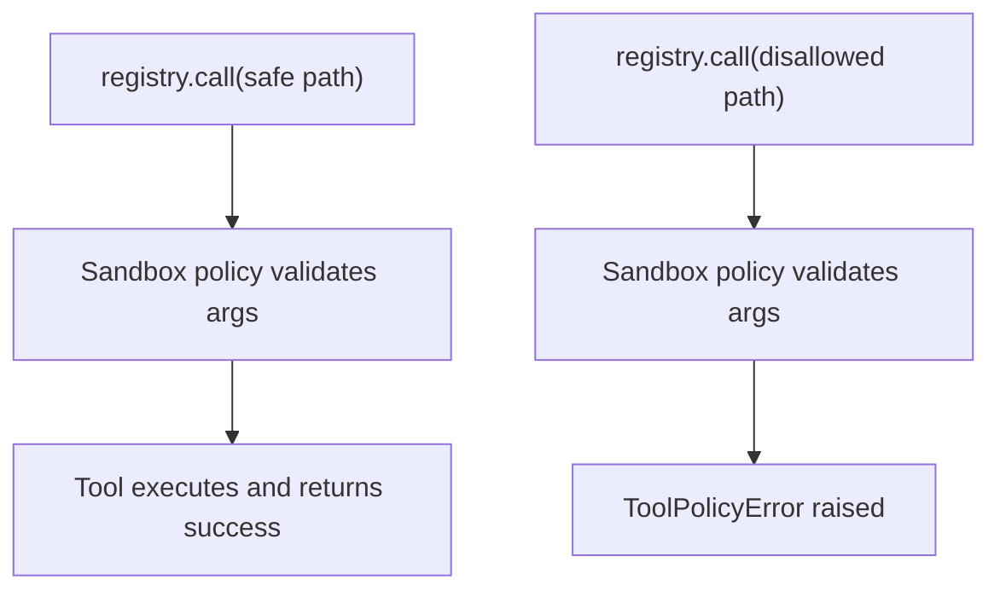
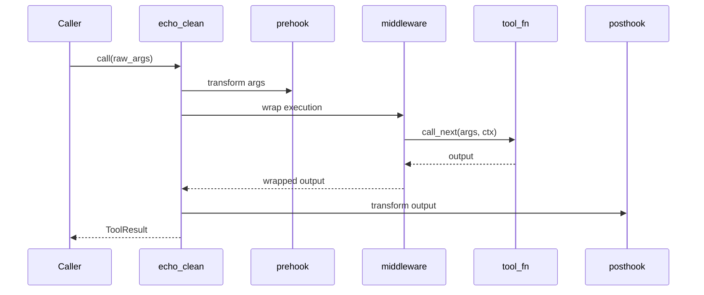
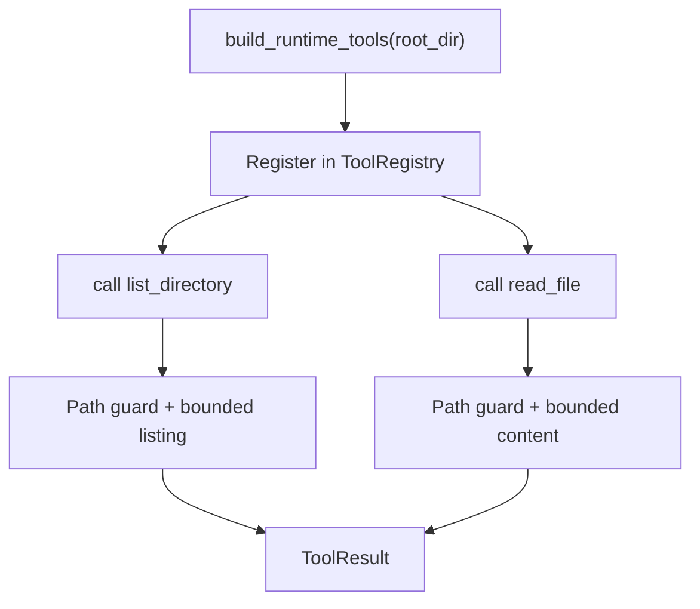

Every example is a runnable Python file under `docs/library/examples/`.

## Before You Run

```bash
uv sync
export AFK_LLM_ADAPTER=openai
export AFK_LLM_MODEL=gpt-4.1-mini
export AFK_LLM_API_KEY=your_key_here
```

## Example Catalog

<CardGroup cols={2}>
  <Card title="01 Minimal Agent" href="#01-minimal-chat-agent" icon="play-circle">
    Agent + typed tool + one-shot run.
  </Card>
  <Card title="02 Policy + HITL" href="#02-policy-with-hitl" icon="shield">
    Deferred approvals and pause/resume flow.
  </Card>
  <Card title="03 Subagents Router" href="#03-subagents-with-router" icon="workflow">
    Manager routes requests to worker subagents.
  </Card>
  <Card title="04 Resume + Compact" href="#04-resume-and-compact" icon="database">
    Checkpoint persistence, resume, and retention.
  </Card>
  <Card title="05 Direct LLM" href="#05-direct-llm-structured-output" icon="cpu">
    Use `afk.llms` with typed structured response.
  </Card>
  <Card title="06 Tool Security" href="#06-tool-registry-security" icon="lock">
    Sandbox policy and output limits.
  </Card>
  <Card title="07 Hooks + Middleware" href="#07-tool-hooks-and-middleware" icon="layers">
    Tool interception and output shaping.
  </Card>
  <Card title="08 Runtime Tools" href="#08-prebuilt-runtime-tools" icon="folder">
    Safe filesystem tools for agent runtime.
  </Card>
</CardGroup>

## Run Commands

```bash
uv run python docs/library/examples/01_minimal_chat_agent.py
uv run python docs/library/examples/02_policy_with_hitl.py
uv run python docs/library/examples/03_subagents_with_router.py
uv run python docs/library/examples/04_resume_and_compact.py
uv run python docs/library/examples/05_direct_llm_structured_output.py
uv run python docs/library/examples/06_tool_registry_security.py
uv run python docs/library/examples/07_tool_hooks_and_middleware.py
uv run python docs/library/examples/08_prebuilt_runtime_tools.py
```

## 01. Minimal Chat Agent

Code: [01_minimal_chat_agent.py](./01_minimal_chat_agent.py)

- Defines a typed tool (`sum_numbers`) with Pydantic validation.
- Creates one `Agent` with model, instructions, and tool list.
- Calls `agent.call(...)` and returns `AgentResult`.



## 02. Policy With HITL

Code: [02_policy_with_hitl.py](./02_policy_with_hitl.py)

- Adds policy rule that gates `risky_action` with `request_approval`.
- Uses `InMemoryInteractiveProvider` for deferred decisions.
- Resolves deferred approval after `run_paused` event.



## 03. Subagents With Router

Code: [03_subagents_with_router.py](./03_subagents_with_router.py)

- Defines `Writer` and `Reviewer` subagents.
- Router inspects transcript text and returns subagent names.
- Manager runs selected subagents and merges outputs.



## 04. Resume And Compact

Code: [04_resume_and_compact.py](./04_resume_and_compact.py)

- Runs once with `Runner.run(...)`.
- Resumes with same `run_id` and `thread_id`.
- Compacts thread records with retention policies.



## 05. Direct LLM Structured Output

Code: [05_direct_llm_structured_output.py](./05_direct_llm_structured_output.py)

- Uses `afk.llms.create_llm(...)` directly.
- Builds `LLMRequest` manually.
- Validates typed response with `response_model=Plan`.



## 06. Tool Registry Security

Code: [06_tool_registry_security.py](./06_tool_registry_security.py)

- Builds a sandbox profile with allowlists and execution restrictions.
- Registers tools in `ToolRegistry` with output-limiting middleware.
- Demonstrates one allowed path and one blocked path call.



## 07. Tool Hooks And Middleware

Code: [07_tool_hooks_and_middleware.py](./07_tool_hooks_and_middleware.py)

- Uses prehook to normalize arguments.
- Uses middleware to wrap tool behavior.
- Uses posthook to shape final output.



## 08. Prebuilt Runtime Tools

Code: [08_prebuilt_runtime_tools.py](./08_prebuilt_runtime_tools.py)

- Builds prebuilt filesystem tools with `build_runtime_tools(root_dir)`.
- Registers them in a `ToolRegistry`.
- Calls both tools using bounded/safe arguments.



## Related Docs

- [Tool Call Lifecycle](/library/tool-call-lifecycle)
- [Security Model](/library/security-model)
- [Checkpoint and Resume Schema](/library/checkpoint-schema)
