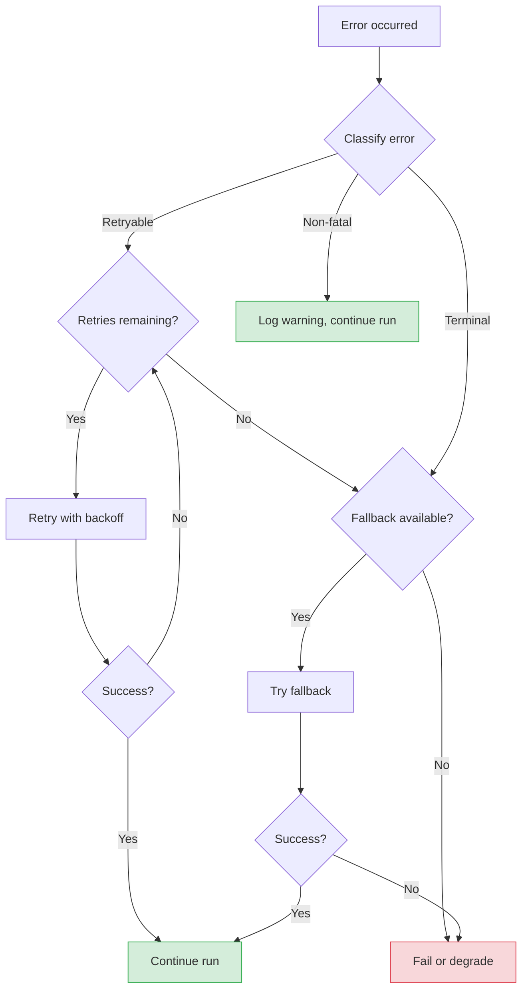

AFK classifies every error and applies a policy-driven response. Understanding the failure matrix helps you configure the right behavior for your use case.

## Error classification

Every error is classified into one of three categories:

| Classification | Meaning                                        | Default behavior               |
| -------------- | ---------------------------------------------- | ------------------------------ |
| **Retryable**  | Transient failure, may succeed on retry        | Retry with exponential backoff |
| **Terminal**   | Permanent failure, will not recover            | Stop and report error          |
| **Non-fatal**  | Something went wrong, but the run can continue | Log warning, continue          |

## Failure decision flow



## Failure matrix by source

### LLM failures

| Error                      | Classification           | Example                               |
| -------------------------- | ------------------------ | ------------------------------------- |
| Rate limit (429)           | Retryable                | "Rate limit exceeded, retry after 2s" |
| Server error (500/502/503) | Retryable                | "Internal server error"               |
| Timeout                    | Retryable                | "Request timed out after 60s"         |
| Auth error (401/403)       | Terminal                 | "Invalid API key"                     |
| Invalid request (400)      | Terminal                 | "Model does not exist"                |
| Circuit breaker open       | Terminal (with fallback) | "Circuit breaker open for provider"   |

**Configuration:**

```python
agent = Agent(
    ...,
    fail_safe=FailSafeConfig(
        llm_failure_policy="degrade",              # "fail" or "degrade"
        fallback_model_chain=["gpt-4.1-mini"],     # Try cheaper model
    ),
)
```

### Tool failures

| Error             | Classification | Example                                                   |
| ----------------- | -------------- | --------------------------------------------------------- |
| Validation error  | Non-fatal      | "Invalid arguments" (returned to LLM for self-correction) |
| Handler exception | Configurable   | "Tool raised an error"                                    |
| Timeout           | Configurable   | "Tool exceeded 10s timeout"                               |
| Policy denial     | Non-fatal      | "Action denied by policy" (returned to LLM)               |

**Configuration:**

```python
agent = Agent(
    ...,
    fail_safe=FailSafeConfig(
        tool_failure_policy="continue",  # "fail" | "degrade" | "continue"
    ),
)
```

### Subagent failures

| Error                 | Classification | Example                                             |
| --------------------- | -------------- | --------------------------------------------------- |
| Subagent run failed   | Configurable   | "Subagent 'researcher' completed with state=failed" |
| Subagent timeout      | Configurable   | "Subagent exceeded wall time"                       |
| Join policy violation | Terminal       | "Required subagent failed (all_required policy)"    |

**Configuration:**

```python
agent = Agent(
    ...,
    fail_safe=FailSafeConfig(
        subagent_failure_policy="degrade",  # "fail" | "degrade" | "continue"
    ),
)
```

### Infrastructure failures

| Error                      | Classification     | Example                        |
| -------------------------- | ------------------ | ------------------------------ |
| Memory backend unavailable | Non-fatal          | "Could not persist checkpoint" |
| Telemetry export failed    | Non-fatal (silent) | "OTEL exporter timed out"      |
| Queue push failed          | Retryable          | "Redis connection refused"     |

## Failure policies

<Tabs>
  <Tab title="fail">
    Any failure causes the run to fail immediately.

    ```python
    fail_safe=FailSafeConfig(tool_failure_policy="fail")
    ```

    **Use when:** All operations are critical and partial results are worse than no results.

  </Tab>
  <Tab title="degrade">
    Failures are tolerated. The run completes with `state="degraded"` instead of `"completed"`.

    ```python
    fail_safe=FailSafeConfig(tool_failure_policy="degrade")
    ```

    **Use when:** Partial results are better than no results (e.g., some tool fails but the agent can still answer).

  </Tab>
  <Tab title="continue">
    Failures are logged but ignored. The run continues as if nothing happened.

    ```python
    fail_safe=FailSafeConfig(tool_failure_policy="continue")
    ```

    **Use when:** The failing component is non-essential (e.g., analytics tool, optional enrichment).

  </Tab>
</Tabs>

## Budget-triggered limits

When a budget limit is hit, the run is stopped immediately:

| Limit                | Triggered by             | Run state              |
| -------------------- | ------------------------ | ---------------------- |
| `max_steps`          | Step count exceeded      | `failed` or `degraded` |
| `max_tool_calls`     | Tool call count exceeded | `failed` or `degraded` |
| `max_total_cost_usd` | Estimated cost exceeded  | `failed`               |
| `max_wall_time_s`    | Wall time exceeded       | `interrupted`          |

## Next steps

<CardGroup cols={2}>
  <Card title="Security Model" icon="shield" href="/library/security-model">
    Security boundaries and hardening checklist.
  </Card>
  <Card title="Core Runner" icon="play" href="/library/core-runner">
    Run lifecycle and state management.
  </Card>
</CardGroup>
