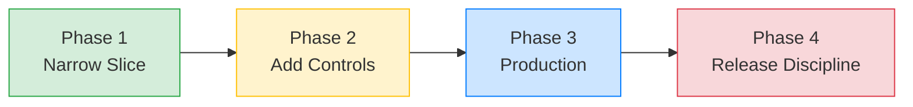

AFK is designed for incremental adoption. Start with the simplest possible agent, add capabilities as you understand the problem space, and layer in production controls before you ship. This guide walks through four phases, each building on the last.

<Tip>
  **You don't need to read this page front-to-back.** Find your current phase
  and start there. Each phase tells you what to build, what to add, and when to
  move on.
</Tip>

## Adoption path



---

<Steps>
  <Step title="Phase 1: Narrow vertical slice" icon="seedling">
    Build one focused agent that does one thing well.

    **What to build:**
    - Single agent with specific instructions
    - 0–2 tools for the core capability
    - Synchronous execution (`run_sync`)

    **Code example:**

    ```python
    from afk.agents import Agent
    from afk.core import Runner

    agent = Agent(
        name="ticket-classifier",
        model="gpt-4.1-mini",
        instructions="""
        Read the support ticket and classify it as exactly one of:
        billing, technical, account, or other.
        Output only the category name.
        """,
    )

    runner = Runner()
    result = runner.run_sync(agent, user_message="I can't log into my account")
    print(result.final_text)  # "account"
    ```

    **Focus on:**
    - Getting the prompt right — iterate until the agent reliably produces correct output
    - Testing with 10–20 real examples before adding any complexity
    - Keeping everything in a single file

    **Move to Phase 2 when:** Your agent works correctly for the core use case and you need it to take actions or handle edge cases.

  </Step>

  <Step title="Phase 2: Add controls" icon="shield">
    Give the agent capabilities and constrain them with safety controls.

    **What to add:**
    - Tools with Pydantic argument models
    - `FailSafeConfig` with step, cost, and time limits
    - Policy rules for dangerous operations
    - Basic error handling

    **Code example:**

    ```python
    from pydantic import BaseModel
    from afk.agents import Agent, FailSafeConfig, PolicyEngine, PolicyRule
    from afk.tools import tool
    from afk.core import Runner, RunnerConfig

    class TicketArgs(BaseModel):
        ticket_id: str

    @tool(name="lookup_ticket", description="Fetch ticket details.")
    def lookup_ticket(args: TicketArgs) -> dict:
        return {"ticket_id": args.ticket_id, "status": "open", "priority": "high"}

    policy = PolicyEngine(rules=[
        PolicyRule(
            rule_id="gate-updates",
            condition=lambda e: e.tool_name and "update" in e.tool_name,
            action="request_approval",
            reason="Ticket updates need human approval",
        ),
    ])

    agent = Agent(
        name="ticket-agent",
        model="gpt-4.1-mini",
        instructions="Look up tickets and classify priority. Never modify without approval.",
        tools=[lookup_ticket],
        fail_safe=FailSafeConfig(
            max_steps=10,
            max_tool_calls=5,
            max_total_cost_usd=0.10,
        ),
    )

    runner = Runner(
        policy_engine=policy,
        config=RunnerConfig(sanitize_tool_output=True),
    )
    ```

    **Focus on:**
    - Every tool has a Pydantic model — no untyped arguments
    - Cost limits are always set (`max_total_cost_usd`)
    - Dangerous operations require approval

    **Move to Phase 3 when:** Your agent works reliably with tools and policies, and you're ready to deploy.

  </Step>

  <Step title="Phase 3: Production controls" icon="server">
    Add the infrastructure for monitoring, testing, and safe deployment.

    **What to add:**
    - Telemetry (console for dev, OTEL for prod)
    - Eval suite with at least 5 test cases
    - Memory persistence for multi-turn conversations
    - Streaming for user-facing UIs

    **Code example:**

    ```python
    from afk.core import Runner, RunnerConfig
    from afk.evals import run_suite, EvalBudget
    from afk.evals.models import EvalCase, EvalSuiteConfig

    # Production runner
    runner = Runner(
        telemetry="otel",
        telemetry_config={"service_name": "ticket-agent"},
        config=RunnerConfig(interaction_mode="headless"),
    )

    # Eval suite for CI
    suite = run_suite(
        runner_factory=lambda: Runner(),
        cases=[
            EvalCase(
                name="basic-lookup",
                agent=agent,
                user_message="Check ticket TK-1234",
                budget=EvalBudget(max_total_cost_usd=0.05),
            ),
            EvalCase(
                name="unknown-ticket",
                agent=agent,
                user_message="Check ticket TK-9999",
            ),
        ],
        config=EvalSuiteConfig(fail_fast=True),
    )
    assert suite.failed == 0, f"Eval failures: {suite.failed}/{suite.total}"
    ```

    **Focus on:**
    - Evals run in CI on every pull request
    - Alerting on error rate and latency
    - Memory compaction for long-running threads

    **Move to Phase 4 when:** Your agent is in production and you need structured release management.

  </Step>

  <Step title="Phase 4: Release discipline" icon="rocket">
    Establish processes for safe agent evolution.

    **What to add:**
    - Golden trace comparison for regression detection
    - Budget-gated CI (releases blocked if evals fail)
    - Canary deployments with cost monitoring
    - Documentation for on-call and incident response

    **Practices:**
    - Run the full eval suite before every release
    - Compare golden traces to catch behavioral drift
    - Monitor cost-per-run trends for budget anomalies
    - Keep system prompts in version-controlled files (not inline strings)

    **This phase never ends** — it's the ongoing discipline of running agents in production.

  </Step>
</Steps>

---

## Phase checklist

Use this to track your progress:

| Phase | Milestone                                           | Status |
| ----- | --------------------------------------------------- | ------ |
| 1     | Agent produces correct output for 20+ test cases    | ☐      |
| 2     | Tools have Pydantic models, FailSafe limits are set | ☐      |
| 2     | Policy rules gate all mutating operations           | ☐      |
| 3     | Telemetry is configured and exporting               | ☐      |
| 3     | Eval suite runs in CI with ≥ 5 cases                | ☐      |
| 3     | Memory persistence is configured                    | ☐      |
| 4     | Golden traces are captured and compared             | ☐      |
| 4     | Releases are gated by eval pass rate                | ☐      |

## Next steps

<CardGroup cols={2}>
  <Card title="Building with AI" icon="hammer" href="/library/building-with-ai">
    Production patterns, common architectures, and anti-patterns.
  </Card>
  <Card title="Agentic Levels" icon="stairs" href="/library/agentic-levels">
    Capability maturity model — know when to add complexity.
  </Card>
</CardGroup>
