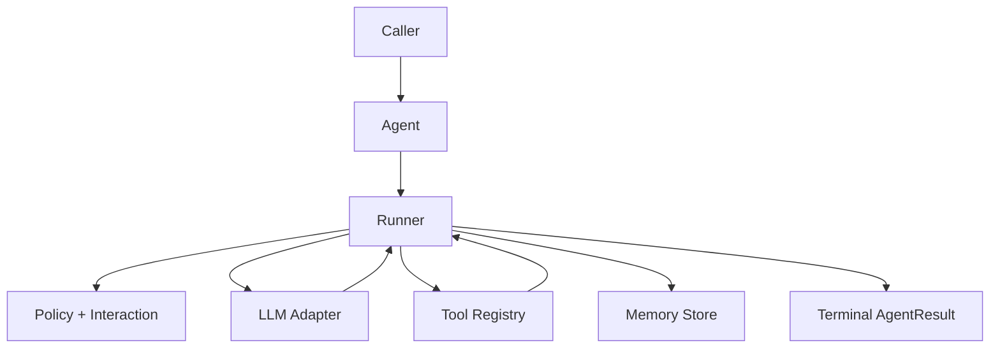

> All runnable code is in Python files under `docs/library/examples/*.py`.

## Start Here

<CardGroup cols={2}>
  <Card title="Developer Guide" icon="rocket" href="/library/developer-guide">
    End-to-end onboarding path for your first reliable agent.
  </Card>
  <Card title="Examples Runbook" icon="code" href="/library/examples/index">
    Eight runnable examples with diagrams and what to customize first.
  </Card>
  <Card title="Architecture" icon="git-branch" href="/library/architecture">
    Runtime data flow, state transitions, persistence, and safety boundaries.
  </Card>
  <Card title="API Reference" icon="book" href="/library/api-reference">
    Public APIs, behavior contracts, edge cases, and import patterns.
  </Card>
</CardGroup>

## Quickstart

```bash
uv sync
export AFK_LLM_ADAPTER=openai
export AFK_LLM_MODEL=gpt-4.1-mini
export AFK_LLM_API_KEY=your_key_here
uv run python docs/library/examples/01_minimal_chat_agent.py
```

If you use `pip`:

```bash
pip install -e .
python docs/library/examples/01_minimal_chat_agent.py
```

## Public Imports Only

Use public package imports in application code:

```python
from afk.agents import Agent
from afk.core import Runner, RunnerConfig
from afk.llms import create_llm
from afk.tools import tool
from afk import agents, core, llms, tools, memory, evals
```

Avoid importing from `src/...` paths.

## Runtime Mental Model



## Read By Goal

<CardGroup cols={2}>
  <Card title="Need HITL + approvals" href="/library/tool-call-lifecycle" icon="shield-check">
    Tool policy gates, deferred approvals, and fallback behavior.
  </Card>
  <Card title="Need subagents + routing" href="/library/agentic-behavior" icon="workflow">
    Router semantics, orchestration flow, and subagent execution records.
  </Card>
  <Card title="Need resume + compaction" href="/library/checkpoint-schema" icon="database">
    Checkpoint shape, replay behavior, and resume guarantees.
  </Card>
  <Card title="Need direct LLM control" href="/library/llm-interaction" icon="cpu">
    Request/response lifecycle, structured output, and retries.
  </Card>
</CardGroup>

## Full Documentation Map

### Core Concepts

- [Architecture](/library/architecture)
- [Tool Call Lifecycle](/library/tool-call-lifecycle)
- [Tools System Walkthrough](/library/tools-system-walkthrough)
- [LLM Interaction Flow](/library/llm-interaction)
- [Agentic Behavior and Orchestration](/library/agentic-behavior)
- [Checkpoint and Resume Schema](/library/checkpoint-schema)
- [Run Event Contract](/library/run-event-contract)
- [Failure Policy Matrix](/library/failure-policy-matrix)
- [Security Model](/library/security-model)

### Reference

- [API Reference](/library/api-reference)
- [Public Imports and Function Improvement](/library/public-imports-and-function-improvement)
- [Tested Behaviors and Edge Cases](/library/tested-behaviors)
- [Full Module Reference](/library/full-module-reference)

### LLM Package

- [LLM Overview](/llms/index)
- [LLM Contracts](/llms/contracts)
- [Adapter Guide](/llms/adapters)
- [Stream Control and Sessions](/llms/control-and-session)
- [Agent Integration Boundary](/llms/agent-integration)

## Production Checklist

1. Start from `01_minimal_chat_agent.py`.
2. Add typed tools and input validation.
3. Add policy rules before side-effecting tools.
4. Enable sandboxing and output limits.
5. Persist checkpoints in non-ephemeral storage.
6. Add eval scenarios for critical workflows.
