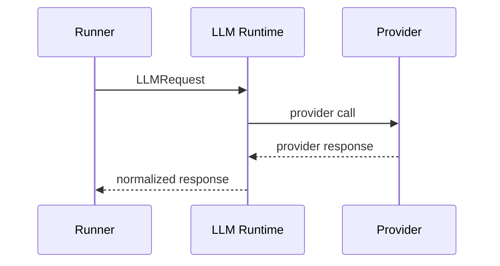

## Interaction diagram

```mermaid
sequenceDiagram
    participant Runner
    participant LLM Runtime
    participant Provider

    Runner->>LLM Runtime: LLMRequest
    LLM Runtime->>Provider: provider call
    Provider-->>LLM Runtime: provider response
    LLM Runtime-->>Runner: normalized response
```
