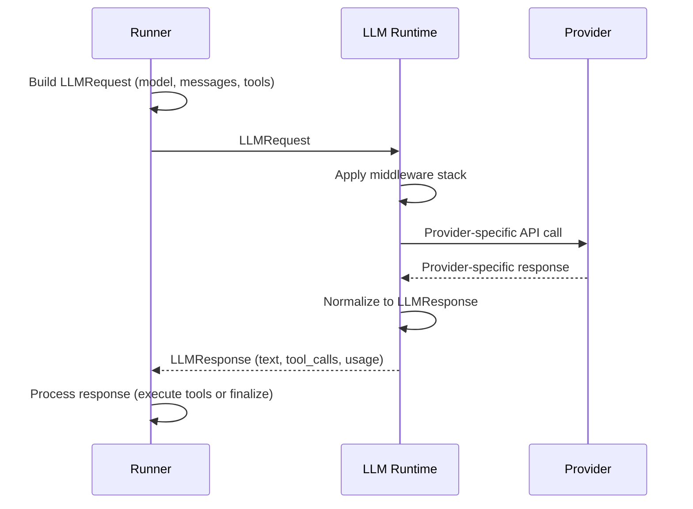

The runner communicates with LLM providers through a well-defined request/response boundary. Understanding this boundary is important for debugging model behavior, diagnosing latency issues, and implementing custom providers or middleware.

This page explains how the runner constructs LLM requests, how responses are interpreted, how streaming works, and how errors are handled at the LLM boundary.

## Interaction diagram



Each step in this flow is described in detail below.

## Request construction

At each step of the agent loop, the runner builds an `LLMRequest` and sends it to the configured LLM provider. Here is what goes into the request:

**Model resolution.** The agent's `model` field (e.g., `"gpt-4.1-mini"`) is resolved through the model resolution chain. This maps the requested model name to a provider, adapter, and normalized model identifier. Custom `model_resolver` functions can override this mapping.

**Message history.** The runner maintains a list of `Message` objects representing the conversation history. This includes:
- A `system` message containing the agent's instructions, skill manifests, and (when enabled) an untrusted-data preamble.
- The initial `user` message.
- `assistant` messages from previous LLM responses.
- `tool` messages containing the results of tool executions.

**Tool definitions.** If the agent has registered tools, they are exported as OpenAI-compatible function tool definitions and included in `LLMRequest.tools`. The `tool_choice` is set to `"auto"` so the model can decide whether to call tools.

**Session and checkpoint tokens.** For providers that support stateful sessions (like Anthropic's agent SDK), the runner passes `session_token` and `checkpoint_token` from previous responses to maintain session continuity.

**Metadata.** The request includes metadata about the run (`run_id`, `thread_id`, `agent_name`) and content channel markers that help the provider distinguish trusted system content from untrusted tool output.

```python
# Simplified view of what the runner builds
request = LLMRequest(
    model="gpt-4.1-mini",
    request_id=f"{run_id}:step:{step}",
    messages=messages,           # Full conversation history
    tools=tool_definitions,      # OpenAI-format function tools
    tool_choice="auto",          # Let the model decide
    idempotency_key=f"{run_id}:step:{step}",
    session_token=session_token,
    checkpoint_token=checkpoint_token,
    metadata={
        "run_id": run_id,
        "thread_id": thread_id,
        "agent_name": agent.name,
    },
)
```

## Response handling

The LLM runtime normalizes provider-specific responses into an `LLMResponse` dataclass. The runner then interprets this response to decide what happens next:

**If the response contains no tool calls** (`resp.tool_calls` is empty), the run is complete. The runner extracts `resp.text` as `final_text`, captures any `resp.structured_response`, and transitions to `state="completed"`.

**If the response contains tool calls**, the runner enters the tool execution phase:
1. Each tool call is evaluated by the policy engine.
2. Approved tools are executed (in parallel, up to the batch limit).
3. Tool results are appended to the message history as `tool` messages.
4. The runner loops back to make another LLM call with the updated history.

**Usage tracking.** The `LLMResponse.usage` field contains token counts (`input_tokens`, `output_tokens`, `total_tokens`). The runner accumulates these into `UsageAggregate` for cost estimation and budget enforcement.

**Session continuity.** If the response includes updated `session_token` or `checkpoint_token`, the runner stores these for the next request.

## LLMRequest fields

| Field | Type | Purpose |
| --- | --- | --- |
| `model` | `str` | Normalized model identifier. |
| `request_id` | `str` | Unique request ID for tracing. |
| `messages` | `list[Message]` | Conversation history. |
| `tools` | `list[dict] or None` | OpenAI-format tool definitions. |
| `tool_choice` | `str or None` | Tool selection strategy (`"auto"`, `"none"`, or specific tool). |
| `max_tokens` | `int or None` | Maximum response tokens. |
| `temperature` | `float or None` | Sampling temperature. |
| `top_p` | `float or None` | Nucleus sampling parameter. |
| `stop` | `list[str] or None` | Stop sequences. |
| `idempotency_key` | `str or None` | Key for request deduplication. |
| `session_token` | `str or None` | Provider session continuity token. |
| `checkpoint_token` | `str or None` | Provider checkpoint continuity token. |
| `timeout_s` | `float or None` | Request-level timeout in seconds. |
| `metadata` | `dict` | Run context metadata. |

## LLMResponse fields

| Field | Type | Purpose |
| --- | --- | --- |
| `text` | `str` | Model-generated text content. |
| `tool_calls` | `list[ToolCall]` | Requested tool invocations. |
| `finish_reason` | `str or None` | Why the model stopped generating (`"stop"`, `"tool_calls"`, etc.). |
| `usage` | `Usage` | Token counts: `input_tokens`, `output_tokens`, `total_tokens`. |
| `structured_response` | `dict or None` | Parsed structured output when using `response_model`. |
| `session_token` | `str or None` | Updated session token for next request. |
| `checkpoint_token` | `str or None` | Updated checkpoint token for next request. |

## Streaming interaction

For real-time UIs, the runner supports streaming via `runner.run_stream()`. The streaming path works differently from the batch path:

```python
handle = await runner.run_stream(agent, user_message="Explain containers.")

async for event in handle:
    if event.type == "text_delta":
        print(event.text_delta, end="", flush=True)
    elif event.type == "tool_started":
        print(f"\n[Tool: {event.tool_name}]")
    elif event.type == "tool_completed":
        print(f"[Tool done: {event.tool_name}]")
    elif event.type == "completed":
        print(f"\n\nFinal state: {event.result.state}")

result = handle.result
```

The stream produces `AgentStreamEvent` instances that include:
- `text_delta` -- incremental text from the model.
- `step_started` -- signals a new step in the agent loop.
- `tool_started` / `tool_completed` -- tool lifecycle events.
- `error` -- error notification.
- `completed` -- terminal event containing the final `AgentResult`.

## Error handling at the LLM boundary

Errors at the LLM boundary are classified and handled according to the [failure policy matrix](/library/failure-policy-matrix):

**Retryable errors** (timeouts, rate limits, server errors) are retried with exponential backoff. The runner supports a fallback model chain: if the primary model fails after retries, it tries the next model in `FailSafeConfig.fallback_model_chain`.

**Terminal errors** (auth failures, invalid payloads) are not retried. The `llm_failure_policy` determines what happens next:
- `"fail"` -- the run aborts with `state="failed"`.
- `"degrade"` -- the run terminates with `state="degraded"` and the error message as `final_text`.

**Circuit breaker** protection prevents cascading failures. After `breaker_failure_threshold` consecutive failures to the same model+provider, the circuit opens and subsequent calls fail fast until the cooldown expires.

**Policy denial** of LLM calls is handled before the call is made. If the policy engine denies an LLM call, the runner applies the `llm_failure_policy` without ever contacting the provider.
