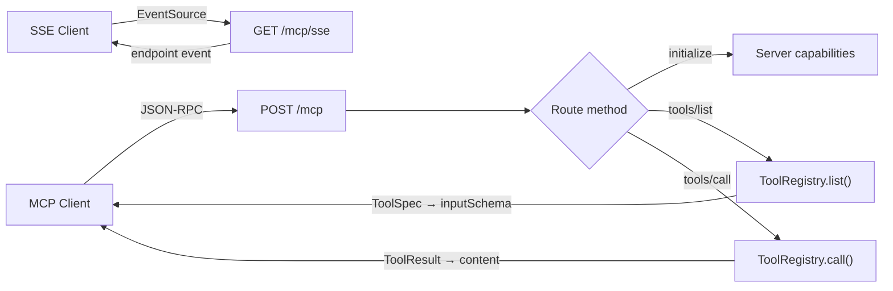

AFK supports both sides of MCP:

- **Server mode**: expose your AFK `ToolRegistry` as an MCP server.
- **Client mode**: connect AFK agents to external MCP servers and use those remote tools in the normal runner tool-call pipeline.

## TL;DR

- `MCPServer(registry)` exposes registered tools over MCP JSON-RPC.
- New DX constructors: `MCPServer.from_tools(...)` and `create_mcp_server(...)`.
- Routes are configurable (`mcp_path`, `sse_path`, `health_path`) and can be mounted into an existing FastAPI app via `mount(...)`.
- Agents can load tools from external MCP servers with `Agent(mcp_servers=[...])`.
- External MCP tools run through AFK’s existing tool runtime (policy/sandbox/fail-safe/telemetry).

## When to Use

- You want to expose your AFK tools to MCP-compatible clients.
- You are integrating with Claude Desktop, Cursor, or other MCP hosts.
- You need a standard protocol for tool discovery and execution.

## Server Mode: Expose AFK Tools as MCP



### Quick Start

```python
from pydantic import BaseModel

from afk.tools import ToolRegistry, tool
from afk.mcp import MCPServer


class GreetArgs(BaseModel):
    name: str

registry = ToolRegistry()

@tool(args_model=GreetArgs, name="greet", description="Greet someone")
def greet(args: GreetArgs) -> str:
    return f"Hello, {args.name}!"

registry.register(greet)

server = MCPServer(registry)
server.run()  # http://0.0.0.0:8000
```

### DX Constructor

```python
from afk.mcp import create_mcp_server

server = create_mcp_server(tools=[greet])
server.run()
```

### Endpoints

| Endpoint   | Method | Description                               |
| ---------- | ------ | ----------------------------------------- |
| `/mcp`     | `POST` | JSON-RPC 2.0 endpoint for all MCP methods |
| `/mcp/sse` | `GET`  | SSE transport for streaming clients       |
| `/health`  | `GET`  | Health check with tool count              |
| `/docs`    | `GET`  | Swagger UI (auto from FastAPI)            |

### MCP Methods

### `initialize`

Returns server capabilities and metadata:

```json
{
  "jsonrpc": "2.0",
  "id": 1,
  "method": "initialize",
  "params": {}
}
```

Response:

```json
{
  "protocolVersion": "2025-02-20",
  "capabilities": {
    "tools": { "listChanged": false }
  },
  "serverInfo": {
    "name": "afk-mcp-server",
    "version": "1.0.0"
  }
}
```

### `tools/list`

Lists all registered tools with their input schemas:

```json
{
  "jsonrpc": "2.0",
  "id": 2,
  "method": "tools/list",
  "params": {}
}
```

Response:

```json
{
  "tools": [
    {
      "name": "calculate",
      "description": "Evaluate a math expression",
      "inputSchema": {
        "type": "object",
        "properties": {
          "expression": { "type": "string" }
        },
        "required": ["expression"]
      }
    }
  ]
}
```

### `tools/call`

Executes a tool and returns the result:

```json
{
  "jsonrpc": "2.0",
  "id": 3,
  "method": "tools/call",
  "params": {
    "name": "greet",
    "arguments": { "name": "Alice" }
  }
}
```

Response:

```json
{
  "content": [{ "type": "text", "text": "Hello, Alice!" }],
  "isError": false
}
```

### Configuration

```python
from afk.mcp import MCPServerConfig, create_mcp_server

server = create_mcp_server(
  tools=[greet],
  config=MCPServerConfig(
    name="my-agent-tools",
    version="2.0.0",
    mcp_path="/rpc/mcp",
    sse_path="/rpc/mcp/sse",
    health_path="/status",
    enable_sse=True,
    enable_health=True,
    allow_batch_requests=True,
  ),
)
```

### FastAPI Mounting

```python
from fastapi import FastAPI
from afk.mcp import create_mcp_server

app = FastAPI()
mcp_server = create_mcp_server(tools=[greet])
mcp_server.mount(app)
```

## Client Mode: Use External MCP Servers in AFK Agents

AFK can materialize tools from external MCP servers and add them to agent runs.

```python
from afk.agents import Agent
from afk.core import Runner

agent = Agent(
  model="gpt-4.1-mini",
  instructions="Use MCP tools when helpful.",
  mcp_servers=[
    "filesystem=http://localhost:8001/mcp",
    {
      "name": "knowledge",
      "url": "http://localhost:8010/mcp",
      "headers": {"Authorization": "Bearer <token>"},
      "timeout_s": 20,
      "prefix_tools": True,
    },
  ],
)

result = Runner().run_sync(agent, user_message="Summarize notes in ./docs")
print(result.final_text)
```

Remote tool names are prefixed by default (for example `filesystem__read_file`) to avoid collisions with local tool names.

### MCP Store APIs

Use `MCPStore` directly when you need explicit control/caching:

```python
from afk.mcp import MCPStore

store = MCPStore()
tools = await store.tools_from_servers([
  "filesystem=http://localhost:8001/mcp",
])
```

## Continue Reading

1. [Tools System](/library/tools-system-walkthrough)
2. [Tool Call Lifecycle](/library/tool-call-lifecycle)
3. [Security Model](/library/security-model)
4. [API Reference](/library/api-reference)
