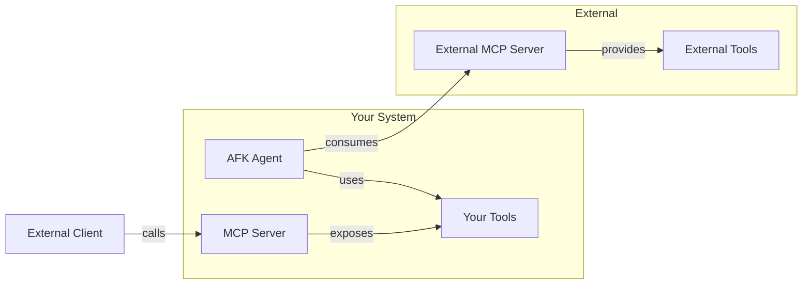

The Model Context Protocol (MCP) is an open standard for sharing tools between AI systems. AFK supports both **exposing** your tools via an MCP server and **consuming** tools from external MCP servers.

## Architecture



## Expose tools via MCP server

Make your AFK tools available to any MCP-compatible client:

<Steps>
  <Step title="Define your tools">
    ```python
    from pydantic import BaseModel
    from afk.tools import tool

    class SearchArgs(BaseModel):
        query: str
        limit: int = 10

    @tool(name="search_docs", description="Search the documentation.")
    def search_docs(args: SearchArgs) -> dict:
        return {"results": ["doc1", "doc2"]}

    class CalcArgs(BaseModel):
        expression: str

    @tool(name="calculate", description="Evaluate a math expression.")
    def calculate(args: CalcArgs) -> dict:
        return {"result": eval(args.expression)}
    ```

  </Step>
  <Step title="Create the MCP server">
    ```python
    from afk.mcp import MCPServer

    server = MCPServer(
        name="my-tools",
        tools=[search_docs, calculate],
        host="0.0.0.0",
        port=3001,
    )
    ```

  </Step>
  <Step title="Start serving">
    ```python
    await server.start()
    # Server is now accepting MCP connections on port 3001
    ```
  </Step>
</Steps>

## Consume tools from external MCP servers

Discover and use tools from any MCP server:

<Steps>
  <Step title="Connect to an MCP server">
    ```python
    from afk.mcp import MCPStore

    store = MCPStore()
    await store.connect("https://tools.example.com:3001")
    ```

  </Step>
  <Step title="Discover available tools">
    ```python
    tools = await store.list_tools()
    for t in tools:
        print(f"{t.name}: {t.description}")
    ```
  </Step>
  <Step title="Attach to an agent">
    ```python
    from afk.agents import Agent

    agent = Agent(
        name="assistant",
        model="gpt-4.1-mini",
        instructions="Use available tools to help the user.",
        tools=tools,  # ← MCP tools work like local tools
    )
    ```

  </Step>
</Steps>

<Tip>
  **MCP tools are transparent.** Once attached to an agent, MCP tools behave
  exactly like local tools — same validation, same policy gates, same telemetry.
  The agent doesn't know (or care) whether a tool is local or remote.
</Tip>

## Security

<AccordionGroup>
  <Accordion title="Authentication">
    Require auth tokens for all MCP connections:

    ```python
    server = MCPServer(
        name="my-tools",
        tools=[search_docs],
        auth_provider=TokenAuthProvider(
            valid_tokens={"client-a": "token-abc"},
        ),
    )
    ```

  </Accordion>
  <Accordion title="CORS configuration">
    Configure allowed origins for browser-based clients:

    ```python
    server = MCPServer(
        name="my-tools",
        tools=[search_docs],
        cors_origins=["https://app.example.com"],
    )
    ```

  </Accordion>
  <Accordion title="Tool-level security">
    Apply policy rules to MCP-exposed tools:

    ```python
    from afk.agents import PolicyEngine, PolicyRule

    policy = PolicyEngine(rules=[
        PolicyRule(
            rule_id="gate-mutations",
            condition=lambda e: not e.tool_read_only,
            action="deny",
            reason="MCP clients cannot call mutating tools",
        ),
    ])

    server = MCPServer(
        name="my-tools",
        tools=[search_docs, calculate],
        policy_engine=policy,
    )
    ```

  </Accordion>
  <Accordion title="Rate limiting">
    Limit request rates per client:

    ```python
    server = MCPServer(
        name="my-tools",
        tools=[search_docs],
        rate_limit={"requests_per_minute": 60, "per_client": True},
    )
    ```

  </Accordion>
</AccordionGroup>

<Warning>
  **Always authenticate MCP servers in production.** An unauthenticated server
  exposes your tools to anyone who can reach the endpoint.
</Warning>

## MCP server vs A2A

| Feature         | MCP Server                   | A2A                          |
| --------------- | ---------------------------- | ---------------------------- |
| **Shares**      | Individual tools             | Full agents                  |
| **Protocol**    | MCP standard                 | AFK A2A protocol             |
| **Use case**    | Tool sharing between systems | Agent-to-agent communication |
| **Client sees** | Tool schemas and results     | Agent responses              |
| **Interop**     | Any MCP client               | AFK agents                   |

## Next steps

<CardGroup cols={2}>
  <Card title="A2A Protocol" icon="network-wired" href="/library/a2a">
    Share full agents across systems.
  </Card>
  <Card title="Security Model" icon="shield" href="/library/security-model">
    Full security architecture.
  </Card>
</CardGroup>
