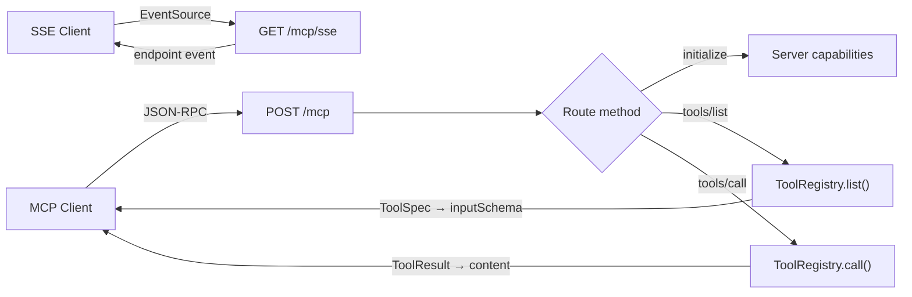

The `MCPServer` class creates a fully compliant Model Context Protocol server from your existing `ToolRegistry`. Any registered tool is automatically exposed via JSON-RPC 2.0 endpoints that MCP clients (like Claude Desktop, Cursor, etc.) can connect to.

## TL;DR

- `MCPServer(registry)` wraps a `ToolRegistry` into a FastAPI server.
- Implements MCP methods: `initialize`, `tools/list`, `tools/call`, `ping`.
- Tools are auto-discovered from the registry — no extra configuration.
- SSE transport available at `/mcp/sse` for streaming MCP clients.
- Swagger docs auto-generated at `/docs`.

## When to Use

- You want to expose your AFK tools to MCP-compatible clients.
- You are integrating with Claude Desktop, Cursor, or other MCP hosts.
- You need a standard protocol for tool discovery and execution.

## Architecture



## Quick Start

```python
from afk.tools import ToolRegistry, tool
from afk.mcp import MCPServer

registry = ToolRegistry()

@tool(name="calculate", description="Evaluate a math expression")
def calculate(expression: str) -> str:
    return str(eval(expression))  # simplified example

@tool(name="greet", description="Greet someone by name")
def greet(name: str) -> str:
    return f"Hello, {name}! Welcome to AFK."

registry.register(calculate)
registry.register(greet)

server = MCPServer(registry)
server.run()  # http://0.0.0.0:8000
```

## Endpoints

| Endpoint   | Method | Description                               |
| ---------- | ------ | ----------------------------------------- |
| `/mcp`     | `POST` | JSON-RPC 2.0 endpoint for all MCP methods |
| `/mcp/sse` | `GET`  | SSE transport for streaming clients       |
| `/health`  | `GET`  | Health check with tool count              |
| `/docs`    | `GET`  | Swagger UI (auto from FastAPI)            |

## MCP Methods

### `initialize`

Returns server capabilities and metadata:

```json
{
  "jsonrpc": "2.0",
  "id": 1,
  "method": "initialize",
  "params": {}
}
```

Response:

```json
{
  "protocolVersion": "2024-11-05",
  "capabilities": {
    "tools": { "listChanged": false }
  },
  "serverInfo": {
    "name": "afk-mcp-server",
    "version": "1.0.0"
  }
}
```

### `tools/list`

Lists all registered tools with their input schemas:

```json
{
  "jsonrpc": "2.0",
  "id": 2,
  "method": "tools/list",
  "params": {}
}
```

Response:

```json
{
  "tools": [
    {
      "name": "calculate",
      "description": "Evaluate a math expression",
      "inputSchema": {
        "type": "object",
        "properties": {
          "expression": { "type": "string" }
        },
        "required": ["expression"]
      }
    }
  ]
}
```

### `tools/call`

Executes a tool and returns the result:

```json
{
  "jsonrpc": "2.0",
  "id": 3,
  "method": "tools/call",
  "params": {
    "name": "greet",
    "arguments": { "name": "Alice" }
  }
}
```

Response:

```json
{
  "content": [{ "type": "text", "text": "Hello, Alice! Welcome to AFK." }],
  "isError": false
}
```

## Configuration

```python
from afk.mcp import MCPServer, MCPServerConfig

server = MCPServer(
    registry,
    config=MCPServerConfig(
        name="my-agent-tools",
        version="2.0.0",
        host="127.0.0.1",
        port=3000,
        instructions="Tools for data analysis and reporting",
        cors_origins=["http://localhost:*"],
    ),
)
```

| Option         | Default            | Description                              |
| -------------- | ------------------ | ---------------------------------------- |
| `name`         | `"afk-mcp-server"` | Server name (advertised in `initialize`) |
| `version`      | `"1.0.0"`          | Server version                           |
| `host`         | `"0.0.0.0"`        | Bind host                                |
| `port`         | `8000`             | Bind port                                |
| `instructions` | `None`             | Optional server-level instructions       |
| `cors_origins` | `["*"]`            | Allowed CORS origins                     |

## Mounting into Existing Apps

If you already have a FastAPI app, access the underlying app instance:

```python
from fastapi import FastAPI

main_app = FastAPI()
mcp = MCPServer(registry)

main_app.mount("/tools", mcp.app)
```

## Testing

Use FastAPI's `TestClient` for integration tests:

```python
from fastapi.testclient import TestClient

client = TestClient(server.app)

# Health check
resp = client.get("/health")
assert resp.json()["tools_count"] == 2

# List tools
resp = client.post("/mcp", json={
    "jsonrpc": "2.0",
    "id": 1,
    "method": "tools/list",
    "params": {},
})
tools = resp.json()["result"]["tools"]
assert len(tools) == 2
```

## Continue Reading

1. [Tools System](/library/tools-system-walkthrough)
2. [Tool Call Lifecycle](/library/tool-call-lifecycle)
3. [Security Model](/library/security-model)
