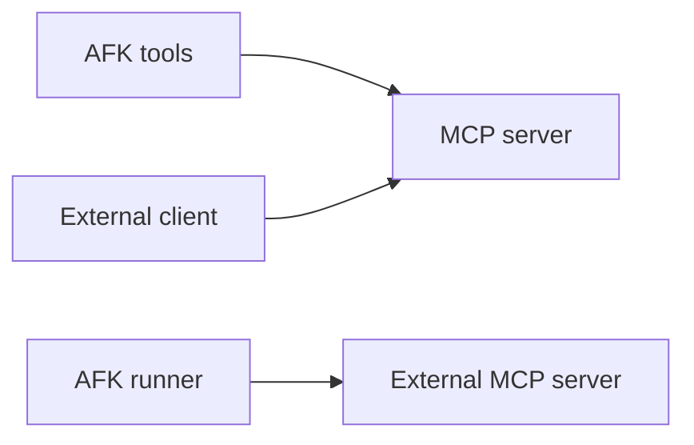

## MCP interaction


```mermaid
flowchart LR
    AFKTools[AFK tools] --> MCPServer[MCP server]
    ExternalClient[External client] --> MCPServer
    Runner[AFK runner] --> MCPRemote[External MCP server]
```

## Expose example

```python
from afk.mcp import create_mcp_server

server = create_mcp_server(tools=[...])
server.run()
```
