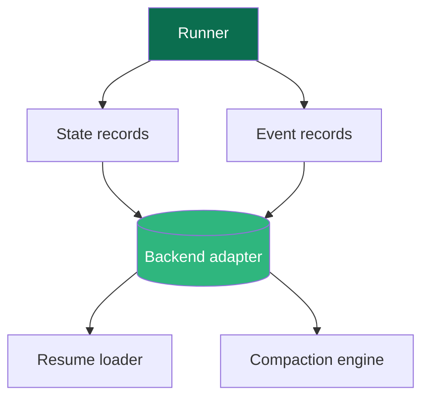
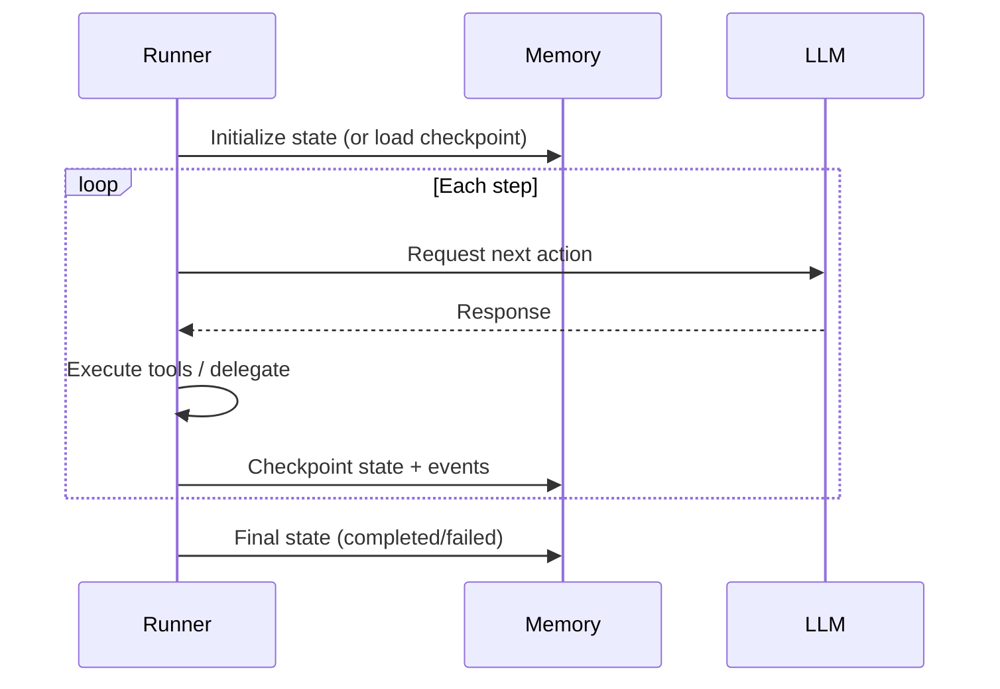

Memory in AFK handles the persistence layer — storing the state needed to resume interrupted runs, maintaining conversation history across interactions, and providing the audit trail that makes agent behavior traceable.

Without memory, every agent run is stateless: it starts from scratch, loses context from previous interactions, and cannot recover from interruptions. The memory module solves all three of these problems.

## Memory Architecture

The memory system has three main roles: recording state, recording events, and providing retrieval for resume and compaction.



Here is how these components work together:

- **State records** capture the current state of a run — the agent's conversation history, the last step number, any pending tool results, and the run's current status. This is what the resume loader reads to pick up where a run left off.

- **Event records** capture everything that happened during a run — LLM calls, tool executions, policy decisions, subagent delegations, and error details. Events are append-only and immutable. They form the audit trail you use for debugging and compliance.

- **Backend adapter** is the storage implementation. AFK defines a backend contract (what needs to be stored and retrieved) and provides adapters for different storage backends. The rest of the system does not know or care which backend is in use.

- **Resume loader** reads state records from the backend and reconstructs the run's context so the runner can continue from the last checkpoint. This enables crash recovery, human-in-the-loop pauses, and multi-session workflows.

- **Compaction engine** reduces the size of the conversation history by summarizing older messages. This prevents long-running threads from exceeding the LLM's context window while preserving the information the agent needs to continue meaningfully.

## What Memory Should Store

Designing what goes into memory is a critical decision. Store too little and you cannot resume reliably. Store too much and your checkpoints become slow and bloated.

Here is the recommended breakdown:

| Category | What to store | Why |
|---|---|---|
| **State** | Conversation messages, step counter, pending tool results, run status | Required for deterministic resume — the runner needs exactly this information to continue a run |
| **Events** | LLM call details, tool executions, policy decisions, errors | Required for audit trail, debugging, and telemetry replay |
| **Metadata** | Run ID, thread ID, agent name, timestamps, correlation IDs | Required for querying, filtering, and correlating events across distributed systems |

**What you should *not* store in memory:**

- Raw LLM provider responses (store the normalized version instead — this keeps your memory portable across providers)
- Large binary blobs (store a reference/URL instead)
- Cached or derived data that can be recomputed

## State Lifecycle

A run's state flows through a predictable lifecycle:



The runner checkpoints after each step, not after each individual operation within a step. This means if the runner crashes in the middle of a step (e.g., between two tool calls in a batch), it will replay the entire step on resume. This is why tool idempotency matters — see the [Tools](/library/tools) page.

## Resume from Checkpoint

When you call `runner.resume()`, the runner loads the last checkpoint and continues:

```python
# Original run gets interrupted (e.g., waiting for human approval)
result = await runner.run(agent, user_message="Deploy to production")
# result.state == "paused"

# Later, after approval is granted:
result = await runner.resume(
    agent,
    run_id=result.run_id,
    thread_id=result.thread_id,
)
# result.state == "completed"
```

Resume works across process restarts — as long as the memory backend is durable (e.g., Redis, database), the run can be resumed from a different process or machine.

## Compaction

Long-running conversation threads accumulate messages over time. Eventually, the conversation history will exceed the LLM's context window. Compaction solves this by summarizing older messages.

```python
compaction_result = await runner.compact_thread(
    thread_id="thread-123",
    event_policy=retention_policy,
    state_policy=state_retention_policy,
)
```

Compaction is a controlled operation — you choose when to compact and what retention policies to apply. The retention policies determine which events and state records to keep, summarize, or discard.

**When to compact:**

- Before the conversation history approaches the LLM's context window limit
- After a logical milestone in a multi-step workflow (e.g., after completing one phase)
- On a regular schedule for long-lived threads (e.g., customer support threads that span days)

## Implementation Guidance

When working with the memory module:

- **Keep checkpoint schemas stable and versioned.** If you change what gets stored in a checkpoint, old checkpoints may become unloadable. Version your schema and handle migration explicitly.
- **Prefer additive fields over destructive changes.** Adding a new optional field to a checkpoint is safe. Removing or renaming a field breaks existing checkpoints.
- **Implement compaction policies early.** Do not wait until your threads are hitting context window limits. Define a compaction strategy during development so it is tested before you need it.
- **Test resume from partially completed runs.** The most common memory bug is a resume that starts from the wrong state. Write tests that interrupt a run mid-step and verify that resume produces the correct result.

## For Coding Agents

When adding or modifying memory code:

1. **Preserve schema compatibility.** Never remove or rename fields in checkpoint schemas. Add new optional fields instead.
2. **Prefer additive fields over destructive changes.** This ensures that existing checkpoints remain loadable after code updates.
3. **Test resume from partially completed runs.** Create test scenarios that interrupt a run after specific steps and verify that resuming produces correct behavior.
