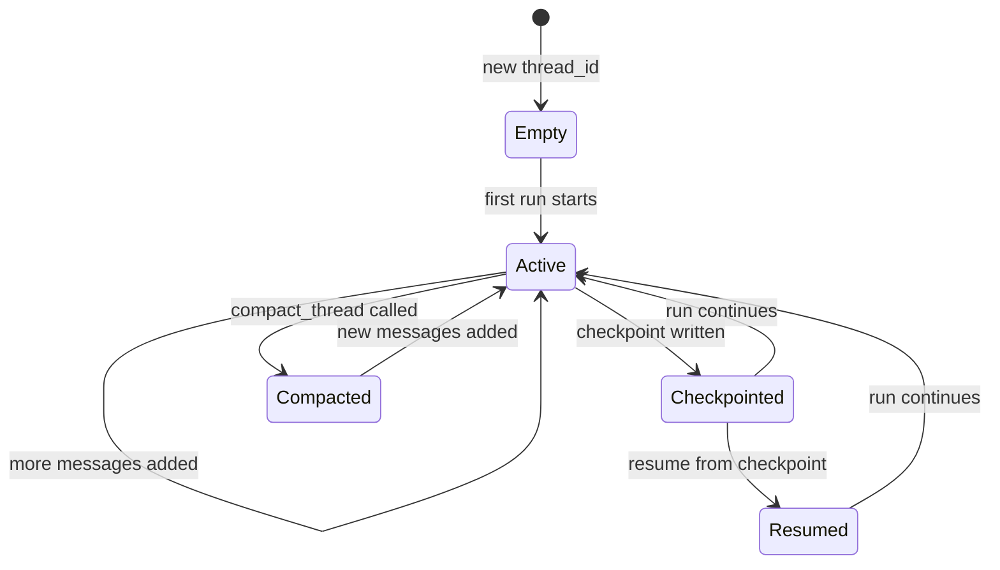

AFK's memory system persists conversation state across runs. Use it for multi-turn conversations, run resumption after interrupts, and long-running agent sessions.

## Quick start: multi-turn conversation

```python
import asyncio
from afk.agents import Agent
from afk.core import Runner

agent = Agent(name="tutor", model="gpt-4.1-mini", instructions="You are a Python tutor.")

async def main():
    runner = Runner()
    thread = "session-42"

    r1 = await runner.run(agent, user_message="What are generators?", thread_id=thread)
    print(r1.final_text)

    # Turn 2 — the agent remembers Turn 1
    r2 = await runner.run(agent, user_message="Show me an example", thread_id=thread)
    print(r2.final_text)

asyncio.run(main())
```

The `thread_id` links runs into a conversation. AFK automatically persists messages between runs.

## What gets stored

| Record type    | What it contains                                           | When it's written                       |
| -------------- | ---------------------------------------------------------- | --------------------------------------- |
| **Message**    | User messages, assistant responses, tool calls and results | After each run step                     |
| **Checkpoint** | Full run state at a point in time                          | At step boundaries (pre-LLM, post-tool) |
| **Event**      | Run lifecycle events (started, completed, failed)          | During and after runs                   |

<Note>
  **What's NOT stored:** Raw LLM responses, internal framework state, or
  intermediate computation. Only the conversation-visible records are persisted.
</Note>

## State lifecycle



## Resume interrupted runs

If a run is interrupted (crash, timeout, pause for approval), resume from the last checkpoint:

```python
# Start a run that might be long
result = await runner.run(agent, user_message="Analyze this dataset...")

# If interrupted, resume later
if result.state == "interrupted":
    resumed = await runner.resume(
        agent,
        run_id=result.run_id,
        thread_id=result.thread_id,
    )
    print(resumed.final_text)
```

<Tip>
  **Checkpoints are written at key boundaries:** before each LLM call, after
  each tool batch, and after each step completes. On resume, completed tool
  calls are replayed from cache — no duplicate side effects.
</Tip>

## Compact long threads

Over time, conversation threads grow and consume tokens. Use compaction to summarize old messages:

```python
# Summarize old turns into a condensed summary
await runner.compact_thread(agent, thread_id="session-42")

# Next run uses the compacted history — fewer tokens, same context
result = await runner.run(agent, user_message="Continue where we left off", thread_id="session-42")
```

Compaction replaces older messages with a generated summary, preserving key context while reducing token usage. The agent sees the summary as context, not individual old messages.

## Memory backends

<Tabs>
  <Tab title="In-memory (default)">
    State lives in process memory. Fast, no setup, but lost on restart.

    ```python
    runner = Runner()  # ← Uses in-memory backend by default
    ```

    **Use for:** Development, testing, short-lived scripts.

  </Tab>
  <Tab title="Persistent backend">
    Implement the `MemoryBackend` protocol to persist state to any storage:

    ```python
    from afk.memory import MemoryBackend

    class PostgresMemory(MemoryBackend):
        async def load_thread(self, thread_id: str) -> list[Message]:
            ...
        async def save_messages(self, thread_id: str, messages: list[Message]):
            ...
        async def load_checkpoint(self, run_id: str) -> Checkpoint | None:
            ...
        async def save_checkpoint(self, run_id: str, checkpoint: Checkpoint):
            ...

    runner = Runner(memory=PostgresMemory(conn_string="..."))
    ```

    **Use for:** Production deployments, multi-turn chat applications.

  </Tab>
</Tabs>

## Design guidelines

- **Always use `thread_id` for conversations.** Without it, each run starts fresh.
- **Compact threads proactively.** Don't wait until you hit token limits. A good rule: compact when the thread exceeds ~50 messages.
- **Use checkpoints for long-running agents.** If a run might take minutes, checkpoints let you resume on failure.
- **Don't store secrets in memory.** Thread messages are persisted and may be readable.

## Next steps

<CardGroup cols={2}>
  <Card title="Core Runner" icon="play" href="/library/core-runner">
    Resume and compact APIs on the Runner.
  </Card>
  <Card title="System Prompts" icon="file-lines" href="/library/system-prompts">
    Template prompts with context from memory.
  </Card>
</CardGroup>
