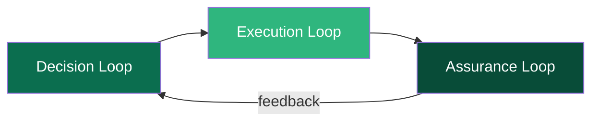
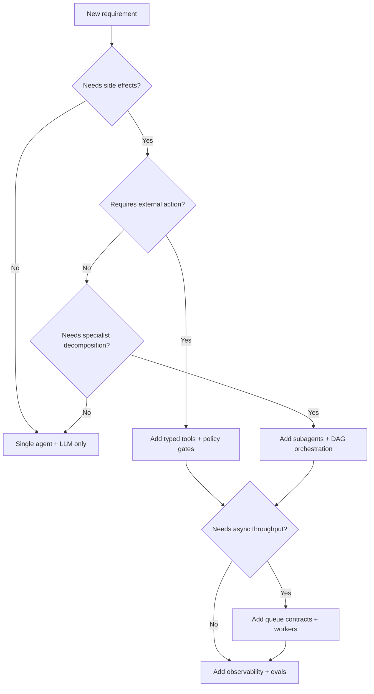

Before writing any code with AFK, it helps to understand the mental model behind the library. This page explains how AFK structures agent systems and why it makes the design choices it does. Once you internalize this model, every API decision in AFK will feel intuitive.

## The Core Mental Model

Every production agent system needs three things working together: something that decides what to do, something that does it safely, and something that tells you whether it worked. AFK organizes these into three coordinated loops:

1. **Decision loop** — The agent and LLM work together to choose the next action. This is where your instructions, model selection, and routing logic live. The agent defines *what* the system should do; the LLM provides the reasoning to get there.

2. **Execution loop** — The runner takes the decision and executes it safely. Tool calls go through schema validation, policy gates, and optional human approval before anything actually happens. Subagent delegation follows the same pattern. The runner owns all state transitions and ensures every action is auditable.

3. **Assurance loop** — Observability and evals close the feedback loop. Telemetry captures what happened during execution, and eval suites validate that the system is behaving correctly over time. This loop is what turns a prototype into a production system.

**If any loop is missing, production quality drops:**

| Missing loop | What goes wrong |
|---|---|
| No decision controls | The agent behaves unpredictably — no instruction boundaries, no routing logic, no model constraints. |
| No execution controls | Side effects happen without validation — no policy gates, no approval flows, no safe failure modes. |
| No assurance loop | Regressions happen silently — no telemetry to debug incidents, no evals to catch quality drift. |

The key insight is that these loops are not optional add-ons. A system with great decision logic but no execution safety will eventually cause real-world damage. A system with perfect execution but no observability will silently degrade. AFK gives you all three from day one.

## Design AFK Systems as Contracts

AFK is built on a contract-first philosophy. Instead of relying on implicit conventions buried in prompts or ad-hoc wrappers, every meaningful boundary in the system is defined by an explicit contract — a typed interface that both sides agree to.

This matters for four reasons:

- **Agents declare their capabilities** through typed contracts (`Agent` with `name`, `model`, `instructions`, `tools`, `subagents`). Other parts of the system can introspect what an agent can do without running it.
- **LLM contracts normalize provider behavior** so you can swap between OpenAI, Anthropic, LiteLLM, or any future provider without changing orchestration logic.
- **Queue contracts define async execution semantics** — enqueue, dequeue, complete, fail, retry — so your task processing works the same whether backed by in-memory queues or Redis.
- **Communication contracts define delivery and correlation** for agent-to-agent messaging, including idempotency keys and dead-letter handling.

This contract-first approach is what allows AFK to scale across different backends without rewriting application logic. When you add a new provider or swap a queue backend, the contracts stay the same — only the adapter implementation changes.

## How to Make Decisions Quickly

When you are starting a new feature or system with AFK, use this decision tree to determine the right level of complexity. Start simple and add layers only when you hit a concrete need.

Here is how to read this tree:

- **Start with a single agent and an LLM.** If your requirement is purely conversational — answering questions, summarizing text, classifying inputs — you do not need tools, subagents, or queues. A single `Agent` with clear `instructions` and a `Runner.run_sync()` call is enough.

- **Add tools when you need side effects.** If the agent needs to call an API, query a database, or trigger an external action, wrap that action in a typed `Tool` with a Pydantic args model. This gives you schema validation, policy gates, and audit trails automatically.

- **Add subagents when you need specialist decomposition.** If the problem naturally breaks into sub-tasks that benefit from different instructions or models (e.g., one agent triages, another diagnoses, another writes), model them as subagents with a `DelegationPlan`.

- **Add queues when you need async throughput.** If tasks arrive faster than you can process them, or you need durable retry semantics, add a `TaskQueue` with an `ExecutionContract` and workers.

- **Always add observability and evals.** No matter how simple the system, instrument it with telemetry and validate it with evals before shipping. This is the assurance loop, and it is never optional for production.

## What Success Looks Like

A mature AFK implementation has these characteristics:

- **Explicit action boundaries** — Every side effect goes through a typed tool or delegation contract. Nothing happens implicitly.
- **Deterministic failure behavior** — Every failure mode is classified (retryable vs. terminal) and handled explicitly. No silent swallowing of errors.
- **Release gates driven by evals** — You do not ship changes without running your eval suite. Quality thresholds in CI block regressions before they reach production.
- **Telemetry rich enough for incident debugging** — When something goes wrong at 3 AM, you can trace exactly what happened: which agent ran, what tools were called, what the LLM returned, and where it failed.

If your system has all four of these properties, you have a production-grade agent system. If any are missing, that is the next thing to work on.
