AFK agents execute through three coordinated loops — **Decision**, **Execution**, and **Assurance**. Understanding these loops helps you reason about agent behavior, debug issues, and design systems that scale predictably.

## The three loops

```mermaid
flowchart LR
    subgraph Decision["🧠 Decision Loop"]
        direction TB
        D1["Receive input"]
        D2["Select action"]
        D3["Emit tool calls or text"]
        D1 --> D2 --> D3
    end

    subgraph Execution["⚡ Execution Loop"]
        direction TB
        E1["Validate arguments"]
        E2["Check policy gate"]
        E3["Run tool handler"]
        E4["Sanitize output"]
        E1 --> E2 --> E3 --> E4
    end

    subgraph Assurance["🛡️ Assurance Loop"]
        direction TB
        A1["Check step limits"]
        A2["Check cost budget"]
        A3["Check wall time"]
        A4["Classify failures"]
        A1 --> A2 --> A3 --> A4
    end

    Decision -->|"tool calls"| Execution
    Execution -->|"results"| Decision
    Assurance -->|"enforce limits"| Decision
    Assurance -->|"enforce limits"| Execution
```



<AccordionGroup>
  <Accordion title="🧠 Decision Loop — what the LLM does" icon="brain">
    The Decision Loop is the model's turn. On each step:
    1. The runner sends the conversation history + tool schemas to the LLM
    2. The LLM decides whether to respond with text (done) or request tool calls (continue)
    3. If tool calls are requested, they flow to the Execution Loop

    **You control this with:** agent instructions, model choice, tool availability

    ```python
    # The Decision Loop is shaped by these fields
    agent = Agent(
        instructions="...",    # ← What the model knows
        model="gpt-4.1-mini", # ← How the model thinks
        tools=[...],           # ← What the model can do
    )
    ```

  </Accordion>

  <Accordion title="⚡ Execution Loop — what happens when a tool is called" icon="bolt">
    The Execution Loop handles every tool call:
    1. **Validate** arguments against the Pydantic schema
    2. **Policy gate** — allow, deny, or defer for human approval
    3. **Execute** the handler (with hooks and middleware)
    4. **Sanitize** the output (truncate, strip injection vectors)
    5. **Return** the result to the Decision Loop

    **You control this with:** tool definitions, policy rules, sandbox profiles

    ```python
    # The Execution Loop is shaped by these
    @tool(args_model=QueryArgs, name="query_db", description="Run a database query.")
    def query_db(args: QueryArgs) -> dict:
        ...

    policy = PolicyEngine(rules=[
        PolicyRule(
            condition=lambda e: e.tool_name == "query_db",
            action="request_approval",
        ),
    ])
    ```

  </Accordion>

  <Accordion title="🛡️ Assurance Loop — what keeps things safe" icon="shield">
    The Assurance Loop runs continuously, enforcing limits on both other loops:
    - **Step count** — stops the agent after N iterations
    - **Tool call count** — prevents excessive tool usage
    - **Cost budget** — stops if estimated cost exceeds the limit
    - **Wall time** — hard timeout on the entire run
    - **Failure classification** — retryable, terminal, or non-fatal

    **You control this with:** `FailSafeConfig`

    ```python
    agent = Agent(
        ...,
        fail_safe=FailSafeConfig(
            max_steps=10,
            max_tool_calls=5,
            max_total_cost_usd=0.25,
            max_wall_time_s=30.0,
        ),
    )
    ```

  </Accordion>
</AccordionGroup>

## Think in contracts

AFK is built on a contract-first design. Every interaction between components is defined by typed data structures:

| Boundary           | Contract                                             | What flows                              |
| ------------------ | ---------------------------------------------------- | --------------------------------------- |
| Runner → LLM       | `LLMRequest` / `LLMResponse`                         | Messages, tool schemas, model responses |
| Runner → Tool      | `ToolCall` / `ToolResult`                            | Validated arguments, execution output   |
| Runner → Subagent  | `AgentInvocationRequest` / `AgentInvocationResponse` | Delegate task and receive result        |
| Runner → Memory    | Checkpoint records                                   | Conversation state for resume/replay    |
| Runner → Telemetry | `AgentRunEvent`, `RunMetrics`                        | Spans, metrics, audit trail             |

<Tip>
  **Contracts are Pydantic models.** This means every boundary is validated at
  runtime — malformed data causes clear errors, not silent bugs. When you see a
  validation error, it's AFK telling you exactly where the contract was
  violated.
</Tip>

## Decision tree: how complex should my system be?

Not sure what to build? Start at the top and follow the path that matches your use case.


> [!TIP]
> **Start at Level 1.** Only move up when you have clear evidence that your current level isn't enough. Each level adds complexity that you need to manage and test.

## What success looks like

A mature AFK implementation exhibits these properties:

- **Every tool has a Pydantic model** — no untyped arguments
- **Every run has cost limits** — `max_total_cost_usd` is always set
- **Policy gates protect mutations** — dangerous actions require approval
- **Evals cover core behaviors** — regression tests catch prompt drift
- **Observability is on from day one** — even if it's just the console exporter
- **Failures are classified** — the system knows what to retry and what to abort
