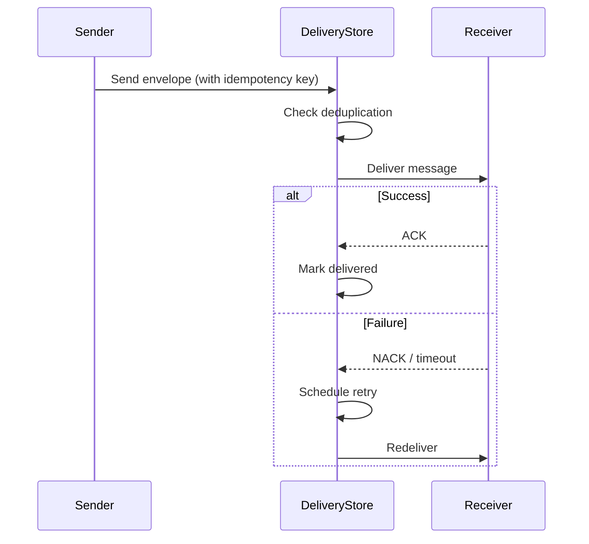

AFK's internal messaging system lets agents communicate via structured envelopes with **at-least-once delivery** and **idempotency**. Use it when agents in the same system need to exchange data reliably.

## Message lifecycle



## The InternalA2AEnvelope

Every message is wrapped in a typed envelope:

```python
from afk.a2a import InternalA2AEnvelope

envelope = InternalA2AEnvelope(
    sender="researcher",
    receiver="writer",
    payload={"findings": ["fact 1", "fact 2"]},
    correlation_id="task-42",         # ← Group related messages together
    idempotency_key="unique-msg-01",  # ← Prevent duplicate processing
)
```

| Field             | Type       | Purpose                                      |
| ----------------- | ---------- | -------------------------------------------- |
| `sender`          | `str`      | Name of the sending agent                    |
| `receiver`        | `str`      | Name of the receiving agent                  |
| `payload`         | `dict`     | Message data (any JSON-serializable content) |
| `correlation_id`  | `str`      | Groups related messages in a workflow        |
| `idempotency_key` | `str`      | Deduplication — same key = same message      |
| `created_at`      | `datetime` | Timestamp of creation                        |
| `attempt`         | `int`      | Current delivery attempt number              |

## Delivery behavior

<Tabs>
  <Tab title="Success path">
    1. Sender creates and submits the envelope
    2. Delivery store checks the idempotency key (rejects duplicates)
    3. Message is delivered to the receiver
    4. Receiver processes and ACKs
    5. Store marks as delivered

    **Result:** Message processed exactly once.

  </Tab>
  <Tab title="Retry path">
    1. Delivery fails (receiver timeout, transient error)
    2. Store schedules retry with exponential backoff
    3. Message is redelivered (same idempotency key)
    4. Receiver processes and ACKs on retry

    **Result:** At-least-once delivery. Receiver must be idempotent.

  </Tab>
  <Tab title="Failure path">
    1. All retry attempts exhausted
    2. Message moves to dead-letter queue
    3. Alert generated (if configured)

    **Result:** Message is not lost — it's in the DLQ for manual review.

  </Tab>
</Tabs>

## Idempotency and correlation

<Tip>
  **Always set an `idempotency_key`.** Without it, retry deliveries can cause
  duplicate processing. Use a deterministic key derived from the task context
  (e.g., `f"{task_id}-{step_name}"`).
</Tip>

**Correlation IDs** group related messages across a workflow. When debugging, filter by `correlation_id` to see the full message chain for a task.

```python
# All messages in this workflow share the same correlation_id
correlation = f"analysis-{run_id}"

await send(InternalA2AEnvelope(
    sender="coordinator", receiver="researcher",
    payload={"query": "AI trends"},
    correlation_id=correlation,
    idempotency_key=f"{correlation}-research",
))

await send(InternalA2AEnvelope(
    sender="coordinator", receiver="writer",
    payload={"topic": "AI trends"},
    correlation_id=correlation,
    idempotency_key=f"{correlation}-write",
))
```

## Delivery store backends

<Tabs>
  <Tab title="In-memory">
    Default. Fast, no setup. State lost on restart.

    ```python
    from afk.a2a import InMemoryDeliveryStore
    store = InMemoryDeliveryStore()
    ```

  </Tab>
  <Tab title="Persistent">
    Implement the `DeliveryStore` protocol for durable messaging:

    ```python
    from afk.a2a import DeliveryStore

    class RedisDeliveryStore(DeliveryStore):
        async def submit(self, envelope: InternalA2AEnvelope) -> bool: ...
        async def ack(self, idempotency_key: str): ...
        async def nack(self, idempotency_key: str): ...
        async def get_dead_letters(self) -> list[InternalA2AEnvelope]: ...
    ```

  </Tab>
</Tabs>

## Next steps

<CardGroup cols={2}>
  <Card title="A2A Protocol" icon="network-wired" href="/library/a2a">
    Cross-system agent communication.
  </Card>
  <Card title="Task Queues" icon="list-check" href="/library/task-queues">
    Async job processing with queue backends.
  </Card>
</CardGroup>
