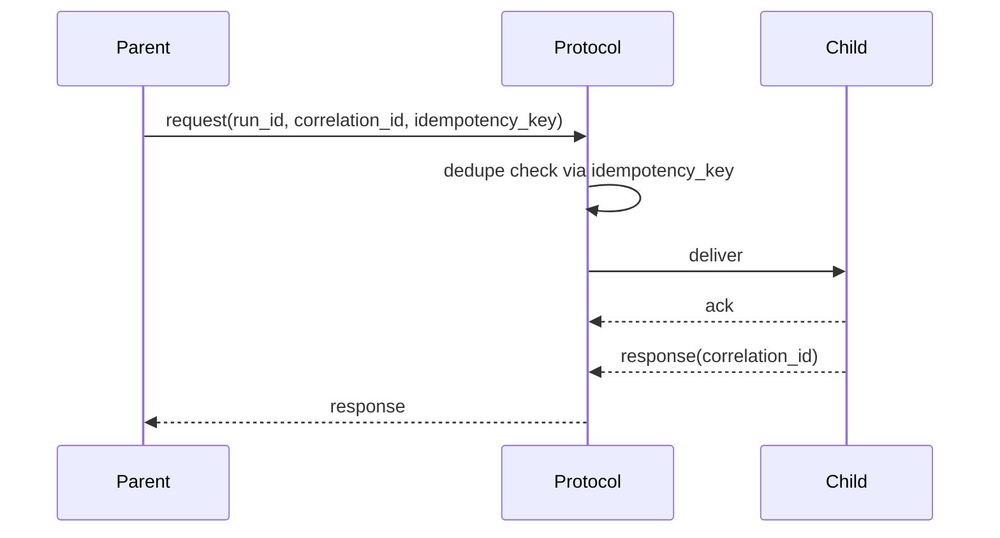

AFK's messaging system enables structured communication between agents using the **Internal A2A (Agent-to-Agent) protocol**. Every message exchanged between agents is wrapped in an `InternalA2AEnvelope` -- a typed, immutable data structure that carries the payload alongside correlation IDs, idempotency keys, and routing metadata. This design gives you end-to-end traceability from the moment a parent agent dispatches a request to the moment a child agent returns a response, including across retries and failure boundaries.

The protocol implementation (`InternalA2AProtocol`) provides **at-least-once delivery** semantics with built-in deduplication, dead-letter tracking, and observable lifecycle events. Legacy mailbox and bus APIs have been removed; all agent communication now flows through the protocol-first A2A contracts.

## Message Lifecycle

The following sequence diagram shows the full lifecycle of a single agent-to-agent request:



**Step-by-step walkthrough:**

1. **Parent sends request** -- The parent agent creates an `AgentInvocationRequest` with a unique `correlation_id` and `idempotency_key`, then calls `protocol.invoke(request)`.
2. **Dedupe check** -- The protocol checks its `A2ADeliveryStore` for a previously successful response matching the `idempotency_key`. If a cached response exists, it is returned immediately and an `ignored_late_response` event is emitted -- the child agent is never contacted.
3. **Envelope creation** -- The protocol wraps the request into an `InternalA2AEnvelope` with `message_type="request"` and emits `queued` and `dispatched` events.
4. **Delivery to child** -- The protocol calls the registered `dispatch` function, which routes the request to the target agent for execution.
5. **Acknowledgment** -- On success, the protocol creates a response envelope with `message_type="response"`, records the response in the delivery store, and emits `acked` and `completed` events. On failure, it emits `nacked` and `failed` events.
6. **Response to parent** -- The `AgentInvocationResponse` is returned to the parent agent with `success=True/False`, `output`, and optional `error`.

## InternalA2AEnvelope Reference

The `InternalA2AEnvelope` is a frozen, slotted dataclass that serves as the wire format for all internal agent messages.

| Field | Type | Purpose |
|---|---|---|
| `message_type` | `"request" \| "response" \| "event"` | Discriminator that identifies the envelope's role in the request-response lifecycle. |
| `run_id` | `str` | Identifies the top-level agent run. All envelopes within a single `Runner.run()` invocation share the same `run_id`. |
| `thread_id` | `str` | Groups messages within a single conversational thread. Used for multi-turn interactions where agents maintain context. |
| `conversation_id` | `str` | Scopes messages to a logical conversation. A conversation may span multiple threads and runs. |
| `correlation_id` | `str` | Links a specific request to its corresponding response. The response envelope's `causation_id` is set to the request's `correlation_id`. |
| `idempotency_key` | `str` | Uniquely identifies the intent of a request for deduplication. If a request with the same key has already succeeded, the cached response is replayed. |
| `source_agent` | `str` | Name of the agent that originated this envelope. |
| `target_agent` | `str` | Name of the agent that should receive and process this envelope. |
| `payload` | `dict[str, JSONValue]` | The actual message content. For requests, this contains the task input. For responses, this contains `success`, `output`, and `error`. |
| `metadata` | `dict[str, JSONValue]` | Arbitrary JSON-safe metadata attached to the envelope (tracing tags, routing hints, priority, etc.). |
| `causation_id` | `str \| None` | Points to the `correlation_id` of the event that caused this envelope. Enables building causal chains across nested agent invocations. |
| `timestamp_ms` | `int` | Unix timestamp in milliseconds when the envelope was created. Defaults to the current wall-clock time. |

## Delivery Behavior

<Tabs>
  <Tab title="Success Path">
    The success path is the most common flow. A parent agent sends a request, the child processes it, and a response comes back.

    **Full lifecycle:** `queued` -> `dispatched` -> `acked` -> `completed`

    1. The parent calls `protocol.invoke(request)` with a unique `correlation_id` and `idempotency_key`.
    2. The protocol checks the delivery store for an existing successful response matching the `idempotency_key`. Finding none, it proceeds.
    3. The request is dispatched to the child agent via the registered `dispatch` callback.
    4. The child agent processes the request and returns an `AgentInvocationResponse` with `success=True`.
    5. The protocol records the response in the delivery store (keyed by `idempotency_key`) for future deduplication.
    6. The protocol emits `acked` and `completed` events and returns the response to the caller.

    ```python
    from afk.messaging import InternalA2AProtocol, InternalA2AEnvelope
    from afk.agents.contracts import AgentInvocationRequest, AgentInvocationResponse

    async def dispatch_to_child(request: AgentInvocationRequest) -> AgentInvocationResponse:
        # Your agent execution logic here
        return AgentInvocationResponse(
            run_id=request.run_id,
            thread_id=request.thread_id,
            conversation_id=request.conversation_id,
            correlation_id=request.correlation_id,
            idempotency_key=request.idempotency_key,
            source_agent=request.target_agent,
            target_agent=request.source_agent,
            success=True,
            output={"answer": "Task completed successfully"},
        )

    protocol = InternalA2AProtocol(dispatch=dispatch_to_child)

    request = AgentInvocationRequest(
        run_id="run-001",
        thread_id="thread-001",
        conversation_id="conv-001",
        correlation_id="corr-001",
        idempotency_key="idem-001",
        source_agent="orchestrator",
        target_agent="summarizer",
        payload={"text": "Summarize this document."},
    )

    response = await protocol.invoke(request)
    assert response.success is True
    ```
  </Tab>
  <Tab title="Retry Path">
    When a child agent fails with a retryable error, the caller can re-invoke the protocol with the **same `idempotency_key`**. The protocol's deduplication logic ensures that:

    - If a previous attempt already succeeded, the cached response is returned immediately without re-executing the child agent.
    - If no cached success exists, the request is dispatched again normally.

    **Event sequence on retry:** `queued` -> `dispatched` -> `nacked` (first attempt fails) -> ... retry logic ... -> `queued` -> `dispatched` -> `acked` -> `completed`

    **Deduplication via `idempotency_key`:** The `A2ADeliveryStore` maps each `idempotency_key` to the first successful response. When the same key is seen again, the protocol emits an `ignored_late_response` event and returns the cached result. This prevents duplicate side effects even when at-least-once delivery causes multiple dispatches.

    **Backoff behavior:** Retry timing is controlled by the caller (e.g., a delegation engine or orchestrator). The protocol itself does not implement automatic retry delays -- it provides the deduplication and event tracking that make retries safe. Higher-level orchestration layers can implement exponential backoff, jitter, and retry budgets using the protocol events.

    ```python
    # Retry with the same idempotency_key is safe
    response = await protocol.invoke(request)  # First attempt -- may fail

    # Same idempotency_key, same request -- if the first attempt succeeded,
    # this returns the cached response without re-executing
    response = await protocol.invoke(request)  # Deduped if previously successful
    ```
  </Tab>
  <Tab title="Failure Path">
    When all retry attempts are exhausted, the message is recorded as a **dead letter**. Dead letters capture the original request, the final error message, and the number of attempts made.

    **What exhausts the retry budget:**
    - The caller decides when retries are exhausted (typically after N failed invocations).
    - The caller then calls `protocol.record_dead_letter()` to persist the failure.

    **How dead letters work:**
    - Each dead letter is an `AgentDeadLetter` dataclass containing the original `AgentInvocationRequest`, the `error` string, `attempts` count, and a `timestamp_ms`.
    - Dead letters are persisted in the `A2ADeliveryStore` (in-memory by default, Redis for production).
    - A `dead_letter` protocol event is emitted and appended to the protocol's event log.

    **Redriving dead letters:**
    - Use `delivery_store.list_dead_letters()` to inspect failed messages.
    - To retry a dead-lettered request, create a new invocation with a fresh `idempotency_key` (since the original key may be tainted by partial success).

    ```python
    # After retry budget is exhausted
    await protocol.record_dead_letter(
        request,
        error="Target agent unreachable after 3 attempts",
        attempts=3,
    )

    # Inspect dead letters
    dead_letters = protocol.dead_letters()
    for dl in dead_letters:
        print(f"Failed: {dl.request.target_agent}, error: {dl.error}, attempts: {dl.attempts}")
    ```
  </Tab>
</Tabs>

## Correlation and Tracing

AFK provides two complementary ID fields for building complete invocation traces across arbitrarily deep agent hierarchies:

**`correlation_id`** identifies a specific request-response pair. When agent A sends a request to agent B, the request gets a unique `correlation_id`. Agent B's response envelope carries the same `correlation_id`, which lets you match requests to their responses in logs and traces. If agent B delegates to agent C, that delegation gets its own `correlation_id`.

**`causation_id`** links effects back to their causes. When agent B's response envelope is created, its `causation_id` is set to the `correlation_id` of the request that triggered it. When agent B delegates to agent C, the new request's `causation_id` is set to the `correlation_id` from agent A's original request. This creates a causal chain that you can walk to reconstruct the full execution tree.

Together, these fields let you build a complete trace:

```
Agent A sends request:
    correlation_id = "corr-1", causation_id = None

  Agent B receives, delegates to C:
      correlation_id = "corr-2", causation_id = "corr-1"

    Agent C responds:
        correlation_id = "corr-2", causation_id = "corr-2"

  Agent B responds to A:
      correlation_id = "corr-1", causation_id = "corr-1"
```

You can query the protocol's event log to reconstruct these chains:

```python
events = protocol.events()
for event in events:
    print(
        f"[{event.type}] "
        f"correlation={event.request.correlation_id} "
        f"causation={event.request.causation_id} "
        f"source={event.request.source_agent} -> {event.request.target_agent}"
    )
```

## Idempotency

The `idempotency_key` field is the foundation of safe-retry semantics in the A2A protocol. Its purpose is to ensure that a request is processed **at most once** even when the delivery layer provides **at-least-once** guarantees.

**How it works:**

1. The caller generates a unique `idempotency_key` for each distinct intent (e.g., "summarize document X for run Y").
2. On the first successful execution, the protocol stores the `AgentInvocationResponse` in the `A2ADeliveryStore`, keyed by the `idempotency_key`.
3. On any subsequent invocation with the same `idempotency_key`, the protocol skips dispatch entirely and returns the cached response. An `ignored_late_response` event is emitted so you can observe when deduplication occurs.

**Best practices for generating idempotency keys:**

- Derive the key from the semantic identity of the work, not from random UUIDs. For example: `f"{run_id}:{source_agent}:{target_agent}:{task_hash}"`.
- If you use random UUIDs, keep the same key across retries of the same logical request.
- Never reuse an idempotency key for a genuinely different request -- you will get a stale cached response.

**Delivery store backends:**

| Backend | Class | Use Case |
|---|---|---|
| In-memory | `InMemoryA2ADeliveryStore` | Development, testing, single-process deployments |
| Redis | `RedisA2ADeliveryStore` | Production, multi-process, distributed deployments |

```python
from afk.messaging import InternalA2AProtocol, RedisA2ADeliveryStore

# Production setup with Redis-backed deduplication
delivery_store = RedisA2ADeliveryStore(redis_client, prefix="afk:a2a")
protocol = InternalA2AProtocol(
    dispatch=dispatch_to_child,
    delivery_store=delivery_store,
)
```

## Protocol Events

The protocol emits `AgentProtocolEvent` instances at each stage of the delivery lifecycle. You can use these events for observability, debugging, and building custom retry/orchestration logic.

| Event Type | When Emitted | Meaning |
|---|---|---|
| `queued` | After envelope creation | Request has been wrapped and is ready for dispatch. |
| `dispatched` | Before calling the dispatch function | Request is being sent to the target agent. |
| `acked` | After successful dispatch | Target agent accepted and completed the request. |
| `nacked` | After failed dispatch | Target agent rejected or errored on the request. |
| `completed` | After successful response | Request-response cycle completed successfully. |
| `failed` | After failed response | Request-response cycle ended in failure. |
| `cancelled` | On `asyncio.CancelledError` | Request was cancelled before completion. |
| `dead_letter` | After recording a dead letter | Request exhausted its retry budget and was shelved. |
| `ignored_late_response` | On idempotency cache hit | A duplicate request was deduped; cached response returned. |

```python
# Stream events as they occur
async for event in protocol.invoke_stream(request):
    print(f"[{event.type}] {event.details}")
```
