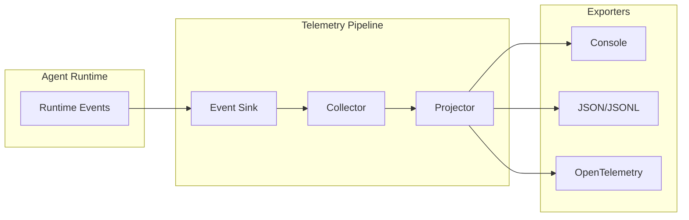

AFK includes a telemetry pipeline that captures every agent run event — LLM calls, tool executions, state transitions, and performance metrics. Export to the console for development, JSON for log aggregation, or OpenTelemetry for production.

## Setup in one line

```python
from afk.core import Runner

# Console output (development)
runner = Runner(telemetry="console")

# OpenTelemetry (production)
runner = Runner(telemetry="otel")

# JSON lines (log files)
runner = Runner(telemetry="json", telemetry_config={"path": "logs/agent.jsonl"})
```

## Telemetry pipeline



## RunMetrics reference

Every completed run produces a `RunMetrics` object:

| Metric                | Type    | Description                        |
| --------------------- | ------- | ---------------------------------- |
| `total_steps`         | `int`   | Number of agent loop iterations    |
| `total_llm_calls`     | `int`   | Number of LLM API calls            |
| `total_tool_calls`    | `int`   | Number of tool executions          |
| `total_tokens`        | `int`   | Total tokens (prompt + completion) |
| `total_cost_usd`      | `float` | Estimated cost in USD              |
| `wall_time_s`         | `float` | Total run duration in seconds      |
| `first_token_ms`      | `float` | Time to first token (streaming)    |
| `tool_latency_p50_ms` | `float` | Median tool execution latency      |
| `tool_latency_p99_ms` | `float` | 99th percentile tool latency       |
| `error_count`         | `int`   | Number of errors during the run    |

```python
result = runner.run_sync(agent, user_message="...")
m = result.usage

print(f"Steps: {m.total_steps}")
print(f"Cost: ${m.total_cost_usd:.4f}")
print(f"Duration: {m.wall_time_s:.1f}s")
```

## Choosing an exporter

<Tabs>
  <Tab title="Console">
    Human-readable output to stdout. Best for development and debugging.

    ```python
    runner = Runner(telemetry="console")
    ```

    ```
    [agent:assistant] step=1 llm_call latency=823ms tokens=142
    [agent:assistant] step=1 tool:search_docs latency=45ms success=true
    [agent:assistant] completed steps=2 cost=$0.0012 wall=1.4s
    ```

  </Tab>
  <Tab title="JSON / JSONL">
    Structured output for log aggregation (ELK, Datadog, etc.).

    ```python
    runner = Runner(
        telemetry="json",
        telemetry_config={"path": "logs/agent.jsonl"},
    )
    ```

    Each event is a JSON line:
    ```json
    {"event": "llm_call", "agent": "assistant", "step": 1, "latency_ms": 823, "tokens": 142}
    {"event": "tool_call", "agent": "assistant", "tool": "search_docs", "latency_ms": 45, "success": true}
    ```

  </Tab>
  <Tab title="OpenTelemetry">
    Export spans and metrics to any OTEL-compatible backend (Jaeger, Grafana, Honeycomb, etc.).

    ```python
    runner = Runner(
        telemetry="otel",
        telemetry_config={
            "service_name": "my-agent-service",
            "endpoint": "http://otel-collector:4317",
        },
    )
    ```

    **Use for:** Production deployments with existing observability infrastructure.

  </Tab>
</Tabs>

## Telemetry spans

AFK creates spans for key operations:

```
agent:assistant (run)
├── llm_call (step 1)
├── tool:search_docs (step 1)
├── llm_call (step 2)
└── completed
```

Spans capture timing, success/failure, and metadata. In OTEL mode, these map directly to traces visible in your observability dashboard.

## Alerting recommendations

| Alert                | Condition                                    | Severity   |
| -------------------- | -------------------------------------------- | ---------- |
| Error rate spike     | `error_count / total_runs > 5%` over 5 min   | **High**   |
| LLM latency spike    | `p99 > 10s` for 5 min                        | **Medium** |
| Cost anomaly         | `daily_cost > 2x rolling average`            | **High**   |
| Tool failure rate    | `tool_failures / tool_calls > 10%` for 5 min | **Medium** |
| Circuit breaker open | Any LLM circuit breaker trips                | **High**   |

<Tip>
  **Start with the console exporter** even in staging. It costs nothing and
  gives you immediate visibility into agent behavior. Switch to OTEL when you
  have a monitoring stack.
</Tip>

## Next steps

<CardGroup cols={2}>
  <Card title="Evals" icon="check-circle" href="/library/evals">
    Behavioral testing for agent quality.
  </Card>
  <Card title="Security Model" icon="shield" href="/library/security-model">
    Security boundaries and hardening.
  </Card>
</CardGroup>
