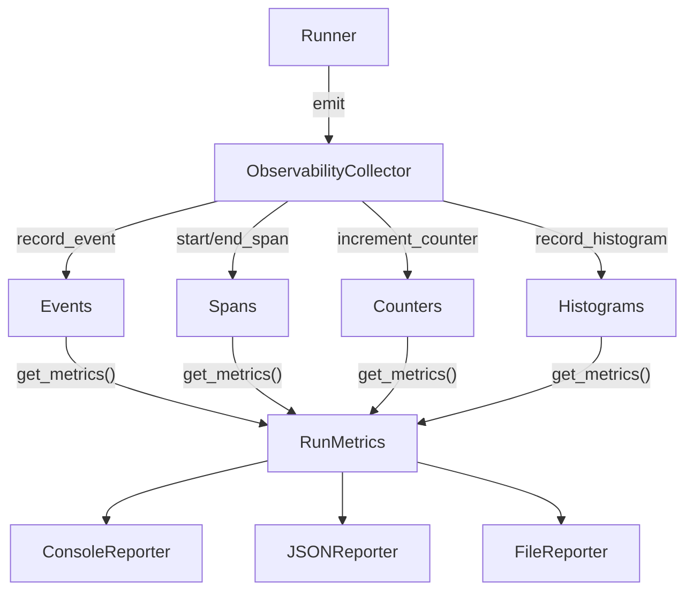

The observability package provides an `ObservabilityCollector` that implements `TelemetrySink` and aggregates events, spans, counters, and histograms into structured `RunMetrics`. Three reporters output results in different formats.

## TL;DR

- `ObservabilityCollector` plugs into `Runner(telemetry=collector)` as a standard `TelemetrySink`.
- After a run, call `collector.get_metrics()` to get aggregated `RunMetrics`.
- `ObservabilityCollector.from_result(result)` extracts metrics post-hoc from any `AgentResult`.
- Three reporters: `ConsoleReporter` (ANSI colored), `JSONReporter`, `FileReporter` (JSONL).

## When to Use

- You need visibility into run duration, token counts, costs, and errors.
- You want to log agent metrics to files for analysis.
- You are debugging slow runs and need tool/LLM latency breakdowns.
- You want a pretty console summary after each agent run.

## Architecture



## Quick Start

### Live Collection

```python
from afk.core import Runner
from afk.observability import ObservabilityCollector, ConsoleReporter

collector = ObservabilityCollector()
runner = Runner(telemetry=collector)

result = await runner.run(agent, user_message="Analyze this dataset")

metrics = collector.get_metrics()
ConsoleReporter().report(metrics)
```

### Post-Hoc from AgentResult

```python
from afk.observability import ObservabilityCollector

metrics = ObservabilityCollector.from_result(result)
print(metrics.to_dict())
```

## RunMetrics Fields

| Field                | Type                     | Description                    |
| -------------------- | ------------------------ | ------------------------------ |
| `run_id`             | `str`                    | Run identifier                 |
| `agent_name`         | `str`                    | Agent that executed            |
| `state`              | `str`                    | Terminal state                 |
| `total_duration_s`   | `float`                  | Wall-clock duration            |
| `llm_calls`          | `int`                    | Number of LLM invocations      |
| `tool_calls`         | `int`                    | Number of tool invocations     |
| `input_tokens`       | `int`                    | Total input tokens             |
| `output_tokens`      | `int`                    | Total output tokens            |
| `total_tokens`       | `int`                    | Total tokens consumed          |
| `estimated_cost_usd` | `float \| None`          | Cost estimate                  |
| `steps`              | `int`                    | Execution steps                |
| `errors`             | `list[str]`              | Error messages encountered     |
| `tool_latencies_ms`  | `dict[str, list[float]]` | Per-tool latency distributions |
| `llm_latencies_ms`   | `list[float]`            | LLM call latencies             |

### Computed Properties

| Property              | Description                           |
| --------------------- | ------------------------------------- |
| `success`             | `True` if state is `"completed"`      |
| `avg_llm_latency_ms`  | Average LLM latency                   |
| `avg_tool_latency_ms` | Average tool latency across all tools |
| `to_dict()`           | JSON-safe dictionary representation   |

## Reporters

### ConsoleReporter

Pretty-prints an ANSI-colored summary to stdout:

```python
from afk.observability import ConsoleReporter

ConsoleReporter().report(metrics)
```

Output:

```
══════════════════════════════════════════════════
  AFK Run Report
══════════════════════════════════════════════════

  Status:    ✓ SUCCESS
  Agent:     summarizer
  Duration:  2.34s
  Steps:     3

  LLM Usage
  ├─ Calls:          2
  ├─ Input tokens:   1,248
  ├─ Output tokens:  523
  ├─ Total tokens:   1,771
  └─ Avg latency:    890ms

  Cost:      $0.0042
══════════════════════════════════════════════════
```

### JSONReporter

Writes metrics as formatted JSON:

```python
from afk.observability import JSONReporter

# Write to file
JSONReporter(path="metrics.json").report(metrics)

# Or print to stdout
JSONReporter().report(metrics)
```

### FileReporter

Appends one JSON line per run to a JSONL file — ideal for long-running systems:

```python
from afk.observability import FileReporter

reporter = FileReporter("runs.jsonl")
reporter.report(metrics)

# Read all recorded metrics
all_metrics = reporter.read_all()
```

## Continue Reading

1. [Architecture](/library/architecture)
2. [Streaming](/library/streaming)
3. [Agent-to-Agent Messaging](/library/messaging)
