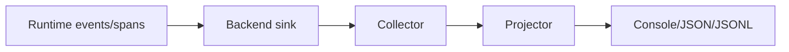

## Telemetry path



## Usage example

```python
runner = Runner(telemetry="otel", telemetry_config={"service_name": "afk-prod"})
```

## Operator guidance

- choose backend by environment (`inmemory` for local, `otel` for prod)
- keep exporter schemas stable for downstream dashboards
- alert on dropped/failed exporter writes

## For Coding Agents

When adding telemetry:

1. use constants, not ad-hoc metric strings
2. do not let telemetry exceptions fail runtime execution
3. include run_id/thread_id correlation fields
