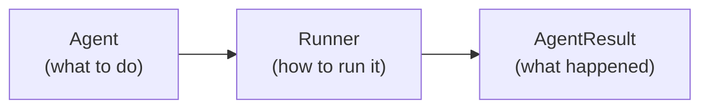

AFK (**Agent Framework Kit**) is a Python SDK for building AI agents that are predictable, testable, and production-ready. It separates **what your agent does** (contracts) from **how it runs** (runtime), so you can iterate on behavior without touching infrastructure.

<Tip>
  If you've used the OpenAI Assistants API or LangChain, think of AFK as the
  layer that adds **typed contracts, policy gates, failure handling, and
  observability** to your agent code — without locking you into a single LLM
  provider.
</Tip>

## The core idea

Every AFK application is built from three pieces:



| Piece           | What it is                                                                                                      | You define                                            |
| --------------- | --------------------------------------------------------------------------------------------------------------- | ----------------------------------------------------- |
| **Agent**       | A configuration object describing the agent's identity, model, instructions, tools, and subagents.              | Name, model, instructions, tools, subagents, policies |
| **Runner**      | The execution engine that runs agents through a step loop, managing LLM calls, tool execution, and state.       | Configuration defaults, telemetry, memory backend     |
| **AgentResult** | The output of a run — containing the final text, run state, tool/subagent execution records, and usage metrics. | Nothing — this is what you read after a run           |

## What AFK gives you

<AccordionGroup>
  <Accordion title="Typed agents with tool calling" icon="robot">
    Define agents as configuration objects. Attach tools as typed Python functions with Pydantic models for argument validation. The framework handles schema generation, execution, and output sanitization.

    ```python
    from afk.agents import Agent
    from afk.tools import tool
    from pydantic import BaseModel

    class SearchArgs(BaseModel):
        query: str

    @tool(name="search", description="Search the knowledge base.")
    def search(args: SearchArgs) -> dict:
        return {"results": ["doc1", "doc2"]}

    agent = Agent(
        name="assistant",
        model="gpt-4.1-mini",
        instructions="Help users find information.",
        tools=[search],
    )
    ```

  </Accordion>

  <Accordion title="Multiple execution modes" icon="play">
    Run agents synchronously (blocking), asynchronously (awaitable), or with real-time streaming. Pause, resume, and cancel runs at any point.

    ```python
    from afk.core import Runner

    runner = Runner()

    # Synchronous (simplest)
    result = runner.run_sync(agent, user_message="Find docs about caching")

    # Async
    result = await runner.run(agent, user_message="Find docs about caching")

    # Streaming
    handle = await runner.run_stream(agent, user_message="Find docs about caching")
    async for event in handle:
        if event.type == "text_delta":
            print(event.text_delta, end="")
    ```

  </Accordion>

  <Accordion title="Multi-agent orchestration" icon="sitemap">
    Build systems where a coordinator agent delegates tasks to specialist subagents. AFK manages the DAG execution, join policies, and backpressure automatically.

    ```python
    researcher = Agent(name="researcher", model="gpt-4.1-mini", instructions="Find facts.")
    writer = Agent(name="writer", model="gpt-4.1-mini", instructions="Write summaries.")

    coordinator = Agent(
        name="coordinator",
        model="gpt-4.1-mini",
        instructions="Delegate research, then summarize.",
        subagents=[researcher, writer],
    )
    ```

  </Accordion>

  <Accordion title="Policy engine and safety controls" icon="shield">
    Gate tool calls with policy rules. Require human approval for dangerous operations. Set hard limits on steps, cost, and wall time.

    ```python
    from afk.agents import PolicyEngine, PolicyRule, FailSafeConfig

    policy = PolicyEngine(rules=[
        PolicyRule(
            rule_id="gate-writes",
            condition=lambda e: e.tool_name and "write" in e.tool_name,
            action="request_approval",
            reason="Write operations need human approval",
        ),
    ])

    agent = Agent(
        name="safe-agent",
        model="gpt-4.1-mini",
        instructions="...",
        fail_safe=FailSafeConfig(
            max_steps=10,
            max_tool_calls=5,
            max_total_cost_usd=0.25,
        ),
    )
    ```

  </Accordion>

  <Accordion title="Provider-portable LLM runtime" icon="sparkles">
    Swap LLM providers without changing agent code. AFK normalizes requests and responses across OpenAI, Anthropic, and 100+ providers via LiteLLM. Built-in retry, circuit breaking, caching, and rate limiting.

    ```python
    from afk.llms import LLMBuilder

    client = (
        LLMBuilder()
        .provider("openai")
        .model("gpt-4.1-mini")
        .profile("production")    # ← retry, timeout, rate limit, circuit breaker
        .build()
    )
    ```

  </Accordion>

  <Accordion title="Observability and evals" icon="chart-bar">
    Built-in telemetry pipeline with spans and metrics. Eval framework for CI-gated release quality. Export to console, JSON, or OpenTelemetry.

    ```python
    # Enable OTEL telemetry
    runner = Runner(telemetry="otel")

    # Run evals in CI
    from afk.evals import run_suite, EvalBudget
    from afk.evals.models import EvalCase

    suite = run_suite(
        runner_factory=lambda: Runner(),
        cases=[EvalCase(name="basic", agent=agent, user_message="Hello")],
    )
    assert suite.failed == 0
    ```

  </Accordion>
</AccordionGroup>

## When should you use AFK?

| Scenario                                  | AFK is a good fit                                | Consider alternatives                 |
| ----------------------------------------- | ------------------------------------------------ | ------------------------------------- |
| Building a production AI agent with tools | ✅ Typed contracts, policy gates, observability  | —                                     |
| Prototyping a quick LLM chat              | ✅ `Agent` + `Runner` in 5 lines                 | Raw API calls may be simpler          |
| Multi-agent orchestration                 | ✅ DAG delegation, join policies, backpressure   | —                                     |
| Fine-tuning or training models            | —                                                | ❌ AFK is for inference, not training |
| Simple text completion without tools      | ✅ Works, but may be more than you need          | Direct SDK call is lighter            |
| Enterprise deployment with compliance     | ✅ Policy engine, audit events, secret isolation | —                                     |

## Key design decisions

- **Contract-first:** Every interface is a Pydantic model or Python protocol. Tools, agents, results, and events are all typed contracts — not magic strings.
- **Separation of concerns:** Orchestration logic (runner, step loop) is completely separate from execution adapters (LLM providers, tool handlers). Swap providers without touching agent code.
- **Fail-safe by default:** Every agent run has configurable limits on steps, tool calls, cost, and wall time. The runner classifies failures as retryable, terminal, or non-fatal automatically.
- **Provider-portable:** Your agent code never touches provider-specific types. The LLM runtime normalizes everything into `LLMRequest` and `LLMResponse`.

## Next steps

<CardGroup cols={2}>
  <Card title="Quickstart" icon="rocket" href="/library/quickstart">
    Build an agent with tools and streaming in 5 minutes.
  </Card>
  <Card
    title="Learn in 15 Minutes"
    icon="graduation-cap"
    href="/library/learn-in-15-minutes"
  >
    Hands-on tutorial covering every major AFK feature.
  </Card>
</CardGroup>
