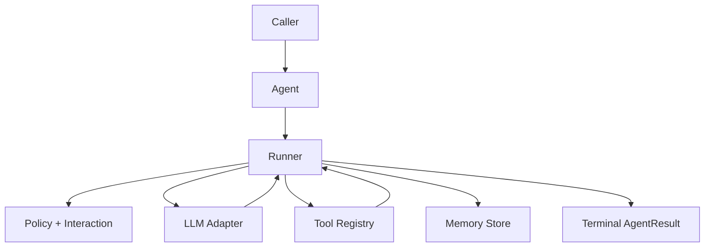

<Info>
All examples are embedded as copy-ready scripts and use public SDK imports (`afk.*`) only.
</Info>

## TL;DR

- Start with the Developer Guide for first implementation.
- Use Agentic Levels to scope capabilities before coding.
- Use Concepts for behavior guarantees and Reference for exact API contracts.

## When to Use

- You are evaluating AFK for a new agentic project.
- You need a single navigation point for docs and examples.
- You want a fast path from onboarding to internals.

## Start Here

<CardGroup cols={2}>
  <Card title="1) Developer Guide" icon="rocket" href="/library/developer-guide">
    Fast onboarding path for first production-ready agent behavior.
  </Card>
  <Card title="2) Agentic Levels" icon="file-code" href="/library/agentic-levels">
    Structured path from prompted agent to production agentic platform.
  </Card>
  <Card title="3) Building with AI" icon="file-code" href="/library/building-with-ai">
    Install AFK skills with `npx skills` and apply them in coding workflows.
  </Card>
  <Card title="4) Examples" icon="code" href="/library/examples/index">
    Nine runnable examples with diagrams and extension tips.
  </Card>
  <Card title="5) Architecture" icon="file-code" href="/library/architecture">
    Execution flow, state model, persistence, and safety boundaries.
  </Card>
  <Card title="6) API Reference" icon="book" href="/library/api-reference">
    Public APIs, contracts, edge cases, and import patterns.
  </Card>
</CardGroup>

## Prerequisites

- Install SDK: `pip install afk pydantic` (or `uv pip install afk pydantic`)
- Configure provider env vars (`AFK_LLM_PROVIDER`, `AFK_LLM_MODEL`, `AFK_LLM_API_KEY`)
- Optional prompt root: `AFK_AGENT_PROMPTS_DIR=.agents/prompt`
- For a full bootstrap script, use [Developer Guide](/library/developer-guide)

## Concept Progression

1. Runtime model: [Architecture](/library/architecture)
2. Prompt/instruction model: [System Prompts](/library/system-prompts)
3. Tool model: [Tools Walkthrough](/library/tools-system-walkthrough)
4. Governance model: [Tool Call Lifecycle](/library/tool-call-lifecycle)
5. Orchestration model: [Agentic Behavior](/library/agentic-behavior)
6. Durability model: [Checkpoint Schema](/library/checkpoint-schema)
7. Reliability model: [Failure Policy Matrix](/library/failure-policy-matrix)
8. Contract model: [Run Event Contract](/library/run-event-contract)

## Public Imports

```python
from afk.agents import Agent
from afk.core import Runner, RunnerConfig
from afk.llms import create_llm
from afk.tools import tool
from afk import agents, core, llms, tools, memory, evals
```

<Warning>
Avoid importing from `src/...` in application code. Stay on public imports (`afk.*`) for stability across releases.
</Warning>

## Runtime Mental Model



## Read by Goal

<CardGroup cols={2}>
  <Card title="Need HITL + approvals" href="/library/tool-call-lifecycle" icon="shield">
    Tool policy gates, deferred approvals, and fallback behavior.
  </Card>
  <Card title="Need subagents + routing" href="/library/agentic-behavior" icon="file-code">
    Router semantics, orchestration flow, and subagent execution records.
  </Card>
  <Card title="Need resume + compaction" href="/library/checkpoint-schema" icon="database">
    Checkpoint shape, replay behavior, and resume guarantees.
  </Card>
  <Card title="Need direct LLM control" href="/library/llm-interaction" icon="play-circle">
    Request/response lifecycle, structured output, and retries.
  </Card>
  <Card title="Need prompt management" href="/library/system-prompts" icon="file-code">
    Auto prompt loading, strict templates, and cache-aware reuse.
  </Card>
  <Card title="Need full API details" href="/library/api-reference" icon="file-code">
    Constructor fields, contracts, defaults, and edge-case behavior.
  </Card>
</CardGroup>

## Choose by Use Case

<Tabs>
  <Tab title="Build Features">
    <ul>
      <li>Approvals/HITL: <a href="/library/tool-call-lifecycle">Tool Call Lifecycle</a></li>
      <li>Agent skills: <a href="/library/agent-skills">Agent Skills</a></li>
      <li>AI-assisted coding setup: <a href="/library/building-with-ai">Building with AI</a></li>
      <li>System prompts: <a href="/library/system-prompts">System Prompts</a></li>
      <li>Subagent orchestration: <a href="/library/agentic-behavior">Agentic Behavior</a></li>
      <li>Resume/checkpoints: <a href="/library/checkpoint-schema">Checkpoint Schema</a></li>
      <li>Tool hardening: <a href="/library/security-model">Security Model</a></li>
    </ul>

  </Tab>
  <Tab title="Deep Internals">
    <ul>
      <li>LLM runtime internals: <a href="/library/llm-interaction">LLM Interaction</a></li>
      <li>Full public contract: <a href="/library/api-reference">API Reference</a></li>
      <li>Full source symbol map: <a href="/library/full-module-reference">Full Module Reference</a></li>
    </ul>

  </Tab>
</Tabs>

## Production Readiness Checklist

<Steps>
  <Step title="Start from runnable baseline">Use the `01_minimal_chat_agent.py` snippet from `/library/examples/index` and keep the first run deterministic.</Step>
  <Step title="Harden tool safety">Add typed args, policy rules, sandbox restrictions, and output limits.</Step>
  <Step title="Enable durability">Persist checkpoints in non-ephemeral storage and validate resume behavior.</Step>
  <Step title="Prevent regressions">Add eval scenarios for business-critical tool and policy paths.</Step>
</Steps>
