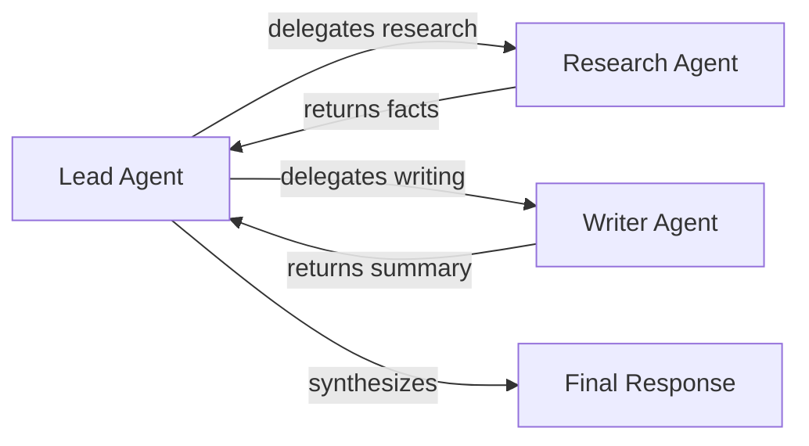

This page gets you from zero to a working agent system as fast as possible. Each example builds on the previous one, introducing one new concept at a time. By the end, you will have a multi-agent system with tool calling and streaming.

## Install and Import

Install AFK from PyPI:

```bash
pip install the-afk==1.0.0
```

Import the core building blocks you will use throughout this guide:

```python
import afk
from afk.agents import Agent
from afk.core import Runner
```

`Agent` is the definition of what your agent can do. `Runner` is the engine that executes it. These two classes are the foundation of every AFK application.

## Example 1: Minimal Chat Agent

The simplest possible AFK application — a single agent that answers a question.

```python
agent = Agent(
    name="assistant",
    model="gpt-4.1-mini",
    instructions="Be concise and accurate.",
)

runner = Runner()
result = runner.run_sync(agent, user_message="What is a circuit breaker pattern?")
print(result.final_text)
```

`run_sync` is a blocking call that sends the message to the LLM, waits for the response, and returns an `AgentResult`. The `final_text` property contains the agent's response as a string.

The `AgentResult` also contains metadata you will use later: `run_id` and `thread_id` for tracing, `usage_aggregate` for token counts and costs, and `state` for the terminal state of the run (`completed`, `failed`, etc.).

<Tip>
Keep your `instructions` focused. A well-written instruction string is more effective than a long, detailed one. Tell the agent what it is and what it should do — not every edge case.
</Tip>

## Example 2: Streaming Output

For user-facing applications, you often want to display the agent's response as it is being generated, rather than waiting for the full response. AFK supports this through `run_stream`.

```python
import asyncio

async def main() -> None:
    runner = Runner()
    agent = Agent(
        name="assistant",
        model="gpt-4.1-mini",
        instructions="List items clearly with numbered points.",
    )

    handle = await runner.run_stream(agent, user_message="List 5 SRE metrics")
    async for event in handle:
        if event.type == "text_delta":
            print(event.text_delta, end="", flush=True)

    print()  # newline after streaming completes
    result = handle.result
    print(f"Tokens used: {result.usage_aggregate.total_tokens}")

asyncio.run(main())
```

The `run_stream` method returns an `AgentStreamHandle` that you can iterate over asynchronously. Each event has a `type` field that tells you what kind of event it is:

| Event type | When it fires | What it contains |
|---|---|---|
| `text_delta` | As each chunk of text is generated | `text_delta` — the new text fragment |
| `tool_started` | When a tool call begins | `tool_name`, `tool_call_id` |
| `tool_completed` | When a tool call finishes | `tool_name`, `success`, `output` or `error` |
| `step_started` | When a new execution step begins | `step` number |
| `completed` | When the run finishes | `result` — the full `AgentResult` |
| `error` | When the run fails | `error` message |

After the stream ends, `handle.result` gives you the same `AgentResult` you would get from `run_sync`.

## Example 3: Tool Calling

Tools let your agent take actions in the real world — calling APIs, querying databases, performing calculations, or anything else that goes beyond generating text.

Every tool in AFK has a **typed args model** (a Pydantic `BaseModel`) that defines exactly what arguments the tool accepts. This means the LLM's tool call is validated before your handler runs, so you never have to deal with malformed input inside your tool function.

```python
from pydantic import BaseModel
from afk.tools import tool

class AddArgs(BaseModel):
    a: int
    b: int

@tool(args_model=AddArgs, name="add")
def add(args: AddArgs) -> dict[str, int]:
    """Add two numbers together."""
    return {"sum": args.a + args.b}

agent = Agent(
    name="calculator",
    model="gpt-4.1-mini",
    instructions="Use the add tool when asked to perform addition.",
    tools=[add],
)

runner = Runner()
result = runner.run_sync(agent, user_message="What is 42 + 17?")
print(result.final_text)  # "The sum of 42 and 17 is 59."
```

Here is what happens behind the scenes when the agent calls a tool:

1. The LLM sees the `add` tool's JSON schema and decides to call it
2. AFK validates the arguments against your `AddArgs` Pydantic model
3. If validation passes, your `add` function runs with the typed args
4. The tool's return value is sent back to the LLM as the tool result
5. The LLM uses the result to generate its final response

You can see every tool execution in `result.tool_executions`, which gives you the tool name, arguments, output, success status, and latency for each call.

<Tip>
Always return JSON-serializable dicts from your tools. This ensures the output can be sent back to the LLM and captured in telemetry cleanly.
</Tip>

## Example 4: Subagent Delegation

When a problem naturally breaks into sub-tasks that need different expertise, you can define specialist agents and a coordinator that delegates to them.

```python
research = Agent(
    name="research",
    model="gpt-4.1-mini",
    instructions="Collect factual information about the given topic. Be thorough and cite sources.",
)

writer = Agent(
    name="writer",
    model="gpt-4.1-mini",
    instructions="Write a clear, well-structured summary from the provided research notes.",
)

lead = Agent(
    name="lead",
    model="gpt-4.1-mini",
    instructions="You coordinate a research team. Delegate research to the research agent and writing to the writer agent, then synthesize their outputs.",
    subagents=[research, writer],
)
```

The delegation flow looks like this:



The **lead agent** receives the user's request and decides which subagents to invoke. Each subagent runs independently with its own instructions and model. The lead agent receives their outputs and synthesizes a final response.

This pattern is useful when:

- Different parts of the task need different instructions or expertise
- You want to parallelize independent sub-tasks for faster execution
- You want to isolate failures — if one subagent fails, the others can still succeed

You can inspect every subagent call in `result.subagent_executions`, which records the subagent name, success status, output, latency, and any errors.

## What to Read Next

Now that you have the basics working:

- [Agents](/library/agents) — Deep dive into agent composition, policies, and delegation patterns
- [Tools](/library/tools) — Tool system design, safety gates, and middleware
- [Core Runner](/library/core-runner) — Execution lifecycle, state machine, and control semantics
- [Mental Model](/library/mental-model) — The architectural thinking behind AFK
