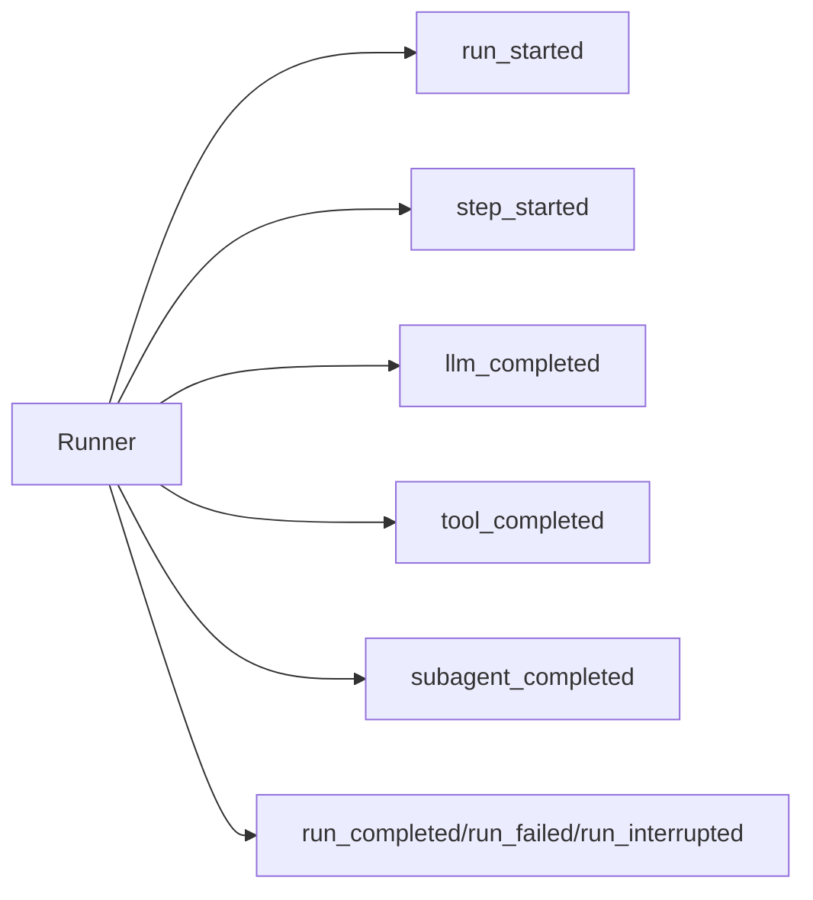

## Event stream model

```mermaid
flowchart LR
    Runner --> Started[run_started]
    Runner --> Step[step_started]
    Runner --> LLM[llm_completed]
    Runner --> Tool[tool_completed]
    Runner --> Subagent[subagent_completed]
    Runner --> Terminal[run_completed/run_failed/run_interrupted]
```

## Consumer recommendation

Use event-type branching and treat unknown types as forward-compatible.
