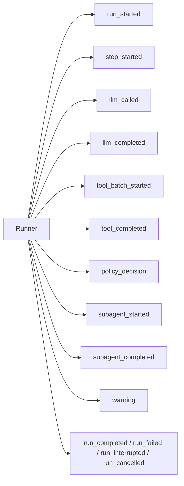

Every AFK agent run produces a stream of `AgentRunEvent` instances that describe what happened during execution. These events form the run's audit trail -- they tell you when the run started, when LLM calls were made, when tools executed, when policy decisions were rendered, and how the run terminated.

Understanding the event contract is essential for building real-time UIs, logging pipelines, eval assertions, and debugging tools. This page documents every event type, explains when each fires, describes the data it carries, and provides patterns for consuming events safely.

## Event stream model



Every run begins with `run_started` and ends with exactly one terminal event: `run_completed`, `run_failed`, `run_interrupted`, or `run_cancelled`. Between those boundaries, the runner emits step, LLM, tool, policy, and subagent events in the order they occur.

## Event reference

| Event Type | When It Fires | Key Fields in `data` |
| --- | --- | --- |
| `run_started` | At the beginning of a new or resumed run. | `agent_name`, `resumed` (bool) |
| `step_started` | At the start of each step iteration. | `step` (int), `state` |
| `llm_called` | Before sending a request to the LLM provider. | `model`, `provider` |
| `llm_completed` | After receiving the LLM response. | `tool_call_count`, `finish_reason` |
| `tool_batch_started` | Before executing a batch of tool calls from one LLM response. | `tool_call_count` |
| `tool_completed` | After each individual tool finishes executing. | `tool_name`, `success` (bool) |
| `policy_decision` | After the policy engine evaluates a tool, LLM, or subagent event. | `event_type`, `action`, `reason`, `policy_id`, `matched_rules` |
| `subagent_started` | Before dispatching a subagent invocation. | `subagent_name`, `correlation_id` |
| `subagent_completed` | After a subagent finishes (success or failure). | `subagent_name`, `success`, `latency_ms`, `error` (if failed) |
| `warning` | When a non-fatal issue occurs (memory fallback, dead letters, etc.). | Varies by warning type |
| `run_completed` | When the run reaches successful terminal state. | None (terminal) |
| `run_failed` | When the run terminates due to an unrecoverable error. | `error` message in `event.message` |
| `run_interrupted` | When the run is interrupted by the caller or by timeout. | Interruption reason in `event.message` |
| `run_cancelled` | When the run is cancelled before completion. | None (terminal) |

## AgentRunEvent structure

Each event is an `AgentRunEvent` dataclass with the following fields:

| Field | Type | Description |
| --- | --- | --- |
| `type` | `str` | Event type identifier (see table above). |
| `run_id` | `str` | Unique run identifier. |
| `thread_id` | `str` | Thread identifier for memory continuity. |
| `state` | `str` | Current run state when the event was emitted. |
| `step` | `int` | Current step number (0 if not yet in a step). |
| `message` | `str or None` | Human-readable description of what happened. |
| `data` | `dict or None` | Structured payload with event-specific fields. |

## Consuming events

The primary way to consume events is through the run handle's `events` async iterator:

```python
from afk.agents import Agent
from afk.core import Runner

agent = Agent(name="demo", model="gpt-4.1-mini", instructions="Be helpful.")
runner = Runner()

handle = await runner.run_handle(agent, user_message="Hello")

async for event in handle.events:
    if event.type == "run_started":
        print(f"Run {event.run_id} started for agent '{event.data['agent_name']}'")
    elif event.type == "llm_completed":
        print(f"  Step {event.step}: LLM responded (tools: {event.data['tool_call_count']})")
    elif event.type == "tool_completed":
        tool = event.data["tool_name"]
        ok = event.data["success"]
        print(f"  Step {event.step}: tool '{tool}' {'succeeded' if ok else 'failed'}")
    elif event.type == "policy_decision":
        action = event.data["action"]
        print(f"  Step {event.step}: policy -> {action}")
    elif event.type == "run_completed":
        print(f"Run completed (state={event.state})")
    elif event.type == "run_failed":
        print(f"Run failed: {event.message}")

result = await handle.await_result()
print(result.final_text)
```

### Pattern: event-type branching

The recommended consumption pattern is a simple `if/elif` chain that branches on `event.type`. This is explicit, readable, and easy to extend:

```python
async for event in handle.events:
    match event.type:
        case "run_started":
            log_run_start(event)
        case "llm_completed":
            log_llm_response(event)
        case "tool_completed":
            log_tool_result(event)
        case "run_completed" | "run_failed" | "run_interrupted" | "run_cancelled":
            log_terminal(event)
        case _:
            # Forward-compatible: unknown types are safe to ignore
            pass
```

## Forward compatibility

The event contract is append-only. New event types may be added in future releases, but existing event types will not be removed or have their `data` fields changed.

Your event consumer should always handle unknown event types gracefully. The simplest approach is a default branch that logs or ignores unknown types:

```python
if event.type in known_types:
    handle_known_event(event)
else:
    # New event type from a future AFK version -- safe to ignore
    logger.debug(f"Unknown event type: {event.type}")
```

This ensures your code continues to work when AFK adds new event types without requiring a code update.
