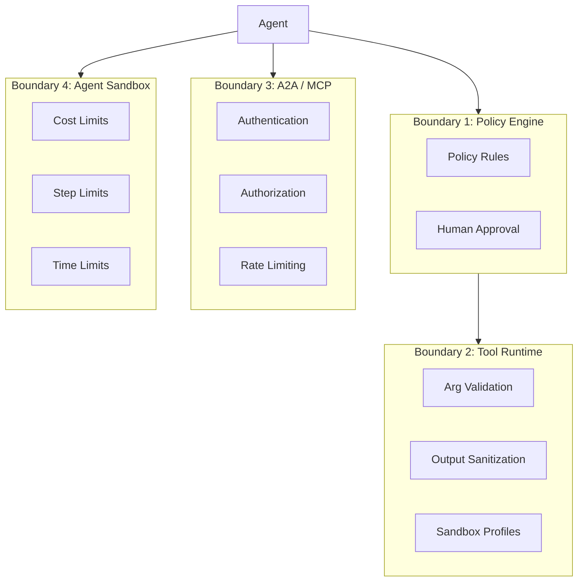

AFK implements security through **four boundaries** — policy engine, tool runtime, A2A/MCP bridges, and sandbox. Each boundary enforces least-privilege defaults and requires explicit opt-in for elevated permissions.

## Security boundaries



<AccordionGroup>
  <Accordion title="Boundary 1: Policy Engine" icon="gavel">
    Gate tool calls and agent actions with configurable rules.

    ```python
    from afk.agents import PolicyEngine, PolicyRule

    policy = PolicyEngine(rules=[
        PolicyRule(
            rule_id="deny-admin",
            condition=lambda e: e.tool_name and "admin" in e.tool_name,
            action="deny",
            reason="Admin tools are disabled",
        ),
        PolicyRule(
            rule_id="approve-writes",
            condition=lambda e: e.tool_name and "write" in e.tool_name,
            action="request_approval",
            reason="Write operations need human approval",
        ),
    ])

    runner = Runner(policy_engine=policy)
    ```

    **Actions:** `allow` (default), `deny`, `request_approval`, `request_user_input`

  </Accordion>

  <Accordion title="Boundary 2: Tool Runtime" icon="wrench">
    Every tool call passes through validation, policy checks, and output sanitization.

    ```python
    runner = Runner(
        config=RunnerConfig(
            sanitize_tool_output=True,        # Strip prompt injection vectors
            tool_output_max_chars=8000,       # Truncate oversized responses
        ),
    )
    ```

    **Sandbox profiles** are configured at the runner level, not per-tool:
    ```python
    class CodeArgs(BaseModel):
        code: str

    @tool(args_model=CodeArgs, name="run_code", description="Execute code.")
    def run_code(args: CodeArgs) -> dict:
        # Execution constraints are enforced by the runner and policy engine
        ...
    ```

  </Accordion>

  <Accordion title="Boundary 3: A2A / MCP Bridges" icon="network-wired">
    External communication requires authentication and per-caller authorization.

    ```python
    from afk.a2a import TokenAuthProvider

    auth = TokenAuthProvider(
        valid_tokens={"system-a": "token-abc"},
        allowed_agents={"system-a": ["analyzer"]},
    )

    server = A2AServer(agents={"analyzer": agent}, auth_provider=auth)
    ```

  </Accordion>

  <Accordion title="Boundary 4: Agent Sandbox" icon="shield">
    Hard limits prevent runaway agents.

    ```python
    from afk.agents import FailSafeConfig

    agent = Agent(
        ...,
        fail_safe=FailSafeConfig(
            max_steps=10,
            max_tool_calls=5,
            max_total_cost_usd=0.50,
            max_wall_time_s=60.0,
        ),
    )
    ```

  </Accordion>
</AccordionGroup>

## Default posture

AFK defaults to **least privilege**:

| Setting                  | Default   | Meaning                               |
| ------------------------ | --------- | ------------------------------------- |
| Tool policy              | `allow`   | Tools run unless explicitly denied    |
| Tool output sanitization | `True`    | Output is sanitized by default        |
| A2A authentication       | Required  | No unauthenticated A2A                |
| MCP authentication       | Required  | No unauthenticated MCP                |
| Cost limits              | None (⚠️) | **You must set `max_total_cost_usd`** |
| Sandbox                  | None      | Tools run in the host process         |

<Warning>
  **Cost limits are not set by default.** Always configure `max_total_cost_usd`
  in production to prevent runaway spending.
</Warning>

## Production hardening checklist

| Area           | Action                                          | Status |
| -------------- | ----------------------------------------------- | ------ |
| **Cost**       | Set `max_total_cost_usd` on all agents          | ☐      |
| **Cost**       | Set `max_steps` and `max_tool_calls`            | ☐      |
| **Policy**     | Add `deny` rules for admin/destructive tools    | ☐      |
| **Policy**     | Add `request_approval` for mutating operations  | ☐      |
| **Tools**      | Enable `sanitize_tool_output=True`              | ☐      |
| **Tools**      | Set `tool_output_max_chars`                     | ☐      |
| **Tools**      | Use sandbox profiles for code execution         | ☐      |
| **A2A/MCP**    | Configure auth providers with valid tokens      | ☐      |
| **A2A/MCP**    | Set per-caller agent access lists               | ☐      |
| **A2A/MCP**    | Enable rate limiting                            | ☐      |
| **Secrets**    | Store API keys in environment variables         | ☐      |
| **Secrets**    | Use secret scope isolation per tool call        | ☐      |
| **Monitoring** | Configure telemetry exporter (OTEL)             | ☐      |
| **Monitoring** | Set up alerts for error rate and cost anomalies | ☐      |

## Secret isolation

AFK recommends isolating secrets at the environment level. Use separate environment scopes and the runner's `ToolContext.metadata` to control which credentials are available to each tool:

```python
from pydantic import BaseModel
from afk.tools import tool, ToolContext

class QueryArgs(BaseModel):
    sql: str

@tool(args_model=QueryArgs, name="query_db", description="Query the database.")
def query_db(args: QueryArgs, ctx: ToolContext) -> dict:
    db_url = ctx.metadata.get("db_url")  # ← Injected via runner context
    return execute_query(db_url, args.sql)
```

## Threat model overview

| Threat                  | Mitigation                                  |
| ----------------------- | ------------------------------------------- |
| **Prompt injection**    | Output sanitization, input validation       |
| **Runaway agents**      | Cost limits, step limits, wall time         |
| **Tool abuse**          | Policy engine, sandbox profiles             |
| **Unauthorized access** | A2A/MCP auth, per-caller authorization      |
| **Secret leakage**      | Secret scope isolation, output sanitization |
| **Cost explosion**      | `max_total_cost_usd`, circuit breakers      |

## Next steps

<CardGroup cols={2}>
  <Card
    title="Failure Policy Matrix"
    icon="table"
    href="/library/failure-policy-matrix"
  >
    How errors flow through the system.
  </Card>
  <Card title="Building with AI" icon="hammer" href="/library/building-with-ai">
    Production playbook and anti-patterns.
  </Card>
</CardGroup>
